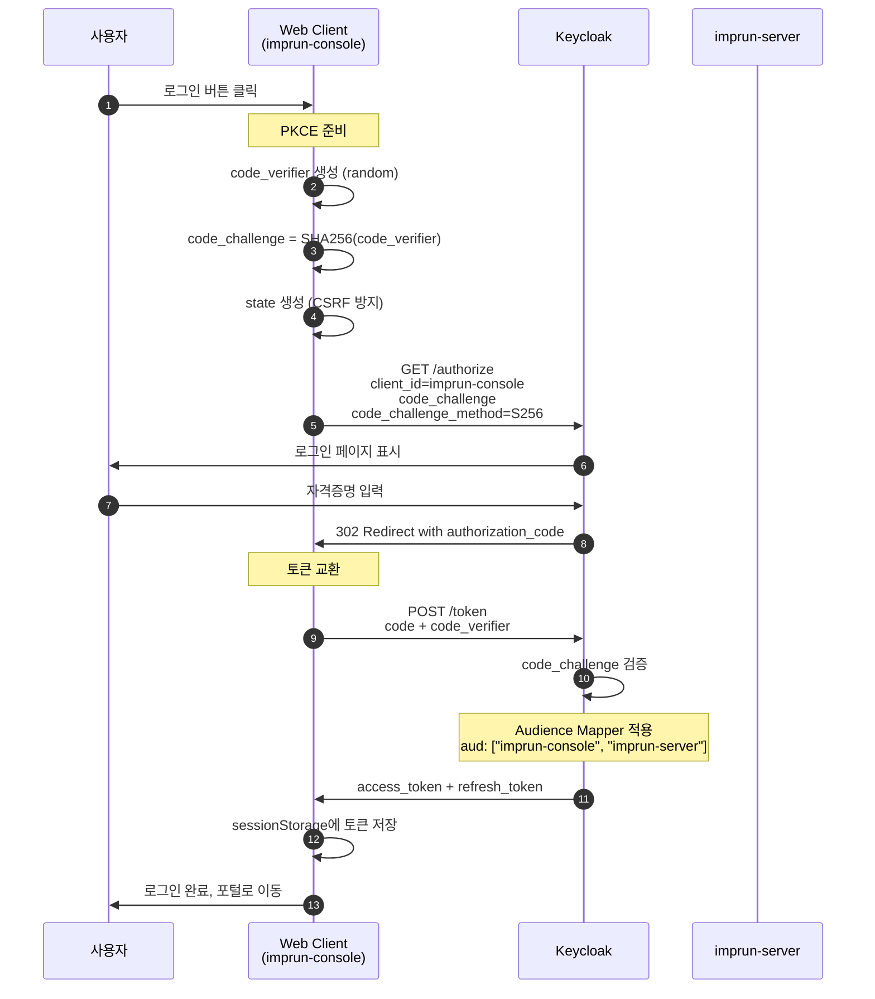
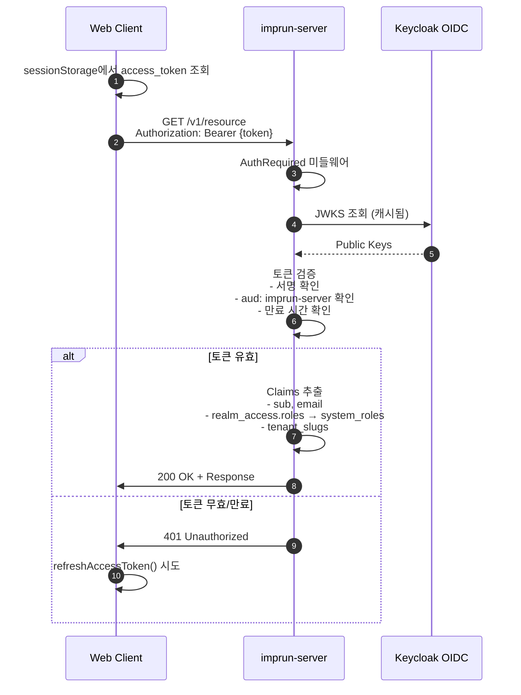
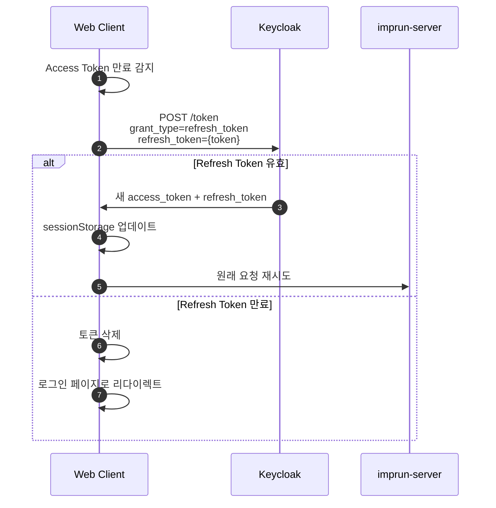
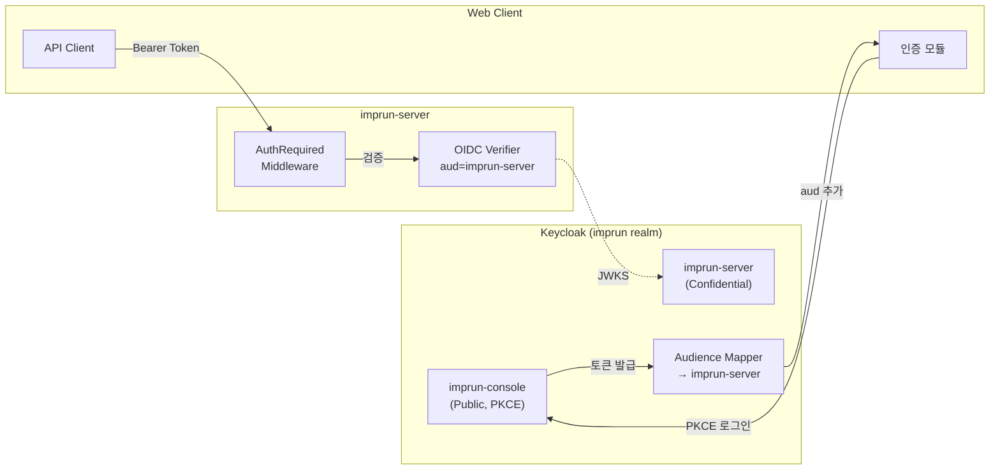

# EPIC-011: 인증 시스템

## 개요

| 항목 | 내용 |
|------|------|
| **Epic ID** | EPIC-011 |
| **제목** | 인증 시스템 |
| **우선순위** | P0 |
| **예상 기간** | 1주 |
| **상태** | ✅ 완료 |
| **의존성** | EPIC-010 (프로젝트 기반) |
| **GitHub Issue** | [#4](https://github.com/imprun/imp-gateway/issues/4) |

## 목표

Keycloak OIDC 기반의 PKCE 인증 시스템을 구현하여 사용자 로그인/로그아웃 및 토큰 관리를 처리한다.

## 배경

Imp-Gateway는 Keycloak을 IdP(Identity Provider)로 사용한다. 프론트엔드는 PKCE(Proof Key for Code Exchange) 흐름을 사용하여 보안을 강화하고, 클라이언트 사이드에서 토큰을 안전하게 관리한다.

## 인증 흐름 다이어그램

### PKCE 로그인 흐름



### API 요청 인증 흐름



### 토큰 갱신 흐름



### Keycloak 클라이언트 구성



## 완료된 범위

### OIDC PKCE 인증 흐름
1. **로그인**: PKCE code challenge 생성 → Keycloak 리다이렉트
2. **콜백**: Authorization code → Access/Refresh Token 교환
3. **토큰 저장**: sessionStorage에 안전하게 보관
4. **토큰 갱신**: Refresh Token으로 Access Token 자동 갱신
5. **로그아웃**: 토큰 삭제 + Keycloak 로그아웃 엔드포인트 호출

### 사용자 정보 관리
- JWT 파싱을 통한 사용자 정보 추출
- 시스템 역할(system-admin, sre-operator, user) 처리
- 테넌트 정보(tenant_slugs) 처리

## 구현된 파일

### 인증 모듈
```
web/src/shared/lib/auth/
├── index.ts              # 모듈 export
├── types.ts              # UserInfo, TokenPayload 등 타입
├── keycloak.ts           # OIDC PKCE 구현
├── client.ts             # useAuth 훅 (클라이언트)
└── server.ts             # 서버 사이드 유틸 (parseAccessToken, getServerSession)
```

### 주요 함수 (keycloak.ts)
```typescript
// 로그인 시작
export async function initiateLogin(returnUrl?: string): Promise<void>

// 콜백 처리
export async function handleCallback(code: string, state: string): Promise<boolean>

// 로그아웃
export function logout(redirectUrl?: string): void

// 토큰 조회
export function getAccessToken(): string | null

// 인증 상태 확인
export function isAuthenticated(): boolean

// 현재 사용자 정보
export function getCurrentUser(): UserInfo | null

// 토큰 갱신
export async function refreshAccessToken(): Promise<boolean>

// 회원가입
export async function initiateRegistration(email?: string): Promise<void>
```

### useAuth 훅 (client.ts)
```typescript
export function useAuth() {
  return {
    user: UserInfo | null,
    isLoading: boolean,
    isAuthenticated: boolean,
    login: (returnUrl?: string) => void,
    logout: () => void,
    register: (email?: string) => void,
  }
}
```

### 페이지
- `web/app/auth/sign-in/page.tsx` - 로그인 페이지
- `web/app/auth/callback/page.tsx` - OAuth 콜백 처리

## 수용 기준 (완료)

- [x] Keycloak OIDC PKCE 로그인 구현
- [x] OAuth 콜백 처리 및 토큰 교환
- [x] Access Token을 sessionStorage에 저장
- [x] Refresh Token으로 자동 토큰 갱신
- [x] JWT 파싱을 통한 사용자 정보 추출
- [x] useAuth 훅 제공 (클라이언트 상태 관리)
- [x] 로그아웃 시 Keycloak 세션 종료
- [x] 회원가입 리다이렉트 지원
- [x] 환경 변수를 통한 Keycloak 설정 관리

## 환경 변수

```env
# Keycloak 설정
NEXT_PUBLIC_KC_ISSUER=http://localhost:8080/realms/imp-gateway
NEXT_PUBLIC_KC_CLIENT_ID=imprun-console
```

## 기술적 결정 사항

### PKCE 사용 이유
- Public 클라이언트에서 보안 강화
- Authorization Code 탈취 방지
- 클라이언트 시크릿 없이 안전한 인증

### sessionStorage 선택 이유
- 탭 단위 격리로 보안 강화
- 브라우저 종료 시 자동 삭제
- XSS 공격에 localStorage보다 안전

### 서드파티 라이브러리 미사용 이유
- NextAuth.js 대비 간단한 요구사항
- 직접 구현으로 완전한 제어권 확보
- 번들 크기 최소화

## 보안 고려사항

1. **State 검증**: CSRF 방지
2. **PKCE**: Authorization Code 인터셉션 방지
3. **토큰 만료 체크**: 모든 API 호출 전 검증
4. **Refresh Token 유효성**: 갱신 전 만료 확인

---

## 변경 이력

| 날짜 | 버전 | 변경 내용 | 작성자 |
|------|------|----------|--------|
| 2025-11-26 | 1.0 | 초기 구현 완료 | - |
| 2025-11-27 | 1.1 | 에픽 문서 작성 | - |
