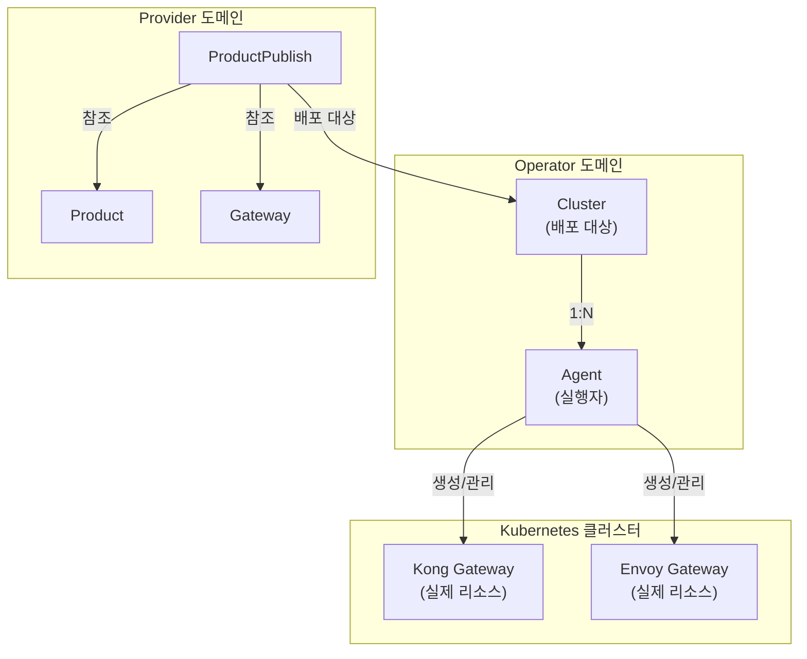
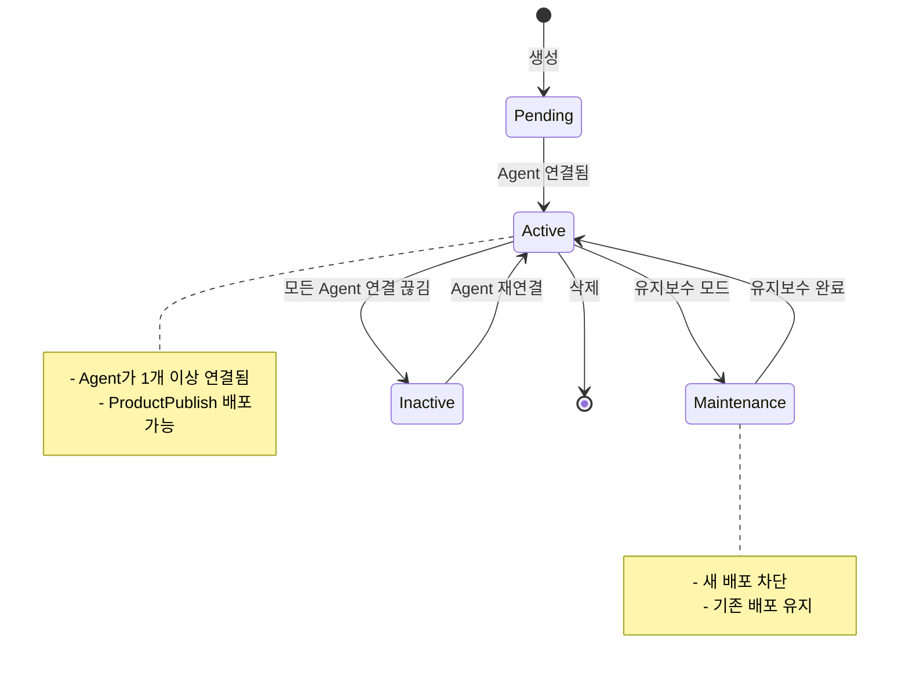
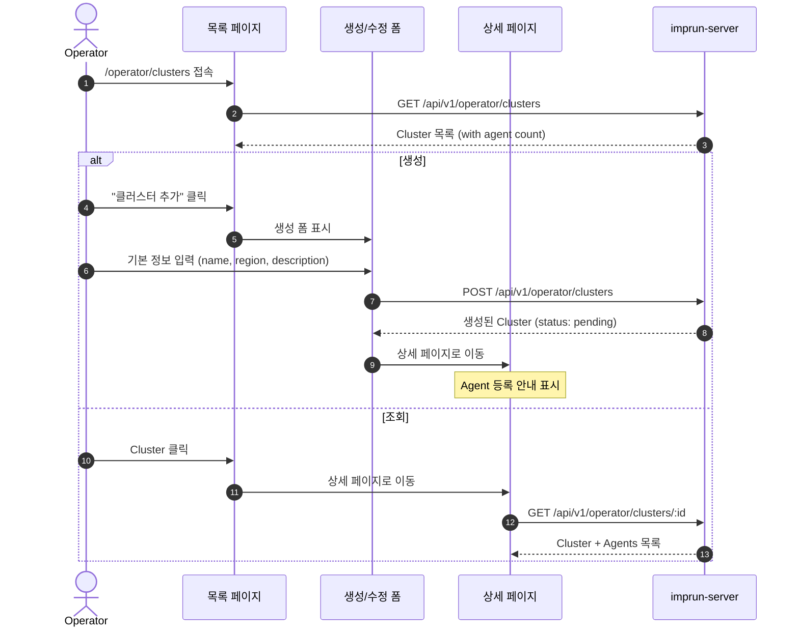

# EPIC-013: Cluster 관리

## 개요

| 항목 | 내용 |
|------|------|
| **Epic ID** | EPIC-013 |
| **제목** | Cluster 관리 |
| **우선순위** | P0 |
| **예상 기간** | 1주 |
| **상태** | ✅ 완료 |
| **의존성** | EPIC-012 (포털 레이아웃) |

## 목표

Operator가 클러스터를 등록, 관리하고 상태를 모니터링할 수 있다.

## 배경

Cluster는 Kong Gateway가 실행되는 Kubernetes 클러스터를 나타낸다. Operator는 클러스터를 등록하고, 각 클러스터에 Agent를 연결하여 Gateway 배포를 관리한다.

> **중요**: Cluster는 Operator 포털에서 관리되며, Provider의 ProductPublish에서 배포 대상으로 선택된다.

---

## 도메인 모델

### Cluster 위치



### Cluster ↔ Agent 관계

> **Architecture Decision**: `environment`(dev/staging/prod)는 Cluster가 아닌 **ProductPublish**에서 관리합니다.
> - **Cluster**: 물리적 인프라 (어디에 배포할 것인가)
> - **ProductPublish.environment**: 논리적 배포 설정 (어떤 환경으로 배포할 것인가)
> - 하나의 Cluster에 여러 environment의 Product를 배포할 수 있습니다.

```
┌─────────────────────────────────────────────────────────────────────┐
│                           Cluster                                    │
│  - id, name, description                                             │
│  - region (kr-central, us-east, etc.)                               │
│  - status (active, inactive, maintenance)                           │
│  - metadata (labels, annotations)                                    │
└─────────────────────────────────────────────────────────────────────┘
                                │
                    ┌───────────┼───────────┐
                    ▼           ▼           ▼
            ┌─────────────┐ ┌─────────────┐ ┌─────────────┐
            │   Agent 1   │ │   Agent 2   │ │   Agent 3   │
            │  (Active)   │ │  (Active)   │ │ (Inactive)  │
            │ last: 2min  │ │ last: 1min  │ │ last: 1hr   │
            └─────────────┘ └─────────────┘ └─────────────┘
```

### Cluster 상태 흐름



---

## 사용자 흐름

### Cluster CRUD 흐름



---

## 범위

### 포함
- Cluster CRUD (생성, 조회, 수정, 삭제)
- Cluster 목록 페이지 (상태, Agent 수 표시)
- Cluster 상세 페이지
- Cluster 상태 관리 (active, inactive, maintenance)
- 연결된 Agent 목록 표시

### 제외
- Agent 등록/관리 (EPIC-014)
- 클러스터 메트릭 대시보드 (EPIC-015)
- 클러스터 자동 발견 (Post-MVP)

---

## 기술 요구사항

### 백엔드 API

```
GET    /api/v1/operator/clusters           # 클러스터 목록
POST   /api/v1/operator/clusters           # 클러스터 생성
GET    /api/v1/operator/clusters/:id       # 클러스터 상세 (with agents)
PUT    /api/v1/operator/clusters/:id       # 클러스터 수정
DELETE /api/v1/operator/clusters/:id       # 클러스터 삭제
POST   /api/v1/operator/clusters/:id/maintenance  # 유지보수 모드
```

### 데이터 모델

```typescript
type ClusterStatus = 'pending' | 'active' | 'inactive' | 'maintenance';

interface Cluster {
  id: string;
  operator_tenant_id: string;
  name: string;
  description?: string;
  region: string;
  // Note: environment는 ProductPublish에서 관리
  status: ClusterStatus;
  metadata?: Record<string, string>;
  agent_count: number;           // 연결된 Agent 수
  active_agent_count: number;    // 활성 Agent 수
  last_heartbeat?: string;       // 마지막 Agent heartbeat
  created_at: string;
  updated_at: string;
}
```

### FSD 구조

```
web/src/
├── entities/cluster/
│   ├── index.ts
│   ├── model/
│   │   └── types.ts
│   ├── api/
│   │   └── cluster-api.ts
│   └── ui/
│       ├── cluster-status-badge.tsx
│       ├── cluster-card.tsx
│       └── cluster-health-indicator.tsx
│
├── features/cluster/
│   ├── index.ts
│   ├── create/
│   │   └── ui/
│   │       └── create-cluster-form.tsx
│   ├── update/
│   │   └── ui/
│   │       └── update-cluster-form.tsx
│   └── delete/
│       └── ui/
│           └── delete-cluster-dialog.tsx
│
├── pages/operator/
│   └── cluster/                    # 🆕 Domain Layer
│       ├── index.ts
│       ├── clusters-page.tsx       # 목록 페이지
│       ├── cluster-detail-page.tsx # 상세 페이지
│       └── cluster-create-page.tsx # 생성 페이지
│
└── app/operator/clusters/
    ├── page.tsx
    ├── new/
    │   └── page.tsx
    └── [id]/
        └── page.tsx
```

---

## 스토리 분해

| Story | 제목 | 예상 | 우선순위 |
|-------|------|------|----------|
| 13.1 | Cluster 엔티티 및 API 훅 구현 | 0.5일 | P0 |
| 13.2 | Cluster 목록 페이지 | 1일 | P0 |
| 13.3 | Cluster 생성 폼 | 1일 | P0 |
| 13.4 | Cluster 상세 페이지 | 1일 | P0 |
| 13.5 | Cluster 수정/삭제 기능 | 0.5일 | P0 |
| 13.6 | 유지보수 모드 토글 | 0.5일 | P1 |

---

## 수용 기준

### 기능 요구사항
- [ ] Operator가 새 클러스터를 등록할 수 있다
- [ ] 클러스터 목록에서 상태와 Agent 수를 확인할 수 있다
- [ ] 클러스터 상세에서 연결된 Agent 목록을 볼 수 있다
- [ ] 클러스터를 수정/삭제할 수 있다
- [ ] 유지보수 모드를 활성화/비활성화할 수 있다

### 비기능 요구사항
- [ ] 클러스터 상태가 실시간으로 업데이트된다 (폴링 또는 SSE)
- [ ] 삭제 시 연결된 Agent가 있으면 경고 표시
- [ ] 로딩/에러 상태 처리

---

## UI/UX 가이드

### 목록 페이지

```
┌─────────────────────────────────────────────────────────────────────────────┐
│  Clusters                                           [ + 클러스터 추가 ]     │
├─────────────────────────────────────────────────────────────────────────────┤
│                                                                             │
│  ┌─────────────────────────────────────────────────────────────────────┐    │
│  │ ● kr-central-main                                          Active   │    │
│  │   Region: kr-central                                                │    │
│  │   Agents: 3 active / 3 total | Last heartbeat: 2 min ago           │    │
│  │                                                        [상세보기]   │    │
│  └─────────────────────────────────────────────────────────────────────┘    │
│                                                                             │
│  ┌─────────────────────────────────────────────────────────────────────┐    │
│  │ ● us-east-primary                                          Active   │    │
│  │   Region: us-east                                                   │    │
│  │   Agents: 2 active / 2 total | Last heartbeat: 1 min ago           │    │
│  │                                                        [상세보기]   │    │
│  └─────────────────────────────────────────────────────────────────────┘    │
│                                                                             │
│  ┌─────────────────────────────────────────────────────────────────────┐    │
│  │ ○ ap-northeast-dr                                         Inactive  │    │
│  │   Region: ap-northeast                                              │    │
│  │   Agents: 0 active / 1 total | Last heartbeat: 1 hour ago          │    │
│  │                                                        [상세보기]   │    │
│  └─────────────────────────────────────────────────────────────────────┘    │
│                                                                             │
└─────────────────────────────────────────────────────────────────────────────┘
```

### 상세 페이지

```
┌─────────────────────────────────────────────────────────────────────────────┐
│  ← 목록     kr-central-main                                                 │
│                                                                             │
│  ┌─────────────────────────────────────────────────────────────────────┐    │
│  │  🖥️                                                                  │    │
│  │  kr-central-main                                                    │    │
│  │                                                                      │    │
│  │  ┌─────────────┐   Region: kr-central                              │    │
│  │  │  ● Active   │   Created: 2025-01-15                             │    │
│  │  └─────────────┘                                                    │    │
│  │                                                                      │    │
│  │                        [ 유지보수 모드 ]  [ 수정 ]  [ 삭제 ]        │    │
│  └─────────────────────────────────────────────────────────────────────┘    │
│                                                                             │
│  ═══════════════════════════════════════════════════════════════════════   │
│                                                                             │
│  ┌─ 기본 정보 ──────────────────────────────────────────────────────────┐   │
│  │                                                                       │   │
│  │  설명: Production cluster for Korea region                           │   │
│  │                                                                       │   │
│  │  메타데이터:                                                          │   │
│  │  ┌────────────────────────────────────────────────────────────────┐  │   │
│  │  │ tier: production | owner: platform-team | cost-center: infra  │  │   │
│  │  └────────────────────────────────────────────────────────────────┘  │   │
│  │                                                                       │   │
│  └───────────────────────────────────────────────────────────────────────┘   │
│                                                                             │
│  ┌─ 연결된 Agents (3) ─────────────────────────────── [ Agent 등록 → ] ─┐   │
│  │                                                                       │   │
│  │  ┌────────────────────────────────────────────────────────────────┐  │   │
│  │  │ ● agent-kr-prod-01                                    Active   │  │   │
│  │  │   Version: 1.2.0 | Last heartbeat: 2 min ago                  │  │   │
│  │  └────────────────────────────────────────────────────────────────┘  │   │
│  │                                                                       │   │
│  │  ┌────────────────────────────────────────────────────────────────┐  │   │
│  │  │ ● agent-kr-prod-02                                    Active   │  │   │
│  │  │   Version: 1.2.0 | Last heartbeat: 1 min ago                  │  │   │
│  │  └────────────────────────────────────────────────────────────────┘  │   │
│  │                                                                       │   │
│  │  ┌────────────────────────────────────────────────────────────────┐  │   │
│  │  │ ● agent-kr-prod-03                                    Active   │  │   │
│  │  │   Version: 1.2.0 | Last heartbeat: 3 min ago                  │  │   │
│  │  └────────────────────────────────────────────────────────────────┘  │   │
│  │                                                                       │   │
│  └───────────────────────────────────────────────────────────────────────┘   │
│                                                                             │
│  ┌─ 배포된 Products ────────────────────────────────────────────────────┐   │
│  │                                                                       │   │
│  │  ┌────────────────────────────────────────────────────────────────┐  │   │
│  │  │ 📦 Payment API v2.0                                ● Published │  │   │
│  │  │    Environment: prod | Auth: oauth2                            │  │   │
│  │  └────────────────────────────────────────────────────────────────┘  │   │
│  │                                                                       │   │
│  │  ┌────────────────────────────────────────────────────────────────┐  │   │
│  │  │ 📦 User API v1.5                                   ● Published │  │   │
│  │  │    Environment: prod | Auth: apikey                            │  │   │
│  │  └────────────────────────────────────────────────────────────────┘  │   │
│  │                                                                       │   │
│  └───────────────────────────────────────────────────────────────────────┘   │
│                                                                             │
└─────────────────────────────────────────────────────────────────────────────┘
```

### 생성 폼

```
┌─────────────────────────────────────────────────────────────────────────────┐
│  새 클러스터 등록                                                           │
├─────────────────────────────────────────────────────────────────────────────┤
│                                                                             │
│  이름 *                                                                     │
│  ┌─────────────────────────────────────────────────────────────────────┐   │
│  │ kr-central-main                                                      │   │
│  └─────────────────────────────────────────────────────────────────────┘   │
│  ※ 소문자, 숫자, 하이픈만 사용 (Kubernetes naming convention)               │
│                                                                             │
│  설명                                                                       │
│  ┌─────────────────────────────────────────────────────────────────────┐   │
│  │ Main cluster for Korea central region                                │   │
│  └─────────────────────────────────────────────────────────────────────┘   │
│                                                                             │
│  Region *                                                                   │
│  ┌─────────────────────────────────────────────────────────────────────┐   │
│  │ kr-central                                                       ▼  │   │
│  └─────────────────────────────────────────────────────────────────────┘   │
│                                                                             │
│  메타데이터 (선택)                                         [ + 추가 ]      │
│  ┌──────────────────────────────────────────────────────────────────┐      │
│  │ Key: tier              Value: production                    [x]  │      │
│  └──────────────────────────────────────────────────────────────────┘      │
│                                                                             │
├─────────────────────────────────────────────────────────────────────────────┤
│                                                   [ 취소 ]  [ 등록 ]       │
└─────────────────────────────────────────────────────────────────────────────┘
```

---

## 참조

### 패턴 참조 파일
- `web/src/entities/agent/` - 엔티티 구조 (기존)
- `web/src/pages/operator/` - Operator 페이지 패턴

### 백엔드 API
- `services/imprun-server/internal/api/v1/operator/clusters.go`

---

## 변경 이력

| 날짜 | 버전 | 변경 내용 | 작성자 |
|------|------|----------|--------|
| 2025-11-27 | 1.0 | 초기 작성 - Operator 포털 Cluster 관리 EPIC | Claude |
