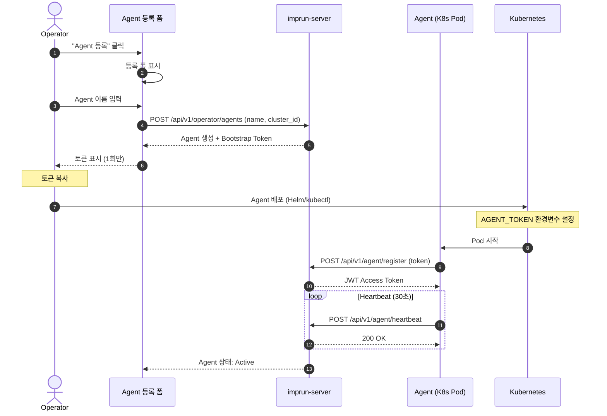
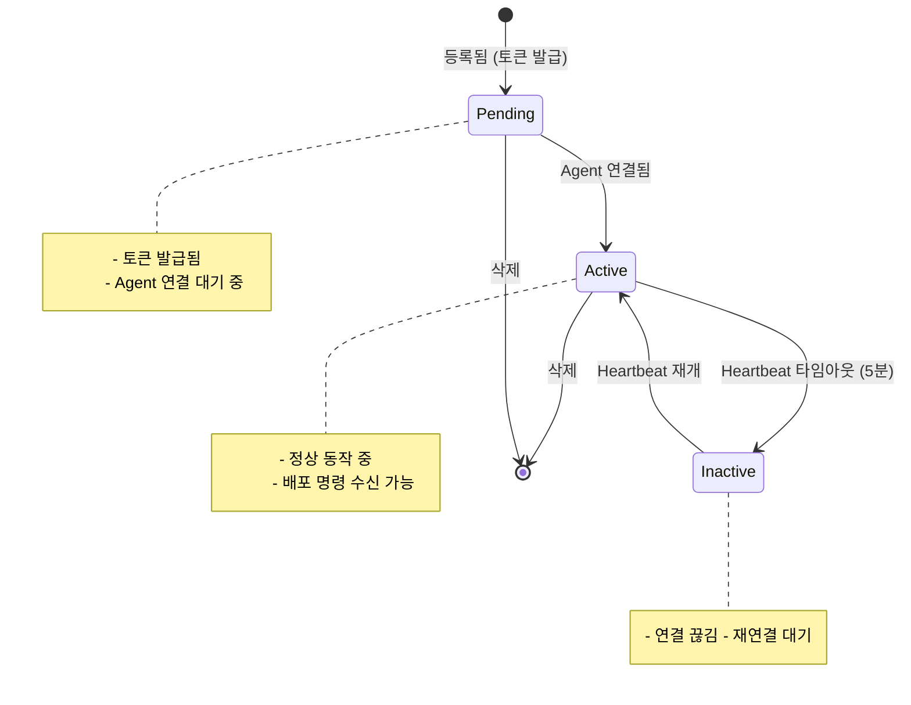
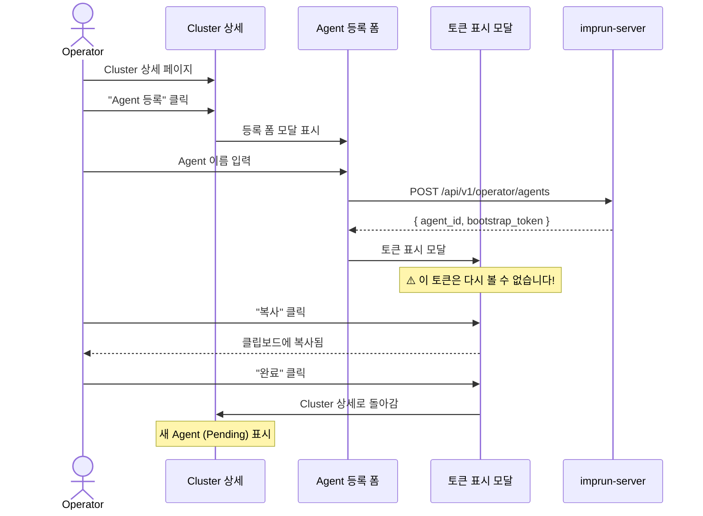

# EPIC-014: Agent 관리

## 개요

| 항목 | 내용 |
|------|------|
| **Epic ID** | EPIC-014 |
| **제목** | Agent 관리 |
| **우선순위** | P0 |
| **예상 기간** | 1주 |
| **상태** | ✅ 완료 |
| **의존성** | EPIC-013 (Cluster 관리) |
| **GitHub Issue** | [#7](https://github.com/imprun/imp-gateway/issues/7) |

## 목표

Operator가 클러스터에 Agent를 등록하고, Agent의 상태를 모니터링할 수 있다.

## 배경

Agent는 Kubernetes 클러스터 내에서 실행되며, imprun-server로부터 배포 명령을 받아 Kong Gateway / Envoy Gateway 리소스를 관리한다. Agent는 JWT 기반으로 인증되며, 주기적으로 heartbeat를 전송한다.

> **핵심 흐름**: Operator가 Agent 등록 → 토큰 발급 → Agent가 토큰으로 서버 연결 → 배포 명령 수신/실행

---

## 도메인 모델

### Agent 등록 흐름



### Agent 상태 관리



### Agent와 다른 엔티티 관계

```
┌─────────────────────────────────────────────────────────────────────┐
│                            Cluster                                   │
│                      (kr-prod-cluster)                              │
└─────────────────────────────────────────────────────────────────────┘
                                │
                    ┌───────────┴───────────┐
                    ▼                       ▼
            ┌─────────────────┐     ┌─────────────────┐
            │     Agent 1     │     │     Agent 2     │
            │ (agent-prod-01) │     │ (agent-prod-02) │
            └─────────────────┘     └─────────────────┘
                    │                       │
                    ▼                       ▼
            ┌─────────────────────────────────────────┐
            │        Kong Gateway Resources           │
            │  - Services, Routes, Plugins            │
            │  - Upstreams, Consumers                 │
            └─────────────────────────────────────────┘
```

---

## 사용자 흐름

### Agent 등록 및 토큰 발급



---

## 범위

### 포함
- Agent 등록 및 토큰 발급
- Agent 목록 표시 (Cluster 상세 내)
- Agent 상세 페이지
- Agent 상태 모니터링 (Active/Inactive/Pending)
- Agent 삭제
- 토큰 재발급

### 제외
- Agent 자동 스케일링 (Post-MVP)
- Agent 로그 조회 (Post-MVP)
- Agent 설정 원격 변경 (Post-MVP)

---

## 기술 요구사항

### 백엔드 API

```
GET    /api/v1/operator/clusters/:clusterId/agents  # 클러스터의 Agent 목록
POST   /api/v1/operator/agents                       # Agent 등록 (토큰 발급)
GET    /api/v1/operator/agents/:id                   # Agent 상세
DELETE /api/v1/operator/agents/:id                   # Agent 삭제
POST   /api/v1/operator/agents/:id/regenerate-token  # 토큰 재발급
```

### 데이터 모델

```typescript
type AgentStatus = 'pending' | 'active' | 'inactive';

interface Agent {
  id: string;
  cluster_id: string;
  operator_tenant_id: string;
  name: string;
  status: AgentStatus;
  version?: string;            // Agent 버전
  last_heartbeat?: string;     // 마지막 heartbeat 시간
  ip_address?: string;         // Agent IP
  metadata?: Record<string, string>;
  created_at: string;
  updated_at: string;
}

interface AgentRegistration {
  agent_id: string;
  bootstrap_token: string;     // 1회성 토큰 (화면에만 표시)
}
```

### FSD 구조

```
web/src/
├── entities/agent/
│   ├── index.ts
│   ├── model/
│   │   └── types.ts
│   ├── api/
│   │   └── agent-api.ts
│   └── ui/
│       ├── agent-status-badge.tsx
│       ├── agent-card.tsx
│       └── agent-list-item.tsx
│
├── features/agent/
│   ├── index.ts
│   ├── register/
│   │   └── ui/
│   │       ├── register-agent-dialog.tsx
│   │       └── token-display-modal.tsx   # 토큰 표시 (복사 기능)
│   ├── regenerate-token/
│   │   └── ui/
│   │       └── regenerate-token-dialog.tsx
│   └── delete/
│       └── ui/
│           └── delete-agent-dialog.tsx
│
├── pages/operator/
│   └── agent/                    # 🆕 Domain Layer
│       ├── index.ts
│       └── agent-detail-page.tsx # Agent 상세 페이지
│
└── app/operator/
    └── agents/
        └── [id]/
            └── page.tsx
```

---

## 스토리 분해

| Story | 제목 | 예상 | 우선순위 |
|-------|------|------|----------|
| 14.1 | Agent 엔티티 및 API 훅 구현 | 0.5일 | P0 |
| 14.2 | Agent 등록 다이얼로그 (토큰 발급) | 1일 | P0 |
| 14.3 | 토큰 표시 모달 (설치 스크립트 포함) | 1일 | P0 |
| 14.4 | Cluster 상세 내 Agent 목록 표시 | 1일 | P0 |
| 14.5 | Agent 상세 페이지 | 1일 | P0 |
| 14.6 | Agent 삭제 기능 | 0.5일 | P0 |
| 14.7 | 토큰 재발급 기능 | 0.5일 | P1 |

---

## 수용 기준

### 기능 요구사항
- [ ] Cluster 상세에서 Agent를 등록할 수 있다
- [ ] Agent 등록 시 Bootstrap Token이 발급된다
- [ ] 토큰은 화면에 1회만 표시되고, 복사할 수 있다
- [ ] Agent 목록에서 상태(Active/Inactive/Pending)를 확인할 수 있다
- [ ] Agent를 삭제할 수 있다
- [ ] 토큰을 재발급할 수 있다

### 비기능 요구사항
- [ ] Agent 상태가 실시간으로 업데이트된다
- [ ] 토큰 복사 시 성공 피드백 표시
- [ ] 삭제 전 확인 다이얼로그

---

## UI/UX 가이드

### Agent 등록 다이얼로그

```
┌─────────────────────────────────────────────────────────────────────────────┐
│  Agent 등록                                                          [X]   │
├─────────────────────────────────────────────────────────────────────────────┤
│                                                                             │
│  클러스터: kr-prod-cluster                                                  │
│                                                                             │
│  Agent 이름 *                                                               │
│  ┌─────────────────────────────────────────────────────────────────────┐   │
│  │ agent-prod-01                                                        │   │
│  └─────────────────────────────────────────────────────────────────────┘   │
│  ⓘ 클러스터 내에서 고유한 이름이어야 합니다                                │
│                                                                             │
├─────────────────────────────────────────────────────────────────────────────┤
│                                                   [ 취소 ]  [ 등록 ]       │
└─────────────────────────────────────────────────────────────────────────────┘
```

### 토큰 표시 모달 (설치 스크립트 포함)

```
┌─────────────────────────────────────────────────────────────────────────────┐
│  🔑 Agent 토큰 발급 완료                                                    │
├─────────────────────────────────────────────────────────────────────────────┤
│                                                                             │
│  ⚠️  이 토큰은 다시 볼 수 없습니다. 지금 복사해주세요!                       │
│                                                                             │
│  ┌─────────────────────────────────────────────────────────────────────┐   │
│  │ eyJhbGciOiJIUzI1NiIsInR5cCI6IkpXVCJ9.eyJhZ2VudF9pZCI6ImFnZW50LXBy │   │
│  │ b2QtMDEiLCJjbHVzdGVyX2lkIjoia3ItcHJvZC1jbHVzdGVyIiwidGVuYW50X2lk  │   │
│  │ IjoiZGVmYXVsdCIsImlhdCI6MTcwNjAwMDAwMH0.xxxxxxxxxxxxxxxxxxxxx...   │   │
│  └─────────────────────────────────────────────────────────────────────┘   │
│                                                                             │
│                                              [ 📋 토큰 복사 ]               │
│                                                                             │
│  ═══════════════════════════════════════════════════════════════════════   │
│                                                                             │
│  설치 방법 선택:                                                            │
│                                                                             │
│  ┌─────────────┐ ┌─────────────┐ ┌─────────────┐                           │
│  │▣ Kubernetes │ │   Docker    │ │   Native    │                           │
│  └─────────────┘ └─────────────┘ └─────────────┘                           │
│                                                                             │
│  ┌─────────────────────────────────────────────────────────────────────┐   │
│  │ # Helm으로 설치                                               [복사] │   │
│  │ helm repo add impgateway https://charts.impgateway.io               │   │
│  │ helm repo update                                                     │   │
│  │                                                                      │   │
│  │ helm install imp-agent impgateway/agent \                           │   │
│  │   --namespace impgateway-system \                                   │   │
│  │   --create-namespace \                                              │   │
│  │   --set agent.token="eyJhbGciOi..." \                              │   │
│  │   --set agent.serverUrl="https://api.impgateway.io"                │   │
│  └─────────────────────────────────────────────────────────────────────┘   │
│                                                                             │
├─────────────────────────────────────────────────────────────────────────────┤
│                                                              [ 완료 ]       │
└─────────────────────────────────────────────────────────────────────────────┘
```

#### Kubernetes 설치 (Helm)

```bash
# Helm으로 설치
helm repo add impgateway https://charts.impgateway.io
helm repo update

helm install imp-agent impgateway/agent \
  --namespace impgateway-system \
  --create-namespace \
  --set agent.token="<YOUR_TOKEN>" \
  --set agent.serverUrl="https://api.impgateway.io"
```

#### Docker 설치

```bash
# Docker로 실행
docker run -d \
  --name imp-agent \
  --restart unless-stopped \
  -e AGENT_TOKEN="<YOUR_TOKEN>" \
  -e SERVER_URL="https://api.impgateway.io" \
  impgateway/agent:latest
```

#### Native 설치 (Binary)

```bash
# 바이너리 다운로드
curl -sSL https://get.impgateway.io/agent | sh

# 환경변수 설정 후 실행
export AGENT_TOKEN="<YOUR_TOKEN>"
export SERVER_URL="https://api.impgateway.io"

# 서비스로 실행
sudo systemctl enable imp-agent
sudo systemctl start imp-agent
```

### Cluster 상세 내 Agent 목록 섹션

```
┌─ 연결된 Agents (3) ──────────────────────────────────── [ Agent 등록 ] ─┐
│                                                                          │
│  ┌────────────────────────────────────────────────────────────────────┐ │
│  │ ● agent-prod-01                                           Active   │ │
│  │   Version: 1.2.0 | IP: 10.0.1.15 | Last: 2 min ago                │ │
│  │                                                    [상세] [삭제]   │ │
│  └────────────────────────────────────────────────────────────────────┘ │
│                                                                          │
│  ┌────────────────────────────────────────────────────────────────────┐ │
│  │ ● agent-prod-02                                           Active   │ │
│  │   Version: 1.2.0 | IP: 10.0.1.16 | Last: 1 min ago                │ │
│  │                                                    [상세] [삭제]   │ │
│  └────────────────────────────────────────────────────────────────────┘ │
│                                                                          │
│  ┌────────────────────────────────────────────────────────────────────┐ │
│  │ ○ agent-prod-03                                          Pending   │ │
│  │   등록됨: 5 min ago | 연결 대기 중...                              │ │
│  │                                           [토큰 재발급] [삭제]     │ │
│  └────────────────────────────────────────────────────────────────────┘ │
│                                                                          │
└──────────────────────────────────────────────────────────────────────────┘
```

### Agent 상세 페이지

```
┌─────────────────────────────────────────────────────────────────────────────┐
│  ← Cluster     agent-prod-01                                                │
│                                                                             │
│  ┌─────────────────────────────────────────────────────────────────────┐    │
│  │  🤖                                                                  │    │
│  │  agent-prod-01                                                      │    │
│  │                                                                      │    │
│  │  ┌─────────────┐   Cluster: kr-prod-cluster                        │    │
│  │  │  ● Active   │   IP: 10.0.1.15                                   │    │
│  │  └─────────────┘   Version: 1.2.0                                  │    │
│  │                    Last Heartbeat: 2 min ago                       │    │
│  │                                                                      │    │
│  │                       [ 토큰 재발급 ]  [ 삭제 ]                     │    │
│  └─────────────────────────────────────────────────────────────────────┘    │
│                                                                             │
│  ═══════════════════════════════════════════════════════════════════════   │
│                                                                             │
│  ┌─ 상세 정보 ──────────────────────────────────────────────────────────┐   │
│  │                                                                       │   │
│  │  Agent ID: agent-prod-01-xxxx-xxxx                                   │   │
│  │  생성일: 2025-01-15 10:30:00                                         │   │
│  │  최초 연결: 2025-01-15 10:32:15                                      │   │
│  │                                                                       │   │
│  │  메타데이터:                                                          │   │
│  │  ┌────────────────────────────────────────────────────────────────┐  │   │
│  │  │ node: worker-1 | namespace: impgateway-system                  │  │   │
│  │  └────────────────────────────────────────────────────────────────┘  │   │
│  │                                                                       │   │
│  └───────────────────────────────────────────────────────────────────────┘   │
│                                                                             │
│  ┌─ Heartbeat 이력 (최근 10건) ─────────────────────────────────────────┐   │
│  │                                                                       │   │
│  │  ● 2025-01-20 14:30:00  Success                                      │   │
│  │  ● 2025-01-20 14:29:30  Success                                      │   │
│  │  ● 2025-01-20 14:29:00  Success                                      │   │
│  │  ● 2025-01-20 14:28:30  Success                                      │   │
│  │  ● 2025-01-20 14:28:00  Success                                      │   │
│  │  ...                                                                  │   │
│  │                                                                       │   │
│  └───────────────────────────────────────────────────────────────────────┘   │
│                                                                             │
└─────────────────────────────────────────────────────────────────────────────┘
```

---

## 참조

### 패턴 참조 파일
- `web/src/features/agent/register/` - 기존 Agent 등록 패턴
- `web/src/entities/cluster/` - 엔티티 구조

### 백엔드 API
- `services/imprun-server/internal/api/v1/operator/agents.go`
- `services/imprun-server/internal/api/v1/agent/` - Agent 인증 API

---

## 변경 이력

| 날짜 | 버전 | 변경 내용 | 작성자 |
|------|------|----------|--------|
| 2025-11-27 | 1.0 | 초기 작성 - Operator 포털 Agent 관리 EPIC | Claude |
| 2025-11-27 | 1.1 | Story 14.3에 K8s/Docker/Native 설치 스크립트 추가 | Claude |
| 2025-11-27 | 1.2 | 시퀀스 다이어그램 API 경로를 /api/v1/ 형식으로 통일 | Claude |
