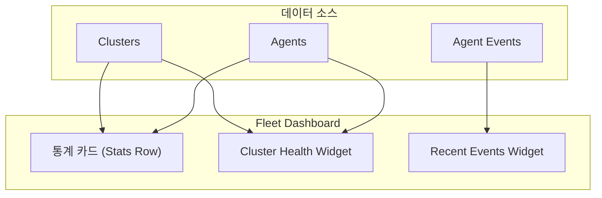

# EPIC-015: Operator Portal - Fleet Dashboard

## 개요

| 항목 | 내용 |
|------|------|
| **Epic ID** | EPIC-015 |
| **제목** | Operator Portal - Fleet Dashboard |
| **우선순위** | P1 |
| **예상 기간** | 0.5주 |
| **상태** | ✅ 완료 |
| **의존성** | EPIC-013 (Cluster), EPIC-014 (Agent) |

## 목표

**Operator Portal**의 메인 페이지로, 전체 클러스터/에이전트 현황을 한눈에 파악할 수 있는 Fleet Dashboard를 제공한다.

## 배경

Operator 포털의 메인 페이지로, 모든 클러스터와 에이전트의 상태를 요약하여 보여준다. 문제가 발생한 리소스를 빠르게 식별하고 조치할 수 있도록 한다.

---

## 도메인 모델

### Dashboard 데이터 구조



---

## 범위

### 포함
- 전체 클러스터/에이전트 요약 카드 (4개)
- Cluster/Agent 상태 Health 표시
- 최근 Agent 이벤트 목록

### 제외
- 배포(Deployment) 관련 통계 (Provider Portal에서 관리)
- 실시간 메트릭 차트 (Post-MVP)
- 알림 설정 (Post-MVP)

---

## 기술 요구사항

### 라우팅

| URL | 설명 |
|-----|------|
| `/operator` | Fleet Dashboard (Operator Portal 메인 페이지) |

### 백엔드 API

```
GET /api/v1/operator/dashboard/stats   # 통합 대시보드 데이터
```

### 데이터 모델

```typescript
// Operator Dashboard 타입
// 파일: entities/operator-dashboard/model/types.ts

interface DashboardAgentEvent {
  id: string;
  agent_id: string;
  type: string;           // "connected" | "disconnected"
  timestamp: string;      // ISO 8601 format
  ip_address?: string;
}

interface OperatorDashboardStats {
  total_clusters: number;
  active_clusters: number;
  total_agents: number;
  connected_agents: number;
  disconnected_agents: number;
  recent_events: DashboardAgentEvent[];
}
```

### FSD 구조

```
web/src/
├── entities/operator-dashboard/        # Operator Portal Dashboard 엔티티
│   ├── index.ts
│   ├── model/
│   │   └── types.ts                    # OperatorDashboardStats, DashboardAgentEvent
│   └── api/
│       └── dashboard-api.ts            # useOperatorDashboardStats hook
│
├── widgets/operator/dashboard/
│   ├── index.ts
│   ├── stats-row.tsx                   # 4개 통계 카드 위젯
│   ├── cluster-health-widget.tsx       # Cluster/Agent 상태 Progress bar
│   └── recent-events-widget.tsx        # 최근 Agent 이벤트 목록
│
├── pages/operator/
│   └── dashboard-page.tsx              # Fleet Dashboard 페이지 컴포넌트
│
└── app/operator/
    └── page.tsx                        # /operator (Fleet Dashboard 진입점)
```

---

## 스토리 분해

| Story | 제목 | 예상 | 우선순위 | 상태 |
|-------|------|------|----------|------|
| 15.1 | Dashboard API 및 타입 정의 | 0.5일 | P1 | ✅ |
| 15.2 | Stats Row 위젯 (4개 카드) | 0.5일 | P1 | ✅ |
| 15.3 | Cluster Health 위젯 | 0.5일 | P1 | ✅ |
| 15.4 | Recent Events 위젯 | 0.5일 | P1 | ✅ |

---

## 수용 기준

### 기능 요구사항
- [x] 전체 클러스터/에이전트 수와 상태별 개수를 확인할 수 있다
- [x] Cluster/Agent 상태를 Progress bar로 시각화한다
- [x] 최근 Agent 이벤트 목록을 확인할 수 있다
- [x] 연결 해제된 Agent가 warning 색상으로 표시된다

### 비기능 요구사항
- [x] TanStack Query로 데이터 캐싱 및 refetch
- [x] 로딩 상태 표시

---

## UI/UX 가이드

### Operator Portal - Fleet Dashboard (현재 구현)

```
┌─────────────────────────────────────────────────────────────────────────────┐
│  Fleet Dashboard                                                             │
├─────────────────────────────────────────────────────────────────────────────┤
│                                                                             │
│  ┌─────────────┐ ┌─────────────┐ ┌─────────────┐ ┌─────────────┐           │
│  │ Total       │ │ Total       │ │ Connected   │ │ Disconnected│           │
│  │ Clusters    │ │ Agents      │ │ Agents      │ │ Agents      │           │
│  │     3       │ │     8       │ │     6       │ │     2       │           │
│  └─────────────┘ └─────────────┘ └─────────────┘ └─────────────┘           │
│                                                                             │
│  ┌─ Cluster & Agent Health ─────────────────────────────────────────────┐   │
│  │                                                                       │   │
│  │  Cluster Status                                                      │   │
│  │  ████████████████████████░░░░░░░░░░  2/3 Active                      │   │
│  │                                                                       │   │
│  │  Agent Status                                                        │   │
│  │  ██████████████████████████████░░░░  6/8 Connected                   │   │
│  │                                                                       │   │
│  │  Summary: 2 inactive clusters, 2 disconnected agents                 │   │
│  └───────────────────────────────────────────────────────────────────────┘   │
│                                                                             │
│  ┌─ Recent Events ──────────────────────────────────────────────────────┐   │
│  │                                                                       │   │
│  │  ● agent-prod-01       connected      192.168.1.10     2 minutes ago │   │
│  │  ● agent-staging-02    connected      192.168.1.11     5 minutes ago │   │
│  │  ○ agent-dev-01        disconnected   192.168.1.12    10 minutes ago │   │
│  │  ● agent-prod-02       connected      192.168.1.13    15 minutes ago │   │
│  │                                                                       │   │
│  └───────────────────────────────────────────────────────────────────────┘   │
│                                                                             │
└─────────────────────────────────────────────────────────────────────────────┘
```

### UI 컴포넌트 설명

1. **Stats Row**: 4개의 통계 카드
   - Total Clusters: 전체 클러스터 수
   - Total Agents: 전체 에이전트 수
   - Connected Agents: 연결된 에이전트 수 (초록색)
   - Disconnected Agents: 연결 해제된 에이전트 수 (경고색)

2. **Cluster Health Widget**: Progress bar 형태
   - Cluster 상태 (Active/Total)
   - Agent 상태 (Connected/Total)
   - 상태 요약 메시지

3. **Recent Events Widget**: Agent 이벤트 목록
   - Agent ID, 이벤트 타입, IP 주소, 상대 시간 표시
   - Connected: 초록색 dot
   - Disconnected: 빨간색 dot

---

## 참조

### 패턴 참조 파일
- [stats-row.tsx](web/src/widgets/operator/dashboard/stats-row.tsx) - 통계 카드
- [cluster-health-widget.tsx](web/src/widgets/operator/dashboard/cluster-health-widget.tsx) - Health Widget
- [recent-events-widget.tsx](web/src/widgets/operator/dashboard/recent-events-widget.tsx) - Events Widget
- [dashboard-page.tsx](web/src/pages/operator/dashboard-page.tsx) - 대시보드 페이지

### 백엔드 API
- [dashboard.go](services/imprun-server/internal/api/v1/operator/dashboard.go) - Dashboard Handler

---

## 변경 이력

| 날짜 | 버전 | 변경 내용 | 작성자 |
|------|------|----------|--------|
| 2025-11-27 | 1.0 | 초기 작성 - Operator Fleet Dashboard EPIC | Claude |
| 2025-11-27 | 1.1 | 포털별 대시보드 구분을 위해 fleet-dashboard로 네이밍 변경 | Claude |
| 2025-11-28 | 2.0 | 실제 구현에 맞게 문서 전면 재작성 | Claude |
| 2025-11-28 | 2.1 | Provider Portal 스타일로 대시보드 리디자인 완료 (Recharts 파이 차트, Avatar 기반 이벤트 로그) | Claude |
