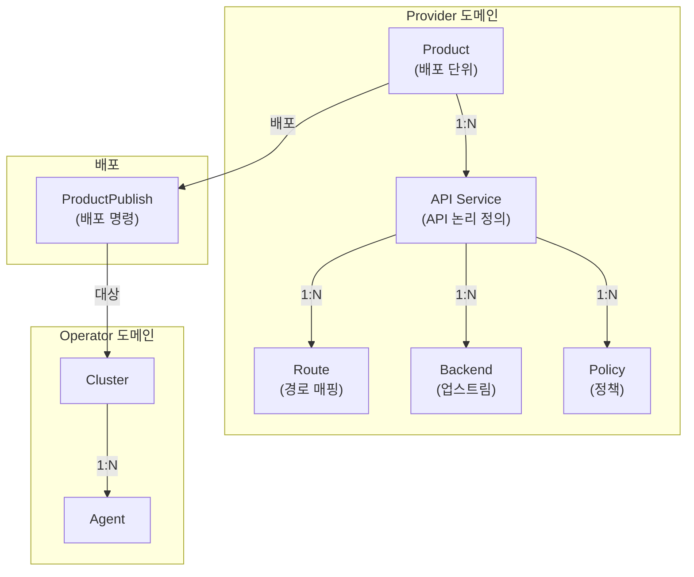
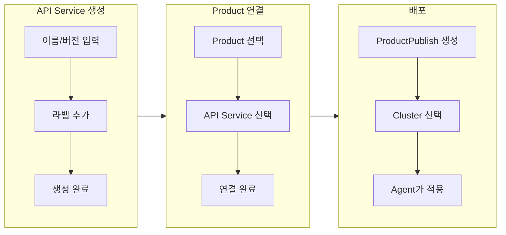
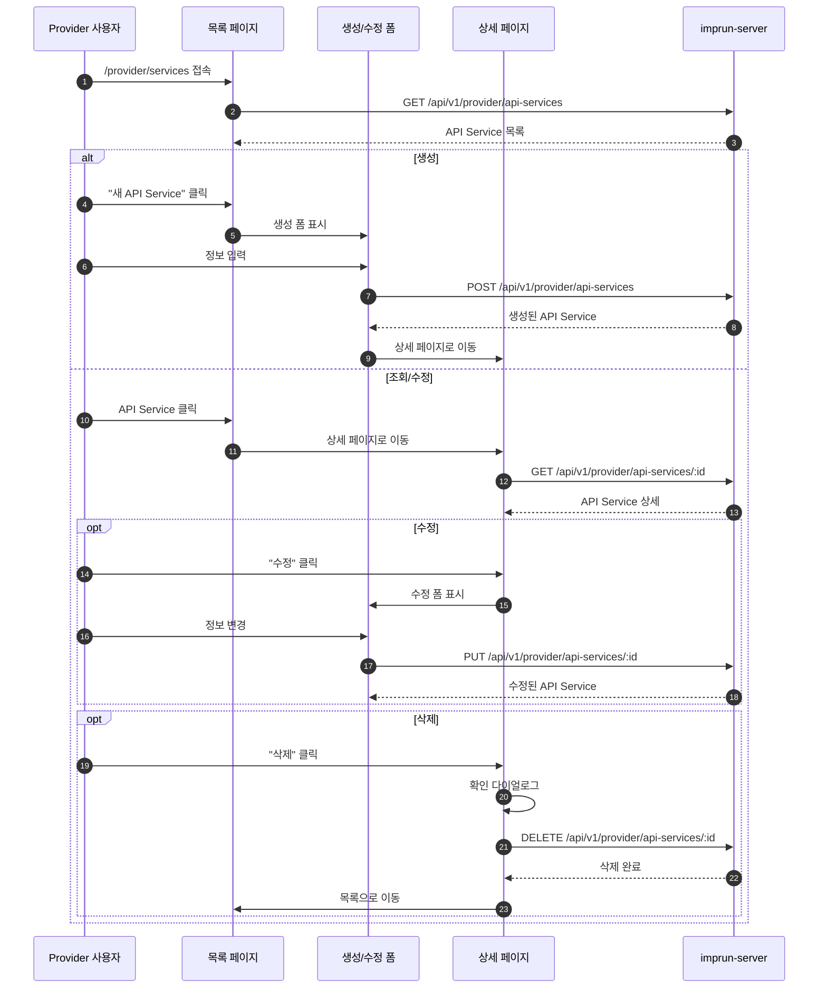

# EPIC-016: API Service 관리

## 개요

| 항목 | 내용 |
|------|------|
| **Epic ID** | EPIC-016 |
| **제목** | API Service 관리 |
| **우선순위** | P0 |
| **예상 기간** | 1주 |
| **상태** | ✅ 완료 |
| **의존성** | EPIC-012 (포털 레이아웃) |
| **GitHub Issue** | [#9](https://github.com/imprun/imp-gateway/issues/9) |

## 목표

Provider가 API Service를 정의하고 관리할 수 있다.

## 배경

API Service는 실제 API의 논리적 정의이다. v2 아키텍처에서 API Service는 `gateway_id`가 제거되어 독립적인 청사진 역할을 한다. API Service는 Product에 연결되어 배포 단위의 일부가 된다.

### v2 아키텍처 변경 사항
- API Service는 독립적인 논리 계층 리소스
- `gateway_id` 제거 → ProductPublish에서 Gateway 선택
- Route, Backend, Policy는 API Service에 연결

## 도메인 모델

### API Service 위치



### 데이터 흐름



## 사용자 흐름

### API Service CRUD 흐름



## 범위

### 포함
- API Service CRUD (생성, 조회, 수정, 삭제)
- API Service 목록 페이지 (검색, 필터, 페이지네이션)
- API Service 상세 페이지
- API Service 상태 표시 (active/inactive)

### 제외
- Product ↔ API Service 연결 UI (EPIC-017 Product 관리에서 처리)
- Route/Backend/Policy CRUD (EPIC-020에서 처리, 본 EPIC에서는 목록 표시만)
- OpenAPI 스펙 임포트 (Post-MVP)
- API 문서 뷰어 (Post-MVP)

## 기술 요구사항

### 백엔드 API (이미 구현됨)

```
GET    /api/v1/provider/api-services          # 목록 조회
POST   /api/v1/provider/api-services          # 생성
GET    /api/v1/provider/api-services/:id      # 상세 조회
PUT    /api/v1/provider/api-services/:id      # 수정
DELETE /api/v1/provider/api-services/:id      # 삭제
```

### 데이터 모델

```typescript
interface APIService {
  id: string;
  tenant_id: string;
  name: string;
  version?: string;
  description?: string;
  labels?: Record<string, string>;
  status: 'active' | 'inactive';
  created_at: string;
  updated_at: string;
}
```

### FSD 구조

```
web/src/
├── entities/service/
│   ├── index.ts
│   ├── model/
│   │   └── types.ts              # APIService 타입
│   ├── api/
│   │   └── service-api.ts        # TanStack Query hooks
│   └── ui/
│       ├── service-card.tsx      # 목록용 카드
│       └── service-status-badge.tsx
├── features/service/
│   ├── index.ts
│   ├── create/
│   │   ├── ui/
│   │   │   └── create-service-form.tsx
│   │   └── model/
│   │       └── create-service-schema.ts  # zod schema
│   ├── update/
│   │   └── ui/
│   │       └── update-service-form.tsx
│   └── delete/
│       └── ui/
│           └── delete-service-dialog.tsx
├── pages/provider/
│   └── service/                   # 도메인별 하위 디렉토리
│       ├── index.ts
│       ├── services-page.tsx      # 목록 페이지
│       └── service-detail-page.tsx # 상세 페이지
└── app/provider/services/
    ├── page.tsx                   # 라우트 진입점
    └── [id]/
        └── page.tsx
```

## 스토리 분해

| Story | 제목 | 예상 | 우선순위 |
|-------|------|------|----------|
| 16.1 | API Service 엔티티 및 API 훅 구현 | 0.5일 | P0 |
| 16.2 | API Service 목록 페이지 구현 | 1일 | P0 |
| 16.3 | API Service 생성 폼 구현 | 1일 | P0 |
| 16.4 | API Service 상세 페이지 구현 (Routes/Backends/Policies 목록 읽기 전용) | 1일 | P0 |
| 16.5 | API Service 수정/삭제 기능 구현 | 0.5일 | P0 |

## 수용 기준

### 기능 요구사항
- [ ] API Service 목록을 조회할 수 있다
- [ ] 새 API Service를 생성할 수 있다
- [ ] API Service 상세 정보를 확인할 수 있다
- [ ] API Service를 수정할 수 있다
- [ ] API Service를 삭제할 수 있다
- [ ] 상세 페이지에서 연결된 Routes/Backends/Policies 목록을 확인할 수 있다 (읽기 전용)

### 비기능 요구사항
- [ ] 목록 조회 시 무한 스크롤 또는 페이지네이션 지원
- [ ] 폼 유효성 검증 (클라이언트 + 서버)
- [ ] 로딩/에러 상태 표시
- [ ] 삭제 시 확인 다이얼로그

## UI/UX 가이드

### 목록 페이지
- 테이블 레이아웃
- 검색 (이름, 설명)
- 상태 필터 (active/inactive/all)
- 빠른 액션: 상세 보기, 삭제

### 상세 페이지 (Kong Gateway 스타일)

```
┌─────────────────────────────────────────────────────────────┐
│ API Service: Payment API v1.0                      [수정]   │
├─────────────────────────────────────────────────────────────┤
│ 기본 정보                                                   │
│ ├─ 상태: ● Active                                          │
│ ├─ 버전: 1.0                                               │
│ ├─ 설명: 결제 처리 API                                      │
│ └─ 라벨: env=prod, team=payment                            │
├─────────────────────────────────────────────────────────────┤
│ Routes (3)                                      [+ 추가]    │
│ ┌─────────┬────────────────┬──────────────────┐            │
│ │ Method  │ Path           │ Backend          │            │
│ ├─────────┼────────────────┼──────────────────┤            │
│ │ GET     │ /payments      │ payment-backend  │            │
│ │ POST    │ /payments      │ payment-backend  │            │
│ │ GET     │ /payments/:id  │ payment-backend  │            │
│ └─────────┴────────────────┴──────────────────┘            │
├─────────────────────────────────────────────────────────────┤
│ Backends (1)                                    [+ 추가]    │
│ ┌────────────────────┬─────────────────────────────────┐   │
│ │ Name               │ Endpoint                        │   │
│ ├────────────────────┼─────────────────────────────────┤   │
│ │ payment-backend    │ https://api.internal:8080       │   │
│ └────────────────────┴─────────────────────────────────┘   │
├─────────────────────────────────────────────────────────────┤
│ Policies (2)                                    [+ 추가]    │
│ ┌────────────────────┬─────────────────────────────────┐   │
│ │ Type               │ Config                          │   │
│ ├────────────────────┼─────────────────────────────────┤   │
│ │ rate-limit         │ 100 req/min                     │   │
│ │ auth               │ jwt-validation                  │   │
│ └────────────────────┴─────────────────────────────────┘   │
└─────────────────────────────────────────────────────────────┘
```

**에픽별 책임:**
- **EPIC-017**: 기본 정보 + Routes/Backends/Policies **목록 표시** (읽기 전용)
- **EPIC-020**: Routes/Backends/Policies **CRUD** ([+ 추가] 버튼, 수정, 삭제)

### 생성/수정 폼

```
┌─────────────────────────────────────────────────────────────┐
│ 새 API Service 생성                                         │
├─────────────────────────────────────────────────────────────┤
│                                                             │
│  이름 *                                                     │
│  ┌─────────────────────────────────────────────────────┐   │
│  │ Payment API                                          │   │
│  └─────────────────────────────────────────────────────┘   │
│                                                             │
│  버전                                                       │
│  ┌─────────────────────────────────────────────────────┐   │
│  │ 1.0.0                                                │   │
│  └─────────────────────────────────────────────────────┘   │
│                                                             │
│  설명                                                       │
│  ┌─────────────────────────────────────────────────────┐   │
│  │ 결제 처리를 위한 REST API                            │   │
│  │                                                      │   │
│  └─────────────────────────────────────────────────────┘   │
│                                                             │
│  라벨                                                       │
│  ┌──────────────────┐  ┌──────────────────┐  [+ 추가]      │
│  │ env: prod    [x] │  │ team: payment [x]│               │
│  └──────────────────┘  └──────────────────┘               │
│                                                             │
│  상태                                                       │
│  ○ Active   ● Inactive                                     │
│                                                             │
├─────────────────────────────────────────────────────────────┤
│                              [취소]  [생성]                 │
└─────────────────────────────────────────────────────────────┘
```

**폼 필드:**
| 필드 | 타입 | 필수 | 설명 |
|------|------|------|------|
| 이름 | text | ✅ | API Service 이름 (unique within tenant) |
| 버전 | text | - | 버전 문자열 (예: 1.0.0) |
| 설명 | textarea | - | API Service 설명 |
| 라벨 | key-value | - | 키-값 쌍 (동적 추가/삭제) |
| 상태 | radio | - | active/inactive (기본: inactive) |

**유효성 검증:**
- 이름: 필수, 2-100자, 영문/숫자/하이픈만
- 버전: 선택, semver 형식 권장
- 라벨 키: 영문/숫자/언더스코어만

## 참조

### 패턴 참조 파일
- `web/src/entities/cluster/` - 엔티티 구조 패턴
- `web/src/features/cluster/` - 피처 구조 패턴
- `web/src/pages/operator/clusters-page.tsx` - 목록 페이지 패턴

### 백엔드 API
- `services/imprun-server/internal/api/v1/provider/apiservices.go`

---

## 변경 이력

| 날짜 | 버전 | 변경 내용 | 작성자 |
|------|------|----------|--------|
| 2025-01-XX | 1.0 | 초기 작성 | - |
| 2025-11-27 | 1.1 | 도메인 모델 및 사용자 흐름 다이어그램 추가 | - |
| 2025-11-27 | 1.2 | 범위 명확화: Product 연결 UI는 EPIC-017로 이동 | - |
| 2025-11-27 | 1.3 | 상세 페이지 UI 설계 추가 (Kong Gateway 스타일) | - |
| 2025-11-27 | 1.4 | 생성/수정 폼 UI 설계 추가 | - |
| 2025-11-27 | 1.5 | FSD 구조: pages/provider/service 도메인 계층 추가 | - |
| 2025-11-27 | 1.6 | 스토리 번호 16.x로 수정, EPIC 참조 오류 수정 | Claude |
