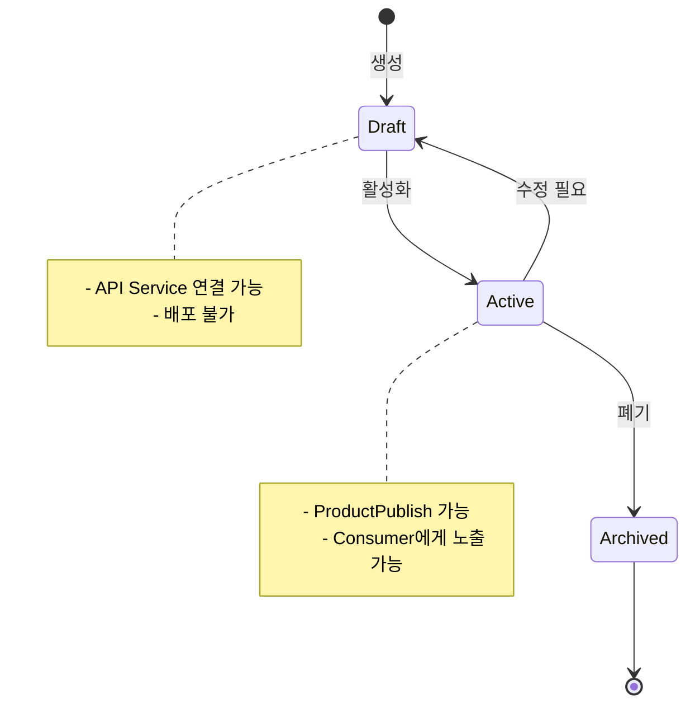
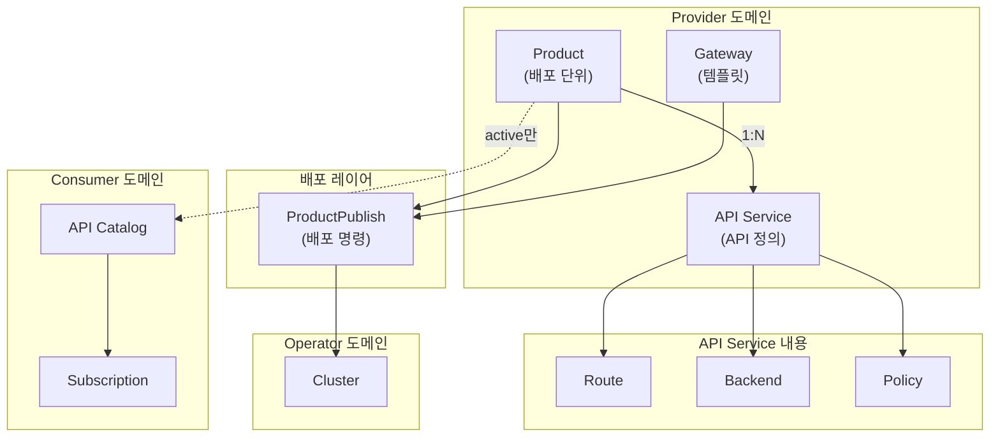
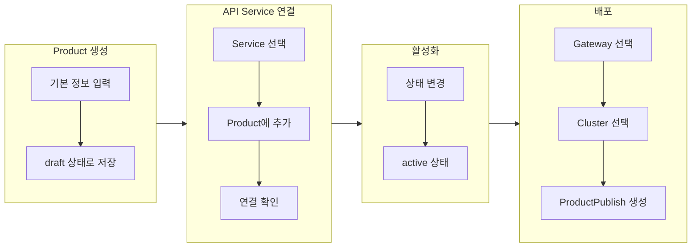
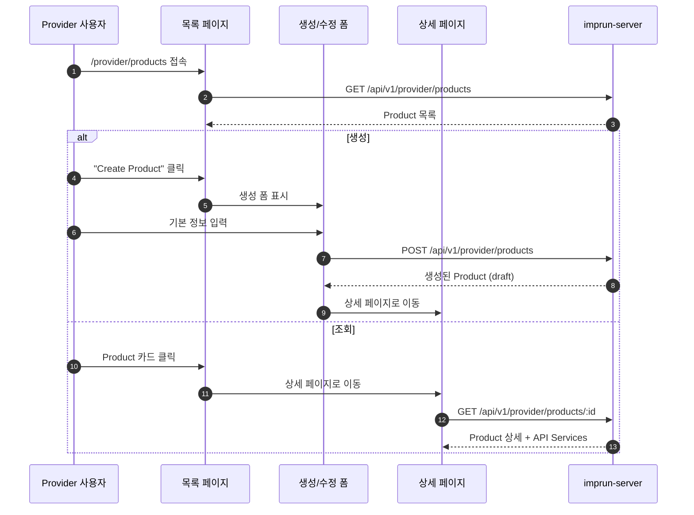
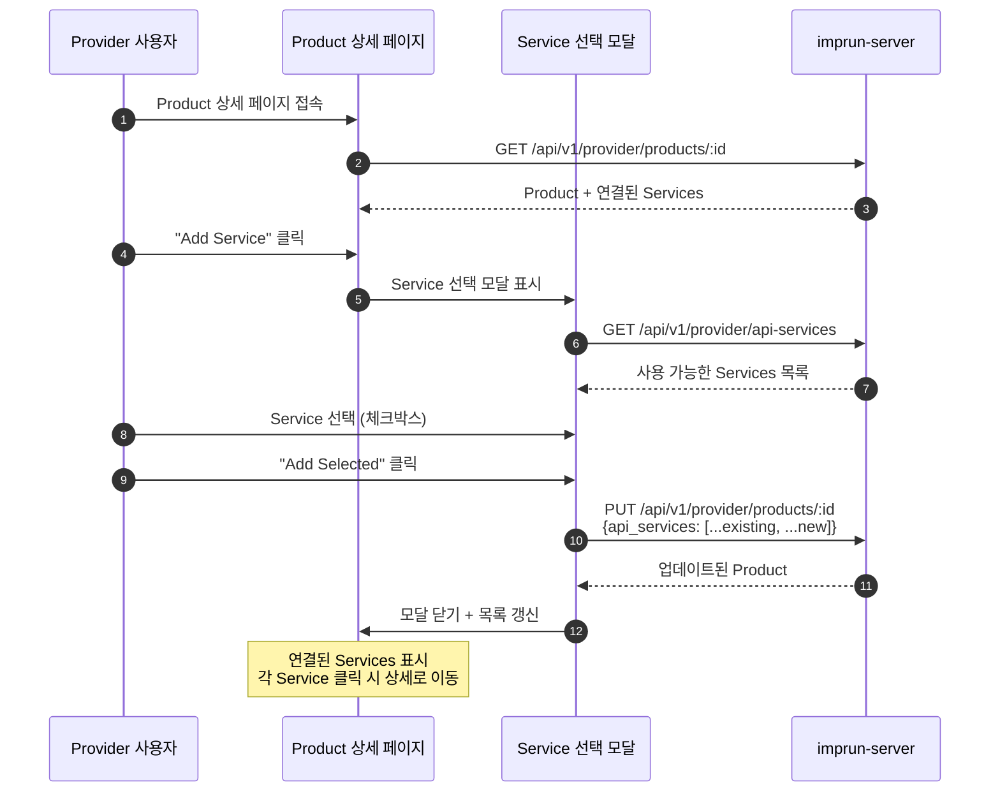
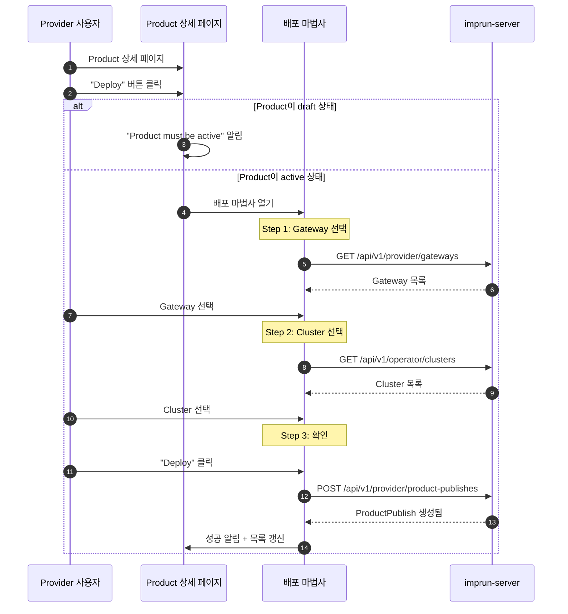

# EPIC-017: Product 관리

## 개요

| 항목 | 내용 |
|------|------|
| **Epic ID** | EPIC-017 |
| **제목** | Product 관리 |
| **우선순위** | P0 (핵심) |
| **예상 기간** | 1.5주 |
| **상태** | 🔲 미시작 |
| **의존성** | EPIC-016 (API Service 관리) |
| **GitHub Issue** | [#10](https://github.com/imprun/imp-gateway/issues/10) |

## 목표

Provider가 API Product를 생성하고 관리하며, API Service를 연결하여 배포 가능한 단위로 패키징할 수 있다.

## 배경

**Product는 Imp-Gateway의 핵심 도메인**이다. API Service들을 묶어 하나의 배포 가능한 상품으로 패키징하고, Consumer에게 노출하는 단위이다.

### 핵심 개념

```
┌─────────────────────────────────────────────────────────────┐
│                        Product                              │
│  ┌─────────────────────────────────────────────────────┐   │
│  │  Metadata: 이름, 버전, 설명, 카테고리, 로고         │   │
│  └─────────────────────────────────────────────────────┘   │
│  ┌─────────────────────────────────────────────────────┐   │
│  │  API Services: [Service A, Service B, ...]          │   │
│  │  └─ 각 Service에는 Routes, Backends, Policies 포함   │   │
│  └─────────────────────────────────────────────────────┘   │
│  ┌─────────────────────────────────────────────────────┐   │
│  │  Status: draft → active → archived                  │   │
│  └─────────────────────────────────────────────────────┘   │
│  ⚠️ Environment, Auth는 Product에 없음!                    │
└─────────────────────────────────────────────────────────────┘
                              │
          ┌───────────────────┼───────────────────┐
          ▼                   ▼                   ▼
┌─────────────────┐ ┌─────────────────┐ ┌─────────────────┐
│ ProductPublish  │ │ ProductPublish  │ │ ProductPublish  │
│ (dev 배포)      │ │ (staging 배포)  │ │ (prod 배포)     │
├─────────────────┤ ├─────────────────┤ ├─────────────────┤
│ env: dev        │ │ env: staging    │ │ env: prod       │
│ auth: none      │ │ auth: apikey    │ │ auth: oauth2    │
│ cluster: kr-dev │ │ cluster: kr-dev │ │ cluster: kr-prod│
└─────────────────┘ └─────────────────┘ └─────────────────┘
```

> **중요**: Environment(dev/staging/prod)와 AuthMode(none/apikey/oauth2)는 **Product가 아닌 ProductPublish**에서 설정됩니다.
> 같은 Product를 여러 환경에 다른 설정으로 배포할 수 있습니다.

### Product 라이프사이클



## 도메인 모델

### Product 중심 관계도



### 데이터 흐름



## 사용자 흐름

### Product CRUD 흐름



### API Service 연결 흐름



### 배포 흐름



## 범위

### 포함
- Product CRUD (생성, 조회, 수정, 삭제)
- Product 목록 페이지 (카드 그리드, 필터, 검색)
- Product 상세 페이지 (Kong Gateway 스타일)
- **API Service 연결 UI** (핵심)
- Product 상태 관리 (draft/active/archived)
- 배포 마법사 진입점 (`Deploy` 버튼)

### 제외
- ProductPublish CRUD → EPIC-019
- API Service CRUD → EPIC-017
- Gateway 템플릿 CRUD → EPIC-018
- Consumer 카탈로그 노출 → EPIC-021

## 기술 요구사항

### 백엔드 API (이미 구현됨)

```
GET    /api/v1/provider/products          # 목록 조회
POST   /api/v1/provider/products          # 생성
GET    /api/v1/provider/products/:id      # 상세 조회
PUT    /api/v1/provider/products/:id      # 수정
DELETE /api/v1/provider/products/:id      # 삭제
```

### 데이터 모델

```typescript
interface ApiProduct {
  id: string;
  provider_tenant_id: string;
  name: string;
  description?: string;
  version: string;
  categories?: string[];
  api_services?: string[];  // Service ID 목록 (핵심!)
  docs_url?: string;
  logo_url?: string;
  status: 'draft' | 'active' | 'archived';
  created_at: string;
  updated_at: string;
}

interface CreateProductReq {
  name: string;
  version: string;
  description?: string;
  categories?: string[];
  api_services?: string[];
  docs_url?: string;
  logo_url?: string;
  status?: 'draft' | 'active' | 'archived';
}
```

### FSD 구조

```
web/src/
├── entities/product/
│   ├── index.ts
│   ├── model/
│   │   └── types.ts              # ApiProduct 타입
│   ├── api/
│   │   └── product-api.ts        # TanStack Query hooks
│   └── ui/
│       ├── product-card.tsx      # 목록용 카드
│       ├── product-status-badge.tsx
│       └── product-services-list.tsx  # 연결된 Services 표시
├── features/product/
│   ├── index.ts
│   ├── create-product/
│   │   └── ui/
│   │       └── create-product-form.tsx
│   ├── update-product/
│   │   └── ui/
│   │       └── update-product-form.tsx
│   ├── delete-product/
│   │   └── ui/
│   │       └── delete-product-dialog.tsx
│   └── link-services/            # 핵심 기능
│       └── ui/
│           ├── link-services-modal.tsx   # Service 선택 모달
│           └── service-selector.tsx      # 검색 + 체크박스 목록
├── pages/provider/
│   └── product/                  # 도메인별 하위 디렉토리
│       ├── index.ts
│       ├── products-page.tsx     # 목록 페이지
│       ├── product-detail-page.tsx # 상세 페이지
│       ├── product-create-page.tsx
│       └── product-update-page.tsx
└── app/provider/products/
    ├── page.tsx                  # 라우트 진입점
    ├── new/
    │   └── page.tsx
    └── [id]/
        ├── page.tsx
        └── edit/
            └── page.tsx
```

## 스토리 분해

| Story | 제목 | 예상 | 우선순위 |
|-------|------|------|----------|
| 16.1 | Product 엔티티 TanStack Query 마이그레이션 | 0.5일 | P0 |
| 16.2 | Product 목록 페이지 개선 (필터, 검색, 상태별) | 1일 | P0 |
| 16.3 | Product 상세 페이지 (Kong Gateway 스타일) | 1일 | P0 |
| 16.4 | **API Service 연결 모달 구현** | 1.5일 | P0 |
| 16.5 | Product 상태 관리 UI (draft/active/archived) | 0.5일 | P0 |
| 16.6 | 배포 마법사 진입점 (EPIC-019 연동) | 0.5일 | P1 |

## 수용 기준

### 기능 요구사항
- [ ] Product 목록을 조회할 수 있다 (카드 그리드)
- [ ] 상태별(draft/active/archived) 필터링할 수 있다
- [ ] 새 Product를 생성할 수 있다 (draft 상태)
- [ ] Product 상세 정보를 확인할 수 있다
- [ ] **Product에 API Service를 연결/해제할 수 있다** (핵심)
- [ ] Product 상태를 변경할 수 있다
- [ ] Product를 수정/삭제할 수 있다
- [ ] 상세 페이지에서 연결된 Services를 확인하고 클릭 시 이동할 수 있다

### 비기능 요구사항
- [ ] 카드에 상태 뱃지 표시
- [ ] 삭제 시 확인 다이얼로그 (연결된 Services 경고)
- [ ] active 상태에서 Services 변경 시 경고
- [ ] 로딩/에러 상태 표시

## UI/UX 가이드

### 목록 페이지

```
┌─────────────────────────────────────────────────────────────┐
│ API Products                              [+ Create Product]│
│ Manage your API products and their versions                 │
├─────────────────────────────────────────────────────────────┤
│ ┌─────────────┐  ┌─────────────────────────────────────┐   │
│ │ Filter...   │  │ All │ Draft │ Active │ Archived    │   │
│ └─────────────┘  └─────────────────────────────────────┘   │
├─────────────────────────────────────────────────────────────┤
│ ┌─────────────────┐ ┌─────────────────┐ ┌─────────────────┐│
│ │ 📦 Payment API  │ │ 📦 User API     │ │ 📦 Order API    ││
│ │ v2.0           │ │ v1.5            │ │ v3.0            ││
│ │ ● Active       │ │ ○ Draft         │ │ ● Active        ││
│ │                │ │                  │ │                 ││
│ │ 3 Services     │ │ 1 Service        │ │ 5 Services      ││
│ │ [결제, 정산]   │ │ [인증]           │ │ [주문, 배송...] ││
│ └─────────────────┘ └─────────────────┘ └─────────────────┘│
└─────────────────────────────────────────────────────────────┘
```

### 상세 페이지 (Kong Gateway 스타일)

```
┌─────────────────────────────────────────────────────────────┐
│ ← Payment API v2.0                    ○ Draft [Activate]    │
│                                       [Edit] [Delete]       │
├─────────────────────────────────────────────────────────────┤
│ 기본 정보                                                   │
│ ├─ 버전: 2.0                                               │
│ ├─ 설명: 결제 및 정산 처리를 위한 API 상품                   │
│ ├─ 카테고리: 결제, 금융                                     │
│ └─ 문서: https://docs.example.com/payment                  │
├─────────────────────────────────────────────────────────────┤
│ API Services (3)                               [+ Add]      │
│ ┌────────────────────────┬──────────┬────────────────────┐ │
│ │ Name                   │ Version  │ Status             │ │
│ ├────────────────────────┼──────────┼────────────────────┤ │
│ │ 🔗 Payment Service     │ v1.0     │ ● Active    [제거] │ │
│ │ 🔗 Settlement Service  │ v1.2     │ ● Active    [제거] │ │
│ │ 🔗 Refund Service      │ v1.0     │ ○ Inactive  [제거] │ │
│ └────────────────────────┴──────────┴────────────────────┘ │
├─────────────────────────────────────────────────────────────┤
│ 배포 현황 (읽기 전용)                                        │
│ ┌────────────────────┬─────────────┬────────────────────┐  │
│ │ Cluster            │ Gateway     │ Status             │  │
│ ├────────────────────┼─────────────┼────────────────────┤  │
│ │ prod-kr            │ api-gw      │ ● Deployed         │  │
│ │ prod-jp            │ api-gw      │ ● Deployed         │  │
│ └────────────────────┴─────────────┴────────────────────┘  │
│                                                [Deploy →]   │
└─────────────────────────────────────────────────────────────┘
```

**에픽별 책임:**
- **EPIC-016**: 기본 정보 + API Services 연결/해제 + 상태 관리
- **EPIC-019**: 배포 현황 + Deploy 마법사

### API Service 연결 모달

```
┌─────────────────────────────────────────────────────────────┐
│ Add API Services to "Payment API"                    [×]    │
├─────────────────────────────────────────────────────────────┤
│ ┌─────────────────────────────────────────────────────┐    │
│ │ 🔍 Search services...                                │    │
│ └─────────────────────────────────────────────────────┘    │
│                                                             │
│ Available Services                                          │
│ ┌───┬────────────────────────┬──────────┬────────────────┐ │
│ │ ☑ │ Payment Service        │ v1.0     │ ● Active       │ │
│ │ ☑ │ Settlement Service     │ v1.2     │ ● Active       │ │
│ │ ☐ │ Notification Service   │ v2.0     │ ● Active       │ │
│ │ ☐ │ Report Service         │ v1.0     │ ○ Inactive     │ │
│ └───┴────────────────────────┴──────────┴────────────────┘ │
│                                                             │
│ ⚠️ 이미 연결된 Services는 자동으로 선택됩니다               │
│                                                             │
├─────────────────────────────────────────────────────────────┤
│                         [Cancel]  [Add 2 Services]          │
└─────────────────────────────────────────────────────────────┘
```

**인터랙션:**
- 검색 시 실시간 필터링
- 체크박스로 다중 선택
- 이미 연결된 Services는 비활성화 + 체크됨
- "Add N Services" 버튼에 선택 개수 표시

### 생성/수정 폼

```
┌─────────────────────────────────────────────────────────────┐
│ Create New Product                                          │
├─────────────────────────────────────────────────────────────┤
│                                                             │
│  이름 *                                                     │
│  ┌─────────────────────────────────────────────────────┐   │
│  │ Payment API                                          │   │
│  └─────────────────────────────────────────────────────┘   │
│                                                             │
│  버전 *                                                     │
│  ┌─────────────────────────────────────────────────────┐   │
│  │ 2.0                                                  │   │
│  └─────────────────────────────────────────────────────┘   │
│                                                             │
│  설명                                                       │
│  ┌─────────────────────────────────────────────────────┐   │
│  │ 결제 및 정산 처리를 위한 API 상품입니다.             │   │
│  │                                                      │   │
│  └─────────────────────────────────────────────────────┘   │
│                                                             │
│  카테고리                                                   │
│  ┌──────────────┐  ┌──────────────┐  [+ 추가]              │
│  │ 결제      [x]│  │ 금융      [x]│                        │
│  └──────────────┘  └──────────────┘                        │
│                                                             │
│  문서 URL                                                   │
│  ┌─────────────────────────────────────────────────────┐   │
│  │ https://docs.example.com/payment                     │   │
│  └─────────────────────────────────────────────────────┘   │
│                                                             │
│  로고 URL                                                   │
│  ┌─────────────────────────────────────────────────────┐   │
│  │ https://cdn.example.com/logos/payment.png            │   │
│  └─────────────────────────────────────────────────────┘   │
│                                                             │
│  💡 API Services는 생성 후 상세 페이지에서 연결할 수 있습니다│
│                                                             │
├─────────────────────────────────────────────────────────────┤
│                              [Cancel]  [Create as Draft]    │
└─────────────────────────────────────────────────────────────┘
```

**폼 필드:**
| 필드 | 타입 | 필수 | 설명 |
|------|------|------|------|
| 이름 | text | ✅ | Product 이름 |
| 버전 | text | ✅ | 버전 문자열 (예: 2.0) |
| 설명 | textarea | - | Product 설명 |
| 카테고리 | tags | - | 태그 형태 입력 (동적 추가/삭제) |
| 문서 URL | url | - | API 문서 링크 |
| 로고 URL | url | - | Product 로고 이미지 |

**유효성 검증:**
- 이름: 필수, 2-100자
- 버전: 필수, semver 권장
- URL: 유효한 URL 형식

## 참조

### 패턴 참조 파일
- `web/src/entities/cluster/` - 엔티티 구조 패턴
- `web/src/features/cluster/` - 피처 구조 패턴
- `web/src/pages/operator/clusters-page.tsx` - 목록 페이지 패턴
- `web/src/pages/operator/cluster-detail-page.tsx` - 상세 페이지 패턴

### 백엔드 API
- `services/imprun-server/internal/api/v1/provider/products.go`

---

## 변경 이력

| 날짜 | 버전 | 변경 내용 | 작성자 |
|------|------|----------|--------|
| 2025-11-27 | 1.0 | 초기 작성 | - |
