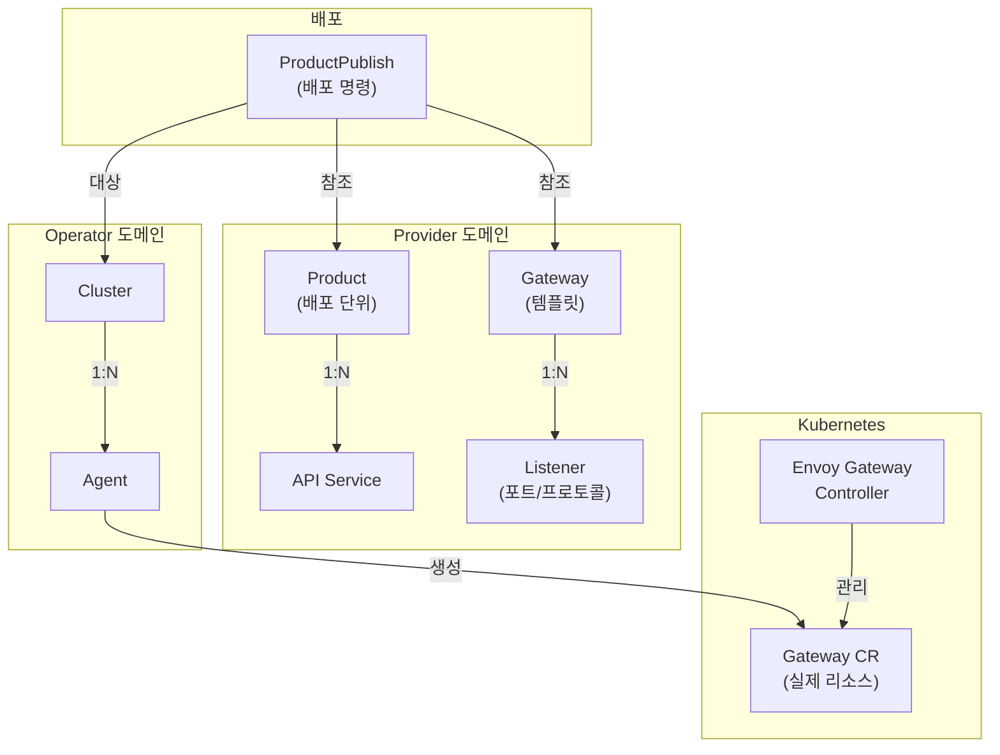
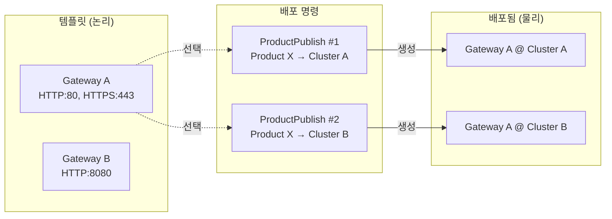
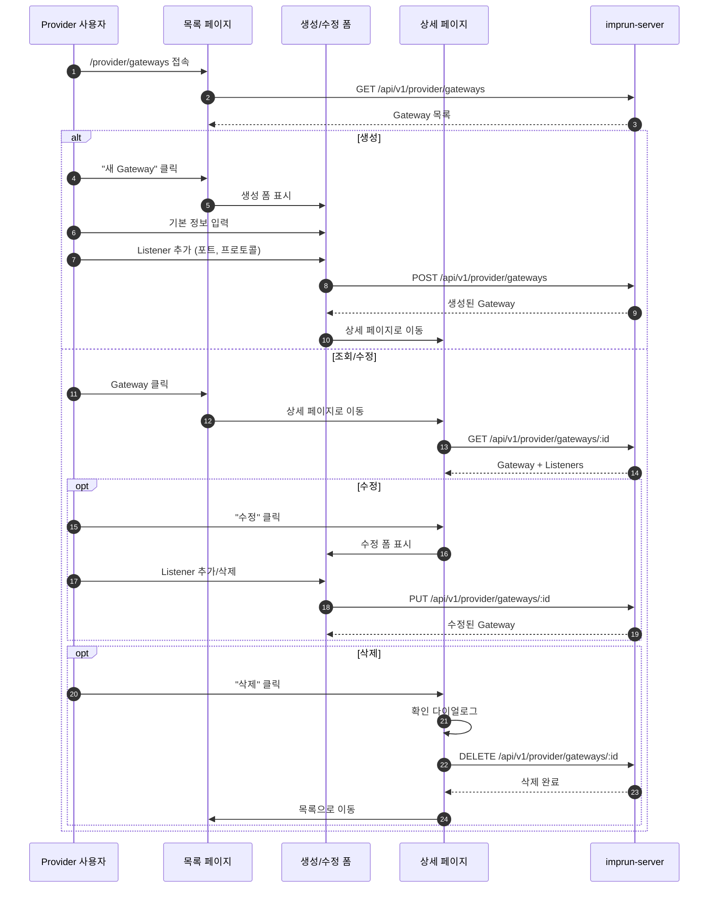

# EPIC-018: Gateway 템플릿 관리

## 개요

| 항목 | 내용 |
|------|------|
| **Epic ID** | EPIC-018 |
| **제목** | Gateway 템플릿 관리 |
| **우선순위** | P0 |
| **예상 기간** | 1주 |
| **상태** | ✅ 완료 |
| **의존성** | 없음 |

## 목표

Provider가 Gateway 설정 템플릿을 생성하고 관리할 수 있다.

## 배경

Gateway는 Envoy Gateway 기반의 게이트웨이 설정 템플릿이다. Provider는 Gateway 템플릿을 정의하고, ProductPublish 시 해당 Gateway를 선택하여 특정 클러스터에 배포한다.

### 핵심 개념
- **GatewayClass**: 게이트웨이 구현체 (기본값: `envoy-gateway`)
- **Listeners**: 포트, 프로토콜, TLS 설정 목록
- Gateway는 논리적 정의이며, 실제 배포는 ProductPublish에서 수행

### 템플릿 설계 원칙

> **MVP 단순화**: 현재 MVP에서는 Gateway를 단순 설정 객체로 사용합니다.
> 향후 확장 시 아래 패턴을 고려할 수 있습니다.

```
현재 MVP 접근 (단순 선택):
┌─────────────────────────────────────────────────────────────┐
│ Gateway "api-gw"                                            │
│ ├─ Listeners: [80/HTTP, 443/HTTPS]                         │
│ └─ Labels: {env: prod}                                      │
└─────────────────────────────────────────────────────────────┘
                              │
                    ProductPublish에서 선택
                              │
                              ▼
                    Cluster에 그대로 적용
```

```
향후 확장 (Post-MVP - 파라미터화된 템플릿):
┌─────────────────────────────────────────────────────────────┐
│ Gateway Template "api-gw-template"                          │
│ ├─ Listeners: [{port: {{PORT}}, protocol: {{PROTOCOL}}}]   │
│ └─ Parameters: PORT=80|443, PROTOCOL=HTTP|HTTPS            │
└─────────────────────────────────────────────────────────────┘
                              │
            ProductPublish에서 파라미터 주입
                              │
                              ▼
              PORT=443, PROTOCOL=HTTPS → 인스턴스화
```

**MVP에서 재사용성 확보 방법:**
- 하나의 Gateway를 여러 ProductPublish에서 참조 가능 (현재 지원)
- 환경별 Gateway 미리 생성: `api-gw-dev`, `api-gw-staging`, `api-gw-prod`
- 파라미터화는 Post-MVP로 연기

## 도메인 모델

### Gateway 위치



### Gateway ↔ ProductPublish 관계



## 사용자 흐름

### Gateway CRUD 흐름



## 범위

### 포함
- Gateway CRUD (생성, 조회, 수정, 삭제)
- Gateway 목록 페이지
- Gateway 상세 페이지
- Listener 설정 (port, protocol, hostname)
- GatewayClass 선택

### 제외
- TLS 인증서 관리 (Post-MVP)
- 고급 Listener 설정 (Post-MVP)
- Gateway 실제 배포 상태 (EPIC-019에서 처리)
- **파라미터화된 템플릿** (Post-MVP) - 현재는 단순 설정 객체로 사용

## 기술 요구사항

### 백엔드 API (이미 구현됨)

```
GET    /api/v1/provider/gateways          # 목록 조회
POST   /api/v1/provider/gateways          # 생성
GET    /api/v1/provider/gateways/:id      # 상세 조회
PUT    /api/v1/provider/gateways/:id      # 수정
DELETE /api/v1/provider/gateways/:id      # 삭제
```

### 데이터 모델

```typescript
interface Gateway {
  id: string;
  tenant_id: string;
  name: string;
  gateway_class: string;  // default: 'envoy-gateway'
  listeners: GatewayListener[];
  labels?: Record<string, string>;
  status: string;
  created_at: string;
  updated_at: string;
}

interface GatewayListener {
  name: string;
  port: number;
  protocol: 'HTTP' | 'HTTPS' | 'TCP' | 'TLS';
  hostname?: string;
  tls?: {
    mode: 'Terminate' | 'Passthrough';
    certificateRef?: string;
  };
}
```

### FSD 구조

```
web/src/
├── entities/gateway/
│   ├── index.ts
│   ├── model/
│   │   └── types.ts              # Gateway, Listener 타입
│   ├── api/
│   │   └── gateway-api.ts        # TanStack Query hooks
│   └── ui/
│       ├── gateway-card.tsx
│       ├── gateway-status-badge.tsx
│       └── listener-list.tsx     # Listener 목록 표시
├── features/gateway/
│   ├── index.ts
│   ├── create/
│   │   └── ui/
│   │       ├── create-gateway-form.tsx
│   │       └── listener-form.tsx  # Listener 편집 폼
│   ├── update/
│   │   └── ui/
│   │       └── update-gateway-form.tsx
│   └── delete/
│       └── ui/
│           └── delete-gateway-dialog.tsx
├── pages/provider/
│   └── gateway/                  # 도메인별 하위 디렉토리
│       ├── index.ts
│       ├── gateways-page.tsx     # 목록 페이지
│       └── gateway-detail-page.tsx # 상세 페이지
└── app/provider/gateways/
    ├── page.tsx
    └── [id]/
        └── page.tsx
```

## 스토리 분해

| Story | 제목 | 예상 | 우선순위 |
|-------|------|------|----------|
| 18.1 | Gateway 엔티티 및 API 훅 구현 | 0.5일 | P0 |
| 18.2 | Gateway 목록 페이지 구현 | 1일 | P0 |
| 18.3 | Gateway 생성 폼 (Listener 편집 포함) | 1.5일 | P0 |
| 18.4 | Gateway 상세 페이지 구현 | 1일 | P0 |
| 18.5 | Gateway 수정/삭제 기능 구현 | 0.5일 | P0 |

## 수용 기준

### 기능 요구사항
- [ ] Gateway 목록을 조회할 수 있다
- [ ] 새 Gateway를 생성할 수 있다
- [ ] Gateway에 하나 이상의 Listener를 추가할 수 있다
- [ ] GatewayClass를 선택할 수 있다 (기본: envoy-gateway)
- [ ] Gateway 상세 정보와 Listener 목록을 확인할 수 있다
- [ ] Gateway를 수정할 수 있다
- [ ] Gateway를 삭제할 수 있다

### 비기능 요구사항
- [ ] Listener 포트 중복 검증
- [ ] 프로토콜별 필수 필드 검증
- [ ] 로딩/에러 상태 표시

## UI/UX 가이드

### 목록 페이지
- 테이블 레이아웃
- 컬럼: 이름, GatewayClass, Listeners 요약, 상태
- Listener 요약: `80/HTTP, 443/HTTPS` 형식
- 빠른 액션: 상세 보기, 삭제

### 상세 페이지

```
┌─────────────────────────────────────────────────────────────┐
│ Gateway: api-gateway                             [수정]      │
├─────────────────────────────────────────────────────────────┤
│ 기본 정보                                                   │
│ ├─ 상태: ● Active                                          │
│ ├─ GatewayClass: envoy-gateway                             │
│ └─ 라벨: env=prod, tier=external                           │
├─────────────────────────────────────────────────────────────┤
│ Listeners (2)                                               │
│ ┌────────────┬──────┬──────────┬─────────────────────────┐ │
│ │ Name       │ Port │ Protocol │ Hostname                │ │
│ ├────────────┼──────┼──────────┼─────────────────────────┤ │
│ │ http       │ 80   │ HTTP     │ api.example.com         │ │
│ │ https      │ 443  │ HTTPS    │ api.example.com         │ │
│ └────────────┴──────┴──────────┴─────────────────────────┘ │
├─────────────────────────────────────────────────────────────┤
│ 사용 중인 ProductPublish (읽기 전용)                         │
│ ┌────────────────────┬─────────────┬────────────────────┐  │
│ │ Product            │ Cluster     │ Status             │  │
│ ├────────────────────┼─────────────┼────────────────────┤  │
│ │ Payment API v1.0   │ prod-kr     │ ● Deployed         │  │
│ │ Payment API v1.0   │ prod-jp     │ ● Deployed         │  │
│ └────────────────────┴─────────────┴────────────────────┘  │
└─────────────────────────────────────────────────────────────┘
```

**에픽별 책임:**
- **EPIC-018**: Gateway 기본 정보 + Listeners CRUD
- **EPIC-019**: ProductPublish 목록 표시 (읽기 전용)

### 생성/수정 폼

```
┌─────────────────────────────────────────────────────────────┐
│ 새 Gateway 생성                                             │
├─────────────────────────────────────────────────────────────┤
│                                                             │
│  이름 *                                                     │
│  ┌─────────────────────────────────────────────────────┐   │
│  │ api-gateway                                          │   │
│  └─────────────────────────────────────────────────────┘   │
│                                                             │
│  GatewayClass                                               │
│  ┌─────────────────────────────────────────────────────┐   │
│  │ envoy-gateway                                    ▼   │   │
│  └─────────────────────────────────────────────────────┘   │
│                                                             │
│  라벨                                                       │
│  ┌──────────────────┐  ┌──────────────────┐  [+ 추가]      │
│  │ env: prod    [x] │  │ tier: external[x]│               │
│  └──────────────────┘  └──────────────────┘               │
│                                                             │
├─────────────────────────────────────────────────────────────┤
│  Listeners                                      [+ 추가]    │
│  ┌─────────────────────────────────────────────────────┐   │
│  │  Listener #1                                   [삭제]│   │
│  │  ┌───────────┐ ┌───────────┐ ┌───────────┐         │   │
│  │  │ Name      │ │ Port      │ │ Protocol  │         │   │
│  │  │ http      │ │ 80        │ │ HTTP    ▼ │         │   │
│  │  └───────────┘ └───────────┘ └───────────┘         │   │
│  │  ┌─────────────────────────────────────────────┐   │   │
│  │  │ Hostname (optional)                          │   │   │
│  │  │ api.example.com                              │   │   │
│  │  └─────────────────────────────────────────────┘   │   │
│  └─────────────────────────────────────────────────────┘   │
│  ┌─────────────────────────────────────────────────────┐   │
│  │  Listener #2                                   [삭제]│   │
│  │  ...                                                 │   │
│  └─────────────────────────────────────────────────────┘   │
│                                                             │
├─────────────────────────────────────────────────────────────┤
│                              [취소]  [생성]                 │
└─────────────────────────────────────────────────────────────┘
```

**폼 필드:**
| 필드 | 타입 | 필수 | 설명 |
|------|------|------|------|
| 이름 | text | ✅ | Gateway 이름 (unique within tenant) |
| GatewayClass | select | - | 게이트웨이 구현체 (기본: envoy-gateway) |
| 라벨 | key-value | - | 키-값 쌍 (동적 추가/삭제) |
| Listeners | array | ✅ | 최소 1개 이상 필요 |

**Listener 필드:**
| 필드 | 타입 | 필수 | 설명 |
|------|------|------|------|
| name | text | ✅ | Listener 이름 (Gateway 내 고유) |
| port | number | ✅ | 포트 번호 (1-65535) |
| protocol | select | ✅ | HTTP, HTTPS, TCP, TLS |
| hostname | text | - | 호스트명 패턴 (예: *.example.com) |

**유효성 검증:**
- 이름: 필수, 2-63자, RFC 1123 DNS 라벨
- Listeners: 최소 1개, 포트 중복 불가
- Port: 1-65535 범위

## 참조

### 패턴 참조 파일
- `web/src/entities/cluster/` - 엔티티 구조
- `web/src/features/agent/register/` - 복잡한 폼 패턴

### 백엔드 API
- `services/imprun-server/internal/api/v1/provider/gateways.go`

---

## 변경 이력

| 날짜 | 버전 | 변경 내용 | 작성자 |
|------|------|----------|--------|
| 2025-01-XX | 1.0 | 초기 작성 | - |
| 2025-11-27 | 1.1 | 도메인 모델 및 사용자 흐름 다이어그램 추가 | - |
| 2025-11-27 | 1.2 | 상세 페이지/생성 폼 UI 설계 추가 | - |
| 2025-11-27 | 1.3 | FSD 구조: pages/provider/gateway 도메인 계층 추가 | - |
| 2025-11-27 | 1.4 | 템플릿 설계 원칙 추가: MVP 단순화 vs Post-MVP 파라미터화 | Claude |
