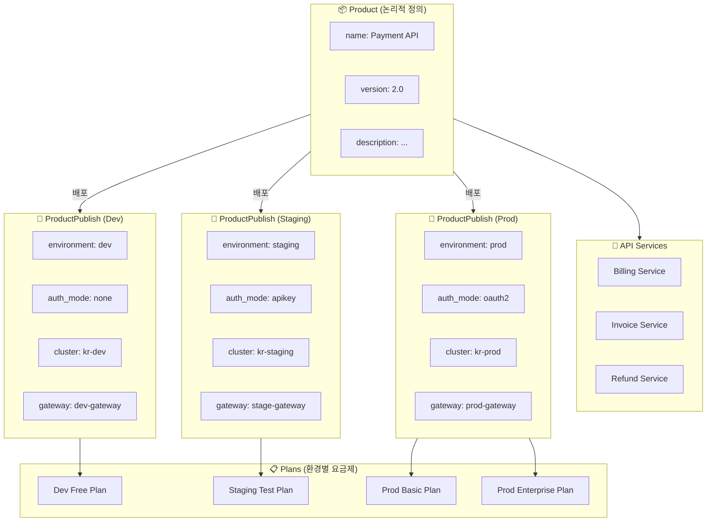
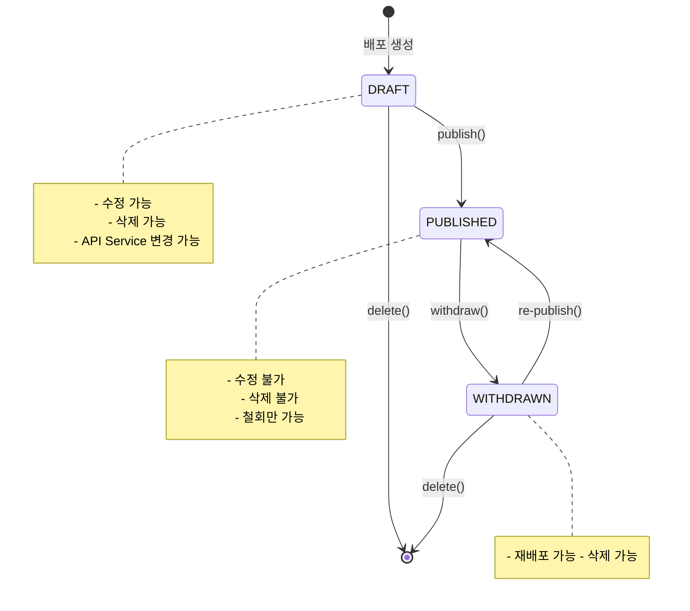
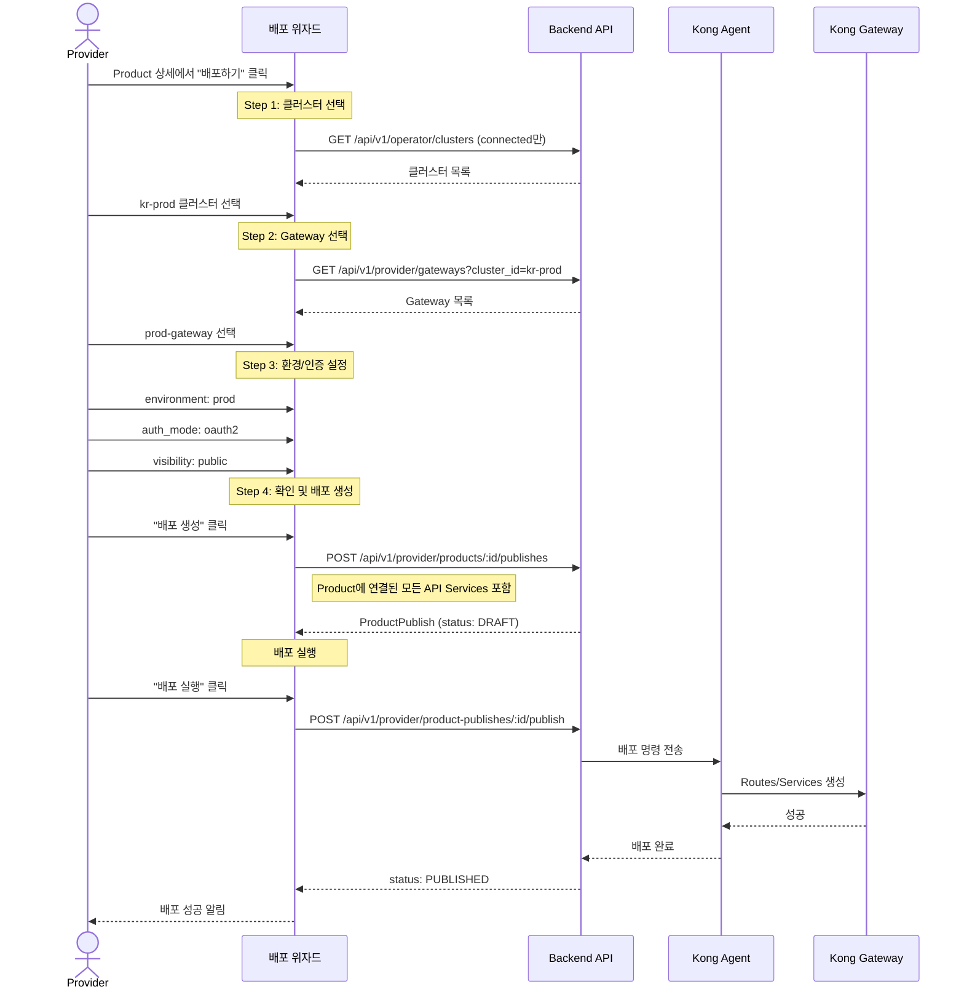
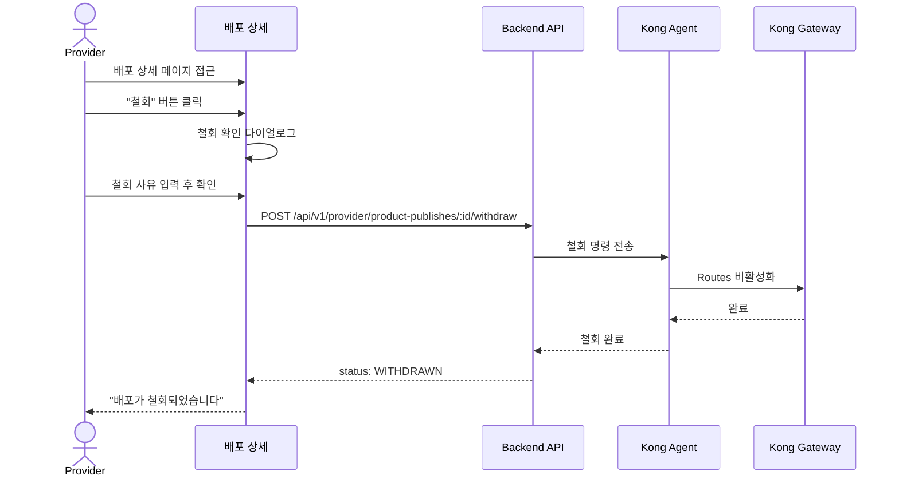

# EPIC-019: ProductPublish 배포

## 개요

| 항목 | 내용 |
|------|------|
| **Epic ID** | EPIC-019 |
| **제목** | ProductPublish 배포 |
| **우선순위** | P0 |
| **예상 기간** | 1.5주 |
| **상태** | 🔲 미시작 |
| **의존성** | EPIC-017 (Product), EPIC-016 (API Service), EPIC-018 (Gateway), EPIC-013 (Cluster) |
| **GitHub Issue** | [#12](https://github.com/imprun/imp-gateway/issues/12) |

## 목표

Provider가 Product를 특정 클러스터에 배포하고 배포 상태를 추적할 수 있다.

## 배경

ProductPublish는 Product를 실제 클러스터에 배포하는 것을 의미한다. v2 아키텍처에서 ProductPublish는 명시적으로 `cluster_id`를 포함하여 배포 대상을 지정한다.

> ⚠️ **중요**: ProductPublish는 **Environment(환경)**와 **AuthMode(인증방식)**를 설정하는 곳입니다.
> Product 자체는 논리적 정의일 뿐이며, 배포 시점에 환경/인증을 결정합니다.

---

## 도메인 모델

### ProductPublish 엔티티 관계



### Product vs ProductPublish 책임 분리

```
┌─────────────────────────────────────────────────────────────────────┐
│                           Product                                   │
│  ✅ 논리적 정의 (What)                                              │
│  - name, description, version                                       │
│  - categories                                                       │
│  - 연결된 API Services                                              │
│  - docs_url, logo_url                                              │
│  ❌ environment 없음                                                │
│  ❌ auth_mode 없음                                                  │
└─────────────────────────────────────────────────────────────────────┘
                                │
                    ┌───────────┼───────────┐
                    ▼           ▼           ▼
┌───────────────────────┐ ┌───────────────────────┐ ┌───────────────────────┐
│    ProductPublish     │ │    ProductPublish     │ │    ProductPublish     │
│    (Dev 환경)         │ │    (Staging 환경)     │ │    (Prod 환경)        │
├───────────────────────┤ ├───────────────────────┤ ├───────────────────────┤
│ ✅ 배포 설정 (Where/How)                                                │
│ - environment         │ │ - environment         │ │ - environment         │
│ - auth_mode           │ │ - auth_mode           │ │ - auth_mode           │
│ - auth_config         │ │ - auth_config         │ │ - auth_config         │
│ - cluster_id          │ │ - cluster_id          │ │ - cluster_id          │
│ - gateway_id          │ │ - gateway_id          │ │ - gateway_id          │
│ - hostname_base       │ │ - hostname_base       │ │ - hostname_base       │
│ - visibility          │ │ - visibility          │ │ - visibility          │
│ - status              │ │ - status              │ │ - status              │
└───────────────────────┘ └───────────────────────┘ └───────────────────────┘
          │                         │                         │
          ▼                         ▼                         ▼
    ┌─────────┐               ┌─────────┐               ┌─────────┬─────────┐
    │  Plan   │               │  Plan   │               │  Plan   │  Plan   │
    │  (Free) │               │  (Test) │               │ (Basic) │ (Ent.)  │
    └─────────┘               └─────────┘               └─────────┴─────────┘
```

### 상태 흐름 (State Machine)



### v2 아키텍처 핵심 변경 사항
- **ProductPublish에 cluster_id 추가**: 배포 대상 명시
- **Gateway 선택**: 배포 시 Gateway 템플릿 선택
- **환경 구분**: dev/stage/prod 환경 선택
- **상태 흐름**: DRAFT → PUBLISHED → WITHDRAWN

### 배포 흐름
1. Product 선택
2. 배포할 클러스터 선택
3. Gateway 템플릿 선택
4. 환경/인증 설정
5. 배포 요청 → Agent가 실행

> **Note**: API Service 선택 단계는 없습니다. Product에 연결된 모든 서비스가 자동으로 배포됩니다.
> Product가 API 서비스를 묶는 논리적 단위이므로, 배포 시 개별 서비스를 선택할 필요가 없습니다.

---

## 사용자 흐름

### 배포 생성 위자드 흐름



### 배포 철회 흐름



## 범위

### 포함
- ProductPublish 생성 위자드
- 배포 대상 선택 (Cluster, Gateway, API Services)
- 배포 설정 (Environment, Auth Mode)
- 배포 상태 추적 (DRAFT/PUBLISHED/WITHDRAWN)
- 배포 이력 목록
- 배포 철회 (Withdraw) 기능

### 제외
- 배포 롤백 (Post-MVP)
- 배포 비교 (Post-MVP)
- 자동 배포 (CI/CD 연동, Post-MVP)

## 기술 요구사항

### 백엔드 API

```
GET    /api/v1/provider/products/:id/publishes     # Product의 배포 목록
POST   /api/v1/provider/products/:id/publishes     # 배포 생성
GET    /api/v1/provider/product-publishes/:id      # 배포 상세
PUT    /api/v1/provider/product-publishes/:id      # 배포 수정 (DRAFT 상태만)
POST   /api/v1/provider/product-publishes/:id/publish   # 배포 실행
POST   /api/v1/provider/product-publishes/:id/withdraw  # 배포 철회
DELETE /api/v1/provider/product-publishes/:id      # 배포 삭제 (DRAFT 상태만)
```

### 데이터 모델

```typescript
type ProductPublishStatus = 'DRAFT' | 'PUBLISHED' | 'WITHDRAWN';

interface ProductPublish {
  id: string;
  product_id: string;
  provider_tenant_id: string;
  gateway_id: string;
  cluster_id: string;           // v2: 배포 대상 클러스터
  environment: 'dev' | 'stage' | 'prod';
  hostname_base: string;
  api_services: string[];       // API Service ID 배열
  route_ids: string[];
  auth_mode: 'api-key' | 'oauth2' | 'none';
  auth_config?: Record<string, any>;
  visibility: 'public' | 'private';
  approval_required: boolean;
  status: ProductPublishStatus;
  published_at?: string;
  published_by?: string;
  withdrawn_at?: string;
  withdrawn_by?: string;
  created_at: string;
  updated_at: string;
}
```

### FSD 구조

```
web/src/
├── entities/publish/
│   ├── index.ts
│   ├── model/
│   │   └── types.ts
│   ├── api/
│   │   └── publish-api.ts
│   └── ui/
│       ├── publish-status-badge.tsx
│       ├── publish-card.tsx
│       └── publish-timeline.tsx  # 배포 이력 타임라인
│
├── features/publish/
│   ├── index.ts
│   ├── create/
│   │   └── ui/
│   │       ├── publish-wizard.tsx
│   │       ├── cluster-select-step.tsx
│   │       ├── gateway-select-step.tsx
│   │       └── config-step.tsx
│   │       # Note: services-select-step 제거됨 (Product의 모든 서비스 자동 배포)
│   ├── execute/
│   │   └── ui/
│   │       └── publish-button.tsx
│   └── withdraw/
│       └── ui/
│           └── withdraw-dialog.tsx
│
├── widgets/provider/
│   ├── publish-wizard/
│   │   └── index.tsx            # 전체 위자드 조합
│   └── deploy-status/
│       └── index.tsx            # 배포 상태 대시보드
│
├── pages/provider/
│   │
│   ├── publish/                 # 🆕 Domain Layer - ProductPublish 도메인
│   │   ├── index.ts             # 도메인 public exports
│   │   ├── publish-create-page.tsx   # 배포 생성 위자드 페이지
│   │   ├── publish-detail-page.tsx   # 배포 상세 페이지
│   │   └── README.md            # 도메인 설명
│   │
│   ├── product-publish-page.tsx     # (deprecated, use publish/ domain)
│   └── publish-detail-page.tsx      # (deprecated, use publish/ domain)
│
└── app/provider/products/[id]/
    ├── publish/
    │   └── page.tsx             # -> pages/provider/publish/publish-create-page.tsx
    └── publishes/
        └── [publishId]/
            └── page.tsx         # -> pages/provider/publish/publish-detail-page.tsx
```

### 도메인 레이어 설계 이유

> **ProductPublish**는 단순한 CRUD가 아닌 **복잡한 워크플로우**를 가진 도메인입니다.
>
> - **다단계 위자드**: 클러스터 → Gateway → Services → 설정 순서의 의존적 단계
> - **상태 기계**: DRAFT → PUBLISHED → WITHDRAWN 전환 로직
> - **외부 시스템 연동**: Agent를 통한 Kong Gateway 동기화
> - **Plan 연결**: 배포된 ProductPublish에 요금제 연결
>
> 따라서 `pages/provider/publish/` 도메인 폴더로 관련 페이지들을 그룹화합니다.

## 스토리 분해

| Story | 제목 | 예상 | 우선순위 |
|-------|------|------|----------|
| 19.1 | Publish 엔티티 및 API 훅 구현 | 0.5일 | P0 |
| 19.2 | Publish 목록 UI (Product 상세 내) | 1일 | P0 |
| 19.3 | Publish 생성 위자드 - 클러스터/Gateway 선택 | 1일 | P0 |
| 19.4 | Publish 생성 위자드 - 환경/인증 설정 | 1일 | P0 |
| 19.5 | Publish 상세 페이지 및 상태 표시 | 1일 | P0 |
| 19.6 | Publish 실행 및 철회 기능 | 1일 | P0 |
| 19.7 | 배포 이력 타임라인 위젯 | 0.5일 | P1 |

> **변경 사항**: Story 19.4에서 "API Service 선택" 단계가 제거됨.
> Product에 연결된 모든 서비스가 자동으로 배포되므로, 개별 서비스 선택은 불필요.

## 수용 기준

### 기능 요구사항
- [ ] Product 상세에서 배포 목록을 확인할 수 있다
- [ ] 새 배포를 생성할 수 있다 (위자드 형태)
- [ ] 배포 시 클러스터를 선택할 수 있다
- [ ] 배포 시 Gateway 템플릿을 선택할 수 있다
- [x] ~~배포 시 포함할 API Service를 선택할 수 있다~~ (제거됨 - Product의 모든 서비스 자동 배포)
- [ ] 환경(dev/stage/prod)을 선택할 수 있다
- [ ] 인증 모드를 설정할 수 있다
- [ ] DRAFT 상태의 배포를 실행(Publish)할 수 있다
- [ ] PUBLISHED 상태의 배포를 철회(Withdraw)할 수 있다
- [ ] 배포 상태가 실시간으로 표시된다

### 비기능 요구사항
- [ ] 위자드 단계별 유효성 검증
- [ ] 이전 단계로 돌아가기 가능
- [ ] 배포 실행 전 확인 다이얼로그
- [ ] 배포 진행 중 로딩 상태 표시

## UI/UX 가이드

### 배포 위자드 (Stepper UI)

```
┌─────────────────────────────────────────────────────────────────────────────┐
│  ← 뒤로    Payment API 배포하기                                             │
├─────────────────────────────────────────────────────────────────────────────┤
│                                                                             │
│  ┌─────────────────────────────────────────────────────────────────────┐    │
│  │  ①────────●────────②────────○────────③────────○────────④    │    │
│  │  클러스터      Gateway       Services       설정             │    │
│  └─────────────────────────────────────────────────────────────────────┘    │
│                                                                             │
│  ┌─────────────────────────────────────────────────────────────────────┐    │
│  │  Step 1: 배포할 클러스터 선택                                        │    │
│  │                                                                      │    │
│  │  ┌──────────────────────────────────────────────────────────────┐   │    │
│  │  │ ◉ kr-prod-cluster                                   ● Active │   │    │
│  │  │   Seoul, Korea • 3 Agents • Last sync: 2 min ago            │   │    │
│  │  └──────────────────────────────────────────────────────────────┘   │    │
│  │                                                                      │    │
│  │  ┌──────────────────────────────────────────────────────────────┐   │    │
│  │  │ ○ kr-staging-cluster                               ● Active │   │    │
│  │  │   Seoul, Korea • 2 Agents • Last sync: 5 min ago            │   │    │
│  │  └──────────────────────────────────────────────────────────────┘   │    │
│  │                                                                      │    │
│  │  ┌──────────────────────────────────────────────────────────────┐   │    │
│  │  │ ○ kr-dev-cluster                                   ○ Offline │   │    │
│  │  │   Seoul, Korea • 1 Agent • Last sync: 1 hour ago            │   │    │
│  │  └──────────────────────────────────────────────────────────────┘   │    │
│  └─────────────────────────────────────────────────────────────────────┘    │
│                                                                             │
│                                            [ 취소 ]  [ 다음 단계 → ]        │
└─────────────────────────────────────────────────────────────────────────────┘
```

### 배포 설정 Step (환경/인증)

```
┌─────────────────────────────────────────────────────────────────────────────┐
│  Step 4: 배포 설정                                                          │
│                                                                             │
│  ┌─────────────────────────────────────────────────────────────────────┐    │
│  │  Environment                                                         │    │
│  │  ───────────────────────────────────────────────────────────────    │    │
│  │  ┌─────────────┐ ┌─────────────┐ ┌─────────────┐                    │    │
│  │  │ Development │ │   Staging   │ │ ▣Production │                    │    │
│  │  │     dev     │ │    stage    │ │    prod     │                    │    │
│  │  └─────────────┘ └─────────────┘ └─────────────┘                    │    │
│  │                                                                      │    │
│  │  ⓘ 환경에 따라 다른 Plan(요금제)을 연결할 수 있습니다               │    │
│  └─────────────────────────────────────────────────────────────────────┘    │
│                                                                             │
│  ┌─────────────────────────────────────────────────────────────────────┐    │
│  │  Authentication Mode                                                 │    │
│  │  ───────────────────────────────────────────────────────────────    │    │
│  │  ┌─────────────┐ ┌─────────────┐ ┌─────────────┐                    │    │
│  │  │    None     │ │   API Key   │ │ ▣ OAuth 2.0 │                    │    │
│  │  │  인증 없음  │ │  키 기반    │ │  토큰 기반  │                    │    │
│  │  └─────────────┘ └─────────────┘ └─────────────┘                    │    │
│  │                                                                      │    │
│  │  OAuth 2.0 설정                                                      │    │
│  │  ┌────────────────────────────────────────────────────────────┐     │    │
│  │  │ Issuer URL: [ https://auth.example.com/realms/api       ] │     │    │
│  │  │ Audience:   [ payment-api                               ] │     │    │
│  │  │ Scopes:     [ read write                                ] │     │    │
│  │  └────────────────────────────────────────────────────────────┘     │    │
│  └─────────────────────────────────────────────────────────────────────┘    │
│                                                                             │
│  ┌─────────────────────────────────────────────────────────────────────┐    │
│  │  Visibility & Access Control                                         │    │
│  │  ───────────────────────────────────────────────────────────────    │    │
│  │                                                                      │    │
│  │  공개 범위:  ◉ Public (누구나 구독 가능)                             │    │
│  │              ○ Private (초대된 Consumer만)                           │    │
│  │                                                                      │    │
│  │  구독 승인:  [✓] 구독 신청 시 관리자 승인 필요                       │    │
│  │                                                                      │    │
│  └─────────────────────────────────────────────────────────────────────┘    │
│                                                                             │
│                                   [ ← 이전 ]  [ 취소 ]  [ 배포 생성 → ]     │
└─────────────────────────────────────────────────────────────────────────────┘
```

### 배포 상세 페이지 (Kong Gateway 스타일)

```
┌─────────────────────────────────────────────────────────────────────────────┐
│  ← 배포 목록     Payment API - Production 배포                             │
│                                                                             │
│  ┌─────────────────────────────────────────────────────────────────────┐    │
│  │  🚀                                                                  │    │
│  │  Payment API v2.0 → kr-prod-cluster                                 │    │
│  │                                                                      │    │
│  │  ┌─────────────┐   Environment: prod                                │    │
│  │  │ ● PUBLISHED │   Auth Mode: OAuth 2.0                             │    │
│  │  └─────────────┘   Published: 2025-01-20 14:30:00 by admin          │    │
│  │                                                                      │    │
│  │                             [ 철회하기 ]  [ 설정 변경 ]              │    │
│  └─────────────────────────────────────────────────────────────────────┘    │
│                                                                             │
│  ═══════════════════════════════════════════════════════════════════════   │
│                                                                             │
│  ┌─ 배포 정보 ──────────────────────────────────────────────────────────┐   │
│  │                                                                       │   │
│  │  ┌─────────────────┬─────────────────┬─────────────────┐              │   │
│  │  │ 클러스터        │ Gateway         │ Hostname        │              │   │
│  │  │ kr-prod-cluster │ prod-gateway    │ api.example.com │              │   │
│  │  │ Seoul, Korea    │ 8443 (HTTPS)    │                 │              │   │
│  │  └─────────────────┴─────────────────┴─────────────────┘              │   │
│  │                                                                       │   │
│  │  Visibility: Public  |  Approval Required: Yes                        │   │
│  │                                                                       │   │
│  └───────────────────────────────────────────────────────────────────────┘   │
│                                                                             │
│  ┌─ API Services (3) ───────────────────────────────────────────────────┐   │
│  │                                                                       │   │
│  │  ┌────────────────────────────────────────────────────────────────┐  │   │
│  │  │ 🔌 Billing Service                                    ● Active │  │   │
│  │  │    /billing/* → billing-upstream:8080                          │  │   │
│  │  │    GET, POST, PUT, DELETE                                      │  │   │
│  │  └────────────────────────────────────────────────────────────────┘  │   │
│  │                                                                       │   │
│  │  ┌────────────────────────────────────────────────────────────────┐  │   │
│  │  │ 🔌 Invoice Service                                    ● Active │  │   │
│  │  │    /invoices/* → invoice-upstream:8080                         │  │   │
│  │  │    GET, POST                                                   │  │   │
│  │  └────────────────────────────────────────────────────────────────┘  │   │
│  │                                                                       │   │
│  │  ┌────────────────────────────────────────────────────────────────┐  │   │
│  │  │ 🔌 Refund Service                                     ● Active │  │   │
│  │  │    /refunds/* → refund-upstream:8080                           │  │   │
│  │  │    POST                                                        │  │   │
│  │  └────────────────────────────────────────────────────────────────┘  │   │
│  │                                                                       │   │
│  └───────────────────────────────────────────────────────────────────────┘   │
│                                                                             │
│  ┌─ 연결된 Plans (2) ───────────────────────────────────────────────────┐   │
│  │                                                                       │   │
│  │  ┌────────────────────────────────────────────────────────────────┐  │   │
│  │  │ 📋 Basic Plan                                  10 subscriptions │  │   │
│  │  │    $29/month • 10,000 req/day • Rate: 100 req/min              │  │   │
│  │  └────────────────────────────────────────────────────────────────┘  │   │
│  │                                                                       │   │
│  │  ┌────────────────────────────────────────────────────────────────┐  │   │
│  │  │ 📋 Enterprise Plan                              3 subscriptions │  │   │
│  │  │    $299/month • Unlimited • Rate: 1000 req/min                 │  │   │
│  │  └────────────────────────────────────────────────────────────────┘  │   │
│  │                                                                       │   │
│  │                                              [ + Plan 연결 ]         │   │
│  └───────────────────────────────────────────────────────────────────────┘   │
│                                                                             │
│  ┌─ 배포 이력 ──────────────────────────────────────────────────────────┐   │
│  │                                                                       │   │
│  │  ●───────────────────────────────────────────────────────────────    │   │
│  │  │                                                                    │   │
│  │  ├─● 2025-01-20 14:30  PUBLISHED by admin                            │   │
│  │  │   "Production release v2.0"                                       │   │
│  │  │                                                                    │   │
│  │  ├─○ 2025-01-20 14:00  DRAFT created by admin                        │   │
│  │  │   Initial deployment configuration                                │   │
│  │  │                                                                    │   │
│  │  └───────────────────────────────────────────────────────────────    │   │
│  │                                                                       │   │
│  └───────────────────────────────────────────────────────────────────────┘   │
│                                                                             │
└─────────────────────────────────────────────────────────────────────────────┘
```

### Product 상세 페이지 내 배포 목록 섹션

```
┌─────────────────────────────────────────────────────────────────────────────┐
│  ┌─ 배포 현황 ──────────────────────────────────────────────────────────┐   │
│  │                                                                       │   │
│  │  3개 환경에 배포됨                              [ + 새 배포 생성 ]   │   │
│  │                                                                       │   │
│  │  ┌───────────────┬───────────────┬───────────────┐                   │   │
│  │  │      DEV      │    STAGING    │     PROD      │                   │   │
│  │  ├───────────────┼───────────────┼───────────────┤                   │   │
│  │  │ kr-dev        │ kr-staging    │ kr-prod       │                   │   │
│  │  │ ● PUBLISHED   │ ● PUBLISHED   │ ● PUBLISHED   │                   │   │
│  │  │ auth: none    │ auth: apikey  │ auth: oauth2  │                   │   │
│  │  │ 0 subscribers │ 5 subscribers │ 42 subscribers│                   │   │
│  │  │               │               │               │                   │   │
│  │  │ [상세보기]    │ [상세보기]    │ [상세보기]    │                   │   │
│  │  └───────────────┴───────────────┴───────────────┘                   │   │
│  │                                                                       │   │
│  └───────────────────────────────────────────────────────────────────────┘   │
└─────────────────────────────────────────────────────────────────────────────┘
```

## 참조

### 패턴 참조 파일
- `web/src/features/agent/register/` - 다단계 폼 패턴
- `web/src/pages/operator/cluster-detail-page.tsx` - 상세 페이지 패턴

### 백엔드 API
- `services/imprun-server/internal/api/v1/provider/products.go`

---

## 변경 이력

| 날짜 | 버전 | 변경 내용 | 작성자 |
|------|------|----------|--------|
| 2025-01-XX | 1.0 | 초기 작성 | - |
| 2025-01-27 | 1.1 | 도메인 모델 다이어그램 추가 (Product vs ProductPublish 책임 분리) | Claude |
| 2025-01-27 | 1.2 | 상태 흐름 State Machine 다이어그램 추가 | Claude |
| 2025-01-27 | 1.3 | 사용자 흐름 시퀀스 다이어그램 추가 (배포 생성/철회) | Claude |
| 2025-01-27 | 1.4 | UI 와이어프레임 추가 (위자드, 상세 페이지, 배포 목록) | Claude |
| 2025-01-27 | 1.5 | FSD 도메인 레이어 구조 추가 (pages/provider/publish/) | Claude |
| 2025-11-27 | 1.6 | 시퀀스 다이어그램 API 경로를 /api/v1/ 형식으로 통일 | Claude |
