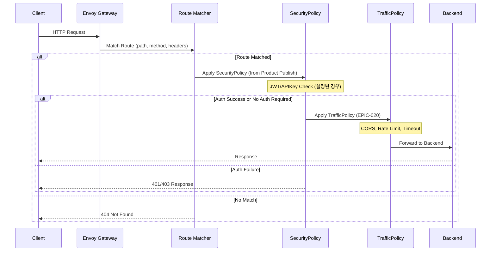
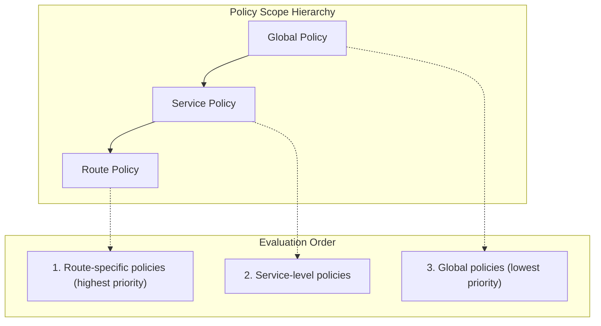
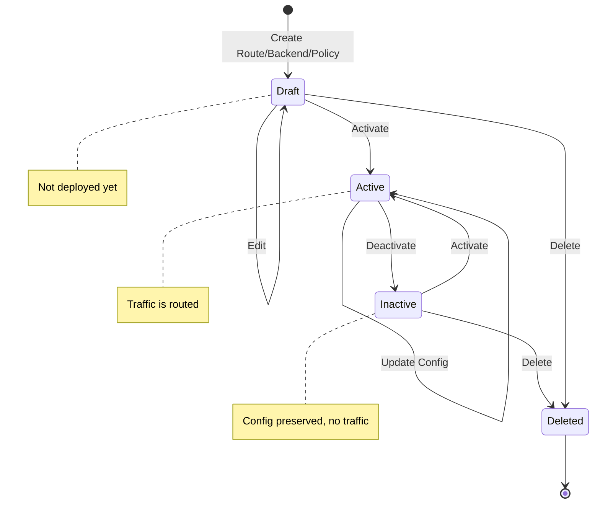

# EPIC-020: Gateway Service Configuration (Routes, Backends, Policies)

## 개요

| 항목 | 내용 |
|------|------|
| **Epic ID** | EPIC-020 |
| **제목** | Gateway Service Configuration |
| **우선순위** | P0 (EPIC-016과 함께 또는 직후 구현 권장) |
| **예상 기간** | 2주 |
| **상태** | ✅ 완료 |
| **의존성** | EPIC-016 (API Service) |

> ⚠️ **구현 순서 참고**: EPIC-016(API Service)과 본 EPIC(Route/Backend/Policy)는 밀접하게 연관되어 있습니다.
> EPIC-016에서 API Service 상세 페이지를 구현할 때 Routes/Backends/Policies 목록을 읽기 전용으로 표시하고,
> 본 EPIC에서 CRUD 기능을 추가합니다. **병렬 또는 연속 구현을 권장**합니다.

## 목표

Provider가 Kong Konnect 스타일의 직관적인 UI로 Envoy Gateway의 모든 기능을 세밀하게 설정할 수 있다.

## 배경

### Kong Konnect 아키텍처 참조

Kong Gateway의 핵심 개념을 참조하되, **Policy** 용어를 사용:
- **Gateway Service**: Upstream 서비스를 나타내는 논리적 엔티티 (≈ API Service)
- **Route**: 요청을 Service로 라우팅하는 규칙
- **Policy**: 인증, Rate Limiting, CORS 등 정책을 적용하는 확장 (Kong의 Plugin에 해당)

```
┌─────────────────────────────────────────────────────────────────────────┐
│                        imprun Gateway Architecture                       │
├─────────────────────────────────────────────────────────────────────────┤
│                                                                         │
│   Client Request                                                        │
│        │                                                                │
│        ▼                                                                │
│   ┌─────────┐     ┌─────────┐     ┌─────────┐     ┌─────────────┐      │
│   │  Route  │ ──▶ │ Policy  │ ──▶ │ Policy  │ ──▶ │   Backend   │      │
│   │ (Match) │     │ (Auth)  │     │ (Rate)  │     │  (Upstream) │      │
│   └─────────┘     └─────────┘     └─────────┘     └─────────────┘      │
│                                                                         │
│   Policies can attach to:                                               │
│   • Global (all requests)                                               │
│   • Service (all routes of a service)                                   │
│   • Route (specific route only)                                         │
│                                                                         │
└─────────────────────────────────────────────────────────────────────────┘
```

### Envoy Gateway 기능 매핑

| Kong Konnect | Envoy Gateway | imprun 모델 |
|--------------|---------------|-------------|
| Gateway Service | Backend + HTTPRoute | APIService + Backend |
| Route | HTTPRoute.rules | Route |
| Plugin (Auth) | SecurityPolicy | Policy (category: security) |
| Plugin (Traffic) | BackendTrafficPolicy | Policy (category: traffic) |
| Plugin (Client) | ClientTrafficPolicy | Policy (category: client) |

### Envoy Gateway 지원 정책 목록

```
┌─────────────────────────────────────────────────────────────────────────┐
│                     Envoy Gateway Policy Types                          │
├─────────────────────────────────────────────────────────────────────────┤
│                                                                         │
│  ┌─────────────────────────────────────────────────────────────────┐   │
│  │ SecurityPolicy (인증/인가) - ⚠️ Product Publish에서 설정          │   │
│  │ • JWT Authentication    • API Key Auth      • Basic Auth        │   │
│  │ • OAuth2/OIDC           • External Auth                          │   │
│  └─────────────────────────────────────────────────────────────────┘   │
│                                                                         │
│  ┌─────────────────────────────────────────────────────────────────┐   │
│  │ SecurityPolicy (CORS) - ✅ EPIC-020 범위                          │   │
│  │ • CORS Headers                                                    │   │
│  └─────────────────────────────────────────────────────────────────┘   │
│                                                                         │
│  ┌─────────────────────────────────────────────────────────────────┐   │
│  │ BackendTrafficPolicy (백엔드 트래픽) - ✅ EPIC-020 범위           │   │
│  │ • Rate Limiting         • Circuit Breaker   • Retry Policy      │   │
│  │ • Timeout               • Load Balancer     • Health Check      │   │
│  │ • Compression           • Fault Injection   • Connection Pool   │   │
│  └─────────────────────────────────────────────────────────────────┘   │
│                                                                         │
│  ┌─────────────────────────────────────────────────────────────────┐   │
│  │ ClientTrafficPolicy (클라이언트 트래픽) - ✅ EPIC-020 범위        │   │
│  │ • TLS Settings          • HTTP/2/3 Config   • Proxy Protocol    │   │
│  │ • Connection Limit      • IP Detection      • Header Settings   │   │
│  │ • Request Timeout                                                 │   │
│  └─────────────────────────────────────────────────────────────────┘   │
│                                                                         │
│  ┌─────────────────────────────────────────────────────────────────┐   │
│  │ HTTPRouteFilter (요청/응답 변환) - ✅ EPIC-020 범위               │   │
│  │ • URL Rewrite           • Header Modifier   • Request Redirect  │   │
│  │ • Request Mirror        • Direct Response                        │   │
│  └─────────────────────────────────────────────────────────────────┘   │
│                                                                         │
└─────────────────────────────────────────────────────────────────────────┘
```

> ⚠️ **인증 정책 분리**: JWT, API Key, Basic Auth, OAuth2, External Auth 등 **인증 관련 정책은 Product Publish 시점**에 설정합니다.
> EPIC-020에서는 CORS, Rate Limit, Timeout 등 **트래픽 제어 정책**만 다룹니다.

## 범위

### 포함
- Route CRUD (path matching, methods, headers, query params)
- Backend CRUD (endpoints, load balancer, health check)
- Policy CRUD (트래픽 제어 정책)
  - Traffic Policies (Rate Limit, Retry, Timeout, Circuit Breaker)
  - Transform Policies (Header Modifier, URL Rewrite)
  - CORS Policy
- API Service 상세 내 Routes/Backends/Policies 탭
- Policy 스코프 설정 (Service, Route)

### 제외
- **인증 정책** (JWT, API Key, Basic Auth, OAuth2, External Auth) - Product Publish에서 설정
- 동적 Policy 폼 빌더 (Post-MVP, JSON 편집기로 대체)
- 실시간 Route 테스트 (Post-MVP)
- OpenAPI 기반 자동 Route 생성 (Post-MVP)
- EnvoyExtensionPolicy (Wasm, External Processing)

## 아키텍처

### 요청 흐름



> 📝 **참고**: SecurityPolicy(인증)는 Product Publish에서 설정되며, EPIC-020에서 설정하는 TrafficPolicy는 인증 이후 단계에서 적용됩니다.

### Policy 적용 우선순위



### 상태 흐름



## 기술 요구사항

### 백엔드 API

```
# Routes (HTTPRoute 매핑)
GET    /api/v1/provider/api-services/:id/routes
POST   /api/v1/provider/api-services/:id/routes
GET    /api/v1/provider/routes/:id
PUT    /api/v1/provider/routes/:id
DELETE /api/v1/provider/routes/:id

# Backends (Upstream 서버)
GET    /api/v1/provider/api-services/:id/backends
POST   /api/v1/provider/api-services/:id/backends
GET    /api/v1/provider/backends/:id
PUT    /api/v1/provider/backends/:id
DELETE /api/v1/provider/backends/:id

# Policies
GET    /api/v1/provider/policies                    # Global policies
GET    /api/v1/provider/api-services/:id/policies   # Service policies
GET    /api/v1/provider/routes/:id/policies         # Route policies
POST   /api/v1/provider/policies                    # Create policy
GET    /api/v1/provider/policies/:id
PUT    /api/v1/provider/policies/:id
DELETE /api/v1/provider/policies/:id
```

### 데이터 모델

```typescript
// Route - HTTPRoute 매핑
interface Route {
  id: string;
  api_service_id: string;
  name: string;

  // Matching
  hostnames?: string[];
  path_prefix?: string;
  path_regex?: string;
  path_exact?: string;
  methods?: ('GET' | 'POST' | 'PUT' | 'DELETE' | 'PATCH' | 'HEAD' | 'OPTIONS')[];
  headers?: RouteHeaderMatch[];
  query_params?: RouteQueryMatch[];

  // Routing
  backend_refs: BackendRef[];

  // Metadata
  priority: number;
  tags?: Record<string, string>;
  status: 'active' | 'inactive' | 'draft';

  // Advanced (HTTPRoute timeouts)
  timeouts?: {
    request?: string;      // e.g., "30s"
    backend_request?: string;
  };

  created_at: string;
  updated_at: string;
}

interface RouteHeaderMatch {
  name: string;
  type: 'Exact' | 'RegularExpression' | 'Present';
  value?: string;
}

interface RouteQueryMatch {
  name: string;
  type: 'Exact' | 'RegularExpression';
  value: string;
}

interface BackendRef {
  backend_id: string;
  weight?: number;  // for traffic splitting
}

// Backend - Envoy Gateway Backend 매핑
interface Backend {
  id: string;
  api_service_id: string;
  name: string;

  // Endpoints
  scheme: 'http' | 'https' | 'grpc' | 'grpcs';
  endpoints: BackendEndpoint[];

  // Load Balancing
  lb_policy: 'RoundRobin' | 'LeastRequest' | 'Random' | 'ConsistentHash';
  consistent_hash?: {
    type: 'SourceIP' | 'Header' | 'Cookie';
    header_name?: string;
    cookie?: { name: string; ttl?: string };
  };

  // Connection
  timeout_ms?: number;
  connect_timeout_ms?: number;
  idle_timeout_ms?: number;

  // Health Check
  health_check?: {
    type: 'HTTP' | 'TCP' | 'GRPC';
    interval: string;
    timeout: string;
    unhealthy_threshold: number;
    healthy_threshold: number;
    http?: { path: string; expected_statuses?: number[] };
  };

  // Circuit Breaker
  circuit_breaker?: {
    max_connections?: number;
    max_pending_requests?: number;
    max_requests?: number;
    max_retries?: number;
  };

  // TLS
  tls?: {
    sni?: string;
    insecure_skip_verify?: boolean;
  };

  // Retry
  retry?: {
    num_retries: number;
    retry_on: string[];  // '5xx', 'reset', 'connect-failure'
    per_try_timeout?: string;
  };

  status: 'active' | 'inactive';
  created_at: string;
  updated_at: string;
}

interface BackendEndpoint {
  host: string;
  port: number;
  weight?: number;
  zone?: string;
}

// Policy (Envoy Gateway Policy 매핑)
interface Policy {
  id: string;
  name: string;  // e.g., 'rate-limit', 'jwt-auth', 'cors'

  // Scope
  scope: 'global' | 'service' | 'route';
  api_service_id?: string;  // when scope is 'service'
  route_id?: string;        // when scope is 'route'

  // Policy Type Category
  category: 'security' | 'traffic' | 'transform' | 'observability';

  // Policy Type (maps to Envoy Gateway policy type)
  type: string;  // 'jwt-auth', 'api-key-auth', 'rate-limit', 'cors', etc.

  // Configuration (JSON)
  spec: Record<string, any>;

  // Ordering
  priority?: number;

  enabled: boolean;
  created_at: string;
  updated_at: string;
}

// Policy 타입별 Spec 스키마
interface RateLimitSpec {
  requests_per_unit: number;
  unit: 'second' | 'minute' | 'hour' | 'day';
  burst?: number;
}

interface JWTAuthSpec {
  issuer: string;
  audiences?: string[];
  jwks_uri?: string;
  local_jwks?: string;
  claim_to_headers?: { header: string; claim: string }[];
}

interface CORSSpec {
  allow_origins: string[];
  allow_methods: string[];
  allow_headers: string[];
  expose_headers?: string[];
  max_age?: number;
  allow_credentials?: boolean;
}

interface APIKeyAuthSpec {
  key_names: string[];  // header/query param names
  hide_credentials?: boolean;
}

interface RetrySpec {
  num_retries: number;
  retry_on: string[];
  per_try_timeout?: string;
  backoff?: { base_interval: string; max_interval: string };
}

interface CircuitBreakerSpec {
  max_connections: number;
  max_pending_requests: number;
  max_requests: number;
  max_retries: number;
}

interface TimeoutSpec {
  request_timeout: string;
  idle_timeout?: string;
}

interface HeaderModifierSpec {
  add?: { name: string; value: string }[];
  set?: { name: string; value: string }[];
  remove?: string[];
}

interface URLRewriteSpec {
  hostname?: string;
  path?: {
    type: 'ReplacePrefixMatch' | 'ReplaceFullPath';
    value: string;
  };
}
```

### FSD 구조

```
web/src/
├── entities/
│   ├── route/
│   │   ├── model/types.ts
│   │   ├── api/route-api.ts
│   │   └── ui/
│   │       ├── route-status-badge.tsx
│   │       ├── route-method-tags.tsx
│   │       └── route-path-display.tsx
│   ├── backend/
│   │   ├── model/types.ts
│   │   ├── api/backend-api.ts
│   │   └── ui/
│   │       ├── backend-status-badge.tsx
│   │       ├── backend-scheme-tag.tsx
│   │       └── backend-endpoints-list.tsx
│   └── policy/
│       ├── model/types.ts
│       ├── api/policy-api.ts
│       ├── lib/
│       │   ├── policy-registry.ts    # 정책 메타데이터
│       │   └── policy-schemas.ts     # JSON Schema per policy type
│       └── ui/
│           ├── policy-card.tsx
│           ├── policy-category-badge.tsx
│           └── policy-scope-indicator.tsx
│
├── features/
│   ├── route/
│   │   ├── create-route/
│   │   ├── update-route/
│   │   └── delete-route/
│   ├── backend/
│   │   ├── create-backend/
│   │   ├── update-backend/
│   │   └── delete-backend/
│   └── policy/
│       ├── create-policy/
│       │   └── ui/
│       │       ├── policy-type-selector.tsx
│       │       ├── policy-spec-editor.tsx  # JSON Editor
│       │       └── create-policy-form.tsx
│       ├── update-policy/
│       └── delete-policy/
│
├── widgets/
│   └── provider/
│       ├── routes-table/
│       ├── backends-table/
│       ├── policies-list/
│       │   └── ui/
│       │       ├── policies-by-category.tsx
│       │       └── policy-quick-enable.tsx
│       └── traffic-flow-diagram/     # 시각적 트래픽 흐름
│           └── index.tsx
│
└── pages/provider/
    ├── routes-page.tsx               # Standalone routes list
    ├── route-detail-page.tsx
    ├── backends-page.tsx
    ├── backend-detail-page.tsx
    ├── policies-page.tsx             # Global policies
    └── policy-detail-page.tsx
```

## UI/UX 설계

### Kong Konnect 스타일 네비게이션

```
┌─────────────────────────────────────────────────────────────────────────┐
│  Provider Portal                                                        │
├─────────────────────────────────────────────────────────────────────────┤
│                                                                         │
│  ┌─────────────────┐  ┌─────────────────────────────────────────────┐  │
│  │ Gateway Manager │  │                                             │  │
│  │                 │  │  API Services > payment-api                 │  │
│  │ ├─ Dashboard    │  │                                             │  │
│  │ ├─ API Services │  │  ┌─────────────────────────────────────────┐│  │
│  │ │   └─ Routes   │  │  │ Overview │ Routes │ Backends │ Policies││  │
│  │ │   └─ Backends │  │  └─────────────────────────────────────────┘│  │
│  │ │   └─ Policies │  │                                             │  │
│  │ ├─ Gateways     │  │  Routes (3)                    [+ Add Route]│  │
│  │ └─ Global       │  │  ┌─────────────────────────────────────────┐│  │
│  │     Policies    │  │  │ Name         Path         Methods   BE  ││  │
│  │                 │  │  │──────────────────────────────────────────│  │
│  └─────────────────┘  │  │ get-users    /users       GET      api  ││  │
│                       │  │ create-user  /users       POST     api  ││  │
│                       │  │ get-user     /users/:id   GET      api  ││  │
│                       │  └─────────────────────────────────────────┘│  │
│                       │                                             │  │
│                       └─────────────────────────────────────────────┘  │
│                                                                         │
└─────────────────────────────────────────────────────────────────────────┘
```

### Route 상세 페이지

```
┌─────────────────────────────────────────────────────────────────────────┐
│  Route: get-users                                    [Edit] [Delete]    │
├─────────────────────────────────────────────────────────────────────────┤
│                                                                         │
│  Status: ● Active       Priority: 100       Created: 2024-01-15        │
│                                                                         │
│  ┌─────────────────────────────────────────────────────────────────┐   │
│  │ Matching Rules                                                   │   │
│  │ ─────────────────────────────────────────────────────────────── │   │
│  │ Path:      /api/v1/users                  (Prefix Match)        │   │
│  │ Methods:   GET                                                   │   │
│  │ Headers:   X-API-Version: v1              (Exact Match)         │   │
│  └─────────────────────────────────────────────────────────────────┘   │
│                                                                         │
│  ┌─────────────────────────────────────────────────────────────────┐   │
│  │ Backend Target                                                   │   │
│  │ ─────────────────────────────────────────────────────────────── │   │
│  │ ┌───────────────────────┐                                        │   │
│  │ │ user-api-backend      │ Weight: 100%                          │   │
│  │ │ https • 2 endpoints   │                                        │   │
│  │ └───────────────────────┘                                        │   │
│  └─────────────────────────────────────────────────────────────────┘   │
│                                                                         │
│  ┌─────────────────────────────────────────────────────────────────┐   │
│  │ Applied Policies                                [+ Add Policy]   │   │
│  │ ─────────────────────────────────────────────────────────────── │   │
│  │                                                                  │   │
│  │ ┌──────────────┐ ┌──────────────┐ ┌──────────────┐              │   │
│  │ │ ⚡ Rate Limit│ │ 🌐 CORS      │ │ 🔄 Header    │              │   │
│  │ │ Route scope  │ │ Service scope│ │ Modifier     │              │   │
│  │ │ ● Enabled    │ │ ● Enabled    │ │ ● Enabled    │              │   │
│  │ └──────────────┘ └──────────────┘ └──────────────┘              │   │
│  │                                                                  │   │
│  │ ℹ️ 인증 정책은 Product Publish에서 설정됩니다                    │   │
│  └─────────────────────────────────────────────────────────────────┘   │
│                                                                         │
└─────────────────────────────────────────────────────────────────────────┘
```

### Policy 생성 Wizard

```
┌─────────────────────────────────────────────────────────────────────────┐
│  Add Policy                                                     [×]     │
├─────────────────────────────────────────────────────────────────────────┤
│                                                                         │
│  Step 1: Select Policy Type                                             │
│  ────────────────────────────────────────────────────────────────────  │
│                                                                         │
│  🌐 CORS                                                                │
│  ┌────────────┐                                                         │
│  │ CORS       │                                                         │
│  └────────────┘                                                         │
│                                                                         │
│  ⚡ Traffic Control                                                      │
│  ┌────────────┐ ┌────────────┐ ┌────────────┐ ┌────────────┐           │
│  │ Rate Limit │ │ Retry      │ │ Timeout    │ │ Circuit    │           │
│  │            │ │            │ │            │ │ Breaker    │           │
│  └────────────┘ └────────────┘ └────────────┘ └────────────┘           │
│                                                                         │
│  🔄 Request/Response Transform                                          │
│  ┌────────────┐ ┌────────────┐ ┌────────────┐                          │
│  │ Header     │ │ URL        │ │ Request    │                          │
│  │ Modifier   │ │ Rewrite    │ │ Redirect   │                          │
│  └────────────┘ └────────────┘ └────────────┘                          │
│                                                                         │
│  ────────────────────────────────────────────────────────────────────  │
│  ℹ️ 인증 정책 (JWT, API Key 등)은 Product Publish에서 설정합니다.       │
│                                                                         │
│                                              [Cancel] [Next →]          │
└─────────────────────────────────────────────────────────────────────────┘
```

### Policy 설정 폼 (Rate Limit 예시)

```
┌─────────────────────────────────────────────────────────────────────────┐
│  Configure: Rate Limiting                                       [×]     │
├─────────────────────────────────────────────────────────────────────────┤
│                                                                         │
│  Scope                                                                  │
│  ○ Global (all routes)                                                  │
│  ○ Service: [payment-api ▼]                                             │
│  ● Route: [get-users ▼]                                                 │
│                                                                         │
│  ────────────────────────────────────────────────────────────────────  │
│                                                                         │
│  Configuration                                                          │
│                                                                         │
│  Requests per unit: [100        ]                                       │
│                                                                         │
│  Time unit:  ○ Second  ● Minute  ○ Hour  ○ Day                         │
│                                                                         │
│  Burst (optional): [10         ]                                        │
│  └─ Allow temporary spike above limit                                   │
│                                                                         │
│  ────────────────────────────────────────────────────────────────────  │
│                                                                         │
│  Advanced (JSON)                                          [▼ Expand]   │
│  ┌─────────────────────────────────────────────────────────────────┐   │
│  │ {                                                                │   │
│  │   "requests_per_unit": 100,                                      │   │
│  │   "unit": "minute",                                              │   │
│  │   "burst": 10                                                    │   │
│  │ }                                                                │   │
│  └─────────────────────────────────────────────────────────────────┘   │
│                                                                         │
│  □ Enable this policy                                                   │
│                                                                         │
│                                              [Cancel] [Save Policy]     │
└─────────────────────────────────────────────────────────────────────────┘
```

### Policy 설정 폼 (Header Modifier 예시 - 외부 API 연동)

```
┌─────────────────────────────────────────────────────────────────────────┐
│  Configure: Header Modifier                                       [×]   │
├─────────────────────────────────────────────────────────────────────────┤
│                                                                         │
│  Scope                                                                  │
│  ○ Global (all routes)                                                  │
│  ○ Service: [openai-proxy ▼]                                            │
│  ● Route: [chat-completions ▼]                                          │
│                                                                         │
│  ────────────────────────────────────────────────────────────────────  │
│                                                                         │
│  Use Case Template (optional)                                           │
│  ┌──────────────┐ ┌──────────────┐ ┌──────────────┐ ┌──────────────┐   │
│  │ OpenAI       │ │ Stripe       │ │ AWS API GW   │ │ Custom       │   │
│  └──────────────┘ └──────────────┘ └──────────────┘ └──────────────┘   │
│                                                                         │
│  ────────────────────────────────────────────────────────────────────  │
│                                                                         │
│  Headers to Add                                        [+ Add Header]   │
│  ┌─────────────────────────────────────────────────────────────────┐   │
│  │ Authorization      │ Bearer sk-proj-xxxxx          │    [×]     │   │
│  │ OpenAI-Organization│ org-xxxxx                     │    [×]     │   │
│  └─────────────────────────────────────────────────────────────────┘   │
│                                                                         │
│  Headers to Set (overwrite existing)                   [+ Add Header]   │
│  ┌─────────────────────────────────────────────────────────────────┐   │
│  │ Content-Type       │ application/json               │    [×]     │   │
│  └─────────────────────────────────────────────────────────────────┘   │
│                                                                         │
│  Headers to Remove                                     [+ Add Header]   │
│  ┌─────────────────────────────────────────────────────────────────┐   │
│  │ X-Internal-Request-Id                               │    [×]     │   │
│  │ X-Debug-Mode                                        │    [×]     │   │
│  └─────────────────────────────────────────────────────────────────┘   │
│                                                                         │
│  ────────────────────────────────────────────────────────────────────  │
│                                                                         │
│  ⚠️ Security Note: API keys stored here will be visible in the         │
│  configuration. Consider using Kubernetes Secrets for sensitive values. │
│                                                                         │
│  □ Enable this policy                                                   │
│                                                                         │
│                                              [Cancel] [Save Policy]     │
└─────────────────────────────────────────────────────────────────────────┘
```

### Backend 상세 페이지

```
┌─────────────────────────────────────────────────────────────────────────┐
│  Backend: user-api-backend                           [Edit] [Delete]    │
├─────────────────────────────────────────────────────────────────────────┤
│                                                                         │
│  Status: ● Active       Scheme: HTTPS       Created: 2024-01-15        │
│                                                                         │
│  ┌─────────────────────────────────────────────────────────────────┐   │
│  │ Endpoints                                        [+ Add Endpoint]│   │
│  │ ─────────────────────────────────────────────────────────────── │   │
│  │                                                                  │   │
│  │ ┌───────────────────────────────────────────────────────────┐   │   │
│  │ │ api-1.example.com:443    Weight: 50%    Zone: us-east-1   │   │   │
│  │ │ ● Healthy (last check: 5s ago)                             │   │   │
│  │ └───────────────────────────────────────────────────────────┘   │   │
│  │ ┌───────────────────────────────────────────────────────────┐   │   │
│  │ │ api-2.example.com:443    Weight: 50%    Zone: us-west-2   │   │   │
│  │ │ ● Healthy (last check: 3s ago)                             │   │   │
│  │ └───────────────────────────────────────────────────────────┘   │   │
│  │                                                                  │   │
│  └─────────────────────────────────────────────────────────────────┘   │
│                                                                         │
│  ┌─────────────────────────────────────────────────────────────────┐   │
│  │ Load Balancing                                                   │   │
│  │ ─────────────────────────────────────────────────────────────── │   │
│  │ Algorithm: Round Robin                                           │   │
│  └─────────────────────────────────────────────────────────────────┘   │
│                                                                         │
│  ┌─────────────────────────────────────────────────────────────────┐   │
│  │ Health Check                                                     │   │
│  │ ─────────────────────────────────────────────────────────────── │   │
│  │ Type: HTTP    Path: /health    Interval: 10s                    │   │
│  │ Healthy threshold: 2    Unhealthy threshold: 3                  │   │
│  └─────────────────────────────────────────────────────────────────┘   │
│                                                                         │
│  ┌─────────────────────────────────────────────────────────────────┐   │
│  │ Connection Settings                                              │   │
│  │ ─────────────────────────────────────────────────────────────── │   │
│  │ Connect Timeout: 10s    Request Timeout: 30s    Idle: 60s       │   │
│  │                                                                  │   │
│  │ Circuit Breaker: ● Enabled                                       │   │
│  │ Max Connections: 1024    Max Pending: 1024    Max Retries: 3    │   │
│  └─────────────────────────────────────────────────────────────────┘   │
│                                                                         │
│  ┌─────────────────────────────────────────────────────────────────┐   │
│  │ Used by Routes                                                   │   │
│  │ ─────────────────────────────────────────────────────────────── │   │
│  │ • get-users (/users, GET)                                        │   │
│  │ • create-user (/users, POST)                                     │   │
│  │ • get-user (/users/:id, GET)                                     │   │
│  └─────────────────────────────────────────────────────────────────┘   │
│                                                                         │
└─────────────────────────────────────────────────────────────────────────┘
```

## 스토리 분해

| Story | 제목 | 예상 | 우선순위 |
|-------|------|------|----------|
| 20.1 | Route 엔티티 및 API 훅 구현 | 0.5일 | P0 |
| 20.2 | Backend 엔티티 및 API 훅 구현 | 0.5일 | P0 |
| 20.3 | Policy 엔티티 및 API 훅 구현 | 0.5일 | P0 |
| 20.4 | API Service 상세 탭 UI (Routes/Backends/Policies) | 1일 | P0 |
| 20.5 | Route CRUD UI (Path/Method/Header Matching) | 1.5일 | P0 |
| 20.6 | Backend CRUD UI (Endpoints, LB, Health Check) | 1.5일 | P0 |
| 20.7 | Policy Type Selector 및 Category UI | 1일 | P0 |
| 20.8 | Policy Configuration Editor (JSON + 기본 폼) | 1.5일 | P0 |
| 20.9 | Route-Backend 연결 및 Traffic Splitting UI | 0.5일 | P1 |
| 20.10 | Policy Scope 설정 (Global/Service/Route) | 0.5일 | P0 |

**총 예상 공수**: 9일 (약 2주)

## 수용 기준

### 기능 요구사항
- [ ] Route를 생성할 수 있다 (path, method, header matching)
- [ ] Route에 여러 Backend를 연결하고 weight를 설정할 수 있다
- [ ] Backend를 생성할 수 있다 (endpoints, load balancer, health check)
- [ ] Policy를 생성하고 scope를 설정할 수 있다 (service/route)
- [ ] CORS policy를 설정할 수 있다
- [ ] Traffic policies (Rate Limit, Timeout, Retry, Circuit Breaker)를 설정할 수 있다
- [ ] Transform policies (Header Modifier, URL Rewrite)를 설정할 수 있다
- [ ] Policy를 활성화/비활성화할 수 있다
- [ ] API Service 상세에서 Routes/Backends/Policies를 확인할 수 있다

### 비기능 요구사항
- [ ] Policy 설정 JSON 스키마 검증
- [ ] 필수 필드 유효성 검증
- [ ] 삭제 시 의존성 경고 (Route 삭제 시 연결된 Policy 경고)
- [ ] Policy 타입별 기본 템플릿 제공

## Policy 목록 (MVP)

### CORS Policy
| Policy Type | Envoy Gateway | 설명 |
|-------------|---------------|------|
| cors | SecurityPolicy.cors | CORS 헤더 설정 |

### Traffic Policies
| Policy Type | Envoy Gateway | 설명 |
|-------------|---------------|------|
| rate-limit | BackendTrafficPolicy.rateLimit | 요청 속도 제한 |
| retry | BackendTrafficPolicy.retry | 재시도 정책 |
| timeout | BackendTrafficPolicy.timeout | 요청 타임아웃 |
| circuit-breaker | BackendTrafficPolicy.circuitBreaker | 서킷 브레이커 |

### Transform Policies
| Policy Type | Envoy Gateway | 설명 |
|-------------|---------------|------|
| header-modifier | HTTPRoute.filters | 헤더 추가/수정/삭제 |
| url-rewrite | HTTPRoute.filters | URL 재작성 |

### 외부 API 연동 시나리오 (Header Modifier 활용)

외부 상용 API 서비스(OpenAI, Stripe, AWS 등)를 Backend로 사용하는 경우, **Header Modifier**를 통해 인증 헤더를 추가할 수 있습니다.

```
┌─────────────────────────────────────────────────────────────────────────┐
│                   External API Integration Flow                          │
├─────────────────────────────────────────────────────────────────────────┤
│                                                                         │
│   Client Request                                                        │
│   (No API Key)                                                          │
│        │                                                                │
│        ▼                                                                │
│   ┌─────────────────────────────────────────────────────────────────┐   │
│   │ Envoy Gateway                                                    │   │
│   │                                                                  │   │
│   │   1. Route Match: /api/openai/*                                  │   │
│   │   2. Apply Header Modifier Policy:                               │   │
│   │      + Authorization: Bearer sk-xxxxx                            │   │
│   │      + x-api-key: key-xxxxx                                      │   │
│   │      - X-Internal-Header (remove)                                │   │
│   │                                                                  │   │
│   └───────────────────────────┬─────────────────────────────────────┘   │
│                               │                                         │
│                               ▼                                         │
│   ┌─────────────────────────────────────────────────────────────────┐   │
│   │ External API Backend                                             │   │
│   │ (OpenAI, Stripe, AWS, etc.)                                      │   │
│   │                                                                  │   │
│   │ Receives request with:                                           │   │
│   │ • Authorization: Bearer sk-xxxxx                                 │   │
│   │ • x-api-key: key-xxxxx                                           │   │
│   └─────────────────────────────────────────────────────────────────┘   │
│                                                                         │
└─────────────────────────────────────────────────────────────────────────┘
```

**사용 사례:**
| 외부 서비스 | 필요한 헤더 | Header Modifier 설정 |
|------------|------------|---------------------|
| OpenAI | `Authorization: Bearer sk-xxx` | add: Authorization |
| Stripe | `Authorization: Bearer sk_xxx` | add: Authorization |
| AWS API Gateway | `x-api-key: xxx` | add: x-api-key |
| Azure OpenAI | `api-key: xxx` | add: api-key |
| Custom API | `X-Custom-Auth: token` | add: X-Custom-Auth |

**Envoy Gateway HTTPRoute 설정 예시:**
```yaml
apiVersion: gateway.networking.k8s.io/v1
kind: HTTPRoute
metadata:
  name: openai-proxy-route
spec:
  parentRefs:
  - name: api-gateway
  rules:
  - matches:
    - path:
        type: PathPrefix
        value: /api/openai
    filters:
    - type: RequestHeaderModifier
      requestHeaderModifier:
        add:
        - name: Authorization
          value: "Bearer sk-proj-xxxxxxxxxxxxxxxx"
        - name: OpenAI-Organization
          value: "org-xxxxxxxx"
        remove:
        - X-Internal-Request-Id
    - type: URLRewrite
      urlRewrite:
        path:
          type: ReplacePrefixMatch
          replacePrefixMatch: /v1
    backendRefs:
    - name: openai-backend
      port: 443
```

> ⚠️ **보안 주의사항**: API 키와 같은 민감한 정보는 Kubernetes Secret으로 관리하고, 환경변수나 SecretRef를 통해 참조하는 것을 권장합니다. 직접 값을 하드코딩하지 마세요.

### 인증 정책 (Product Publish에서 설정)

> ⚠️ 아래 정책들은 **EPIC-020 범위에서 제외**됩니다. Product Publish 시점에 설정합니다.

| Policy Type | Envoy Gateway | 설명 |
|-------------|---------------|------|
| jwt-auth | SecurityPolicy.jwt | JWT 토큰 검증 |
| api-key-auth | SecurityPolicy.apiKeyAuth | API Key 인증 |
| basic-auth | SecurityPolicy.basicAuth | Basic 인증 |
| oauth2 | SecurityPolicy.oidc | OAuth2/OIDC 인증 |
| ext-auth | SecurityPolicy.extAuth | 외부 인증 서비스 |

## 참조

### 패턴 참조
- Kong Konnect Gateway Manager UI: https://docs.konghq.com/konnect/
- Envoy Gateway Policies: https://gateway.envoyproxy.io/docs/

### 백엔드 API
- `services/imprun-server/internal/api/v1/provider/routes.go`
- `services/imprun-server/internal/api/v1/provider/backends.go`
- `services/imprun-server/internal/api/v1/provider/policies.go`

### Envoy Gateway 문서
- `docs/vendor/envoy-gateway/extension_types.md`
- `docs/vendor/envoy-gateway/gateway_api/httproute.md`

---

## 변경 이력

| 날짜 | 버전 | 변경 내용 | 작성자 |
|------|------|----------|--------|
| 2025-01-XX | 1.0 | 초기 작성 | - |
| 2025-11-27 | 1.1 | 의존성 EPIC-017→EPIC-016으로 수정, 우선순위 P0으로 상향 | Claude |
| 2025-11-27 | 2.0 | Kong Konnect 스타일 재설계, Envoy Gateway 전체 기능 포함, Mermaid 다이어그램 추가 | Claude |
| 2025-11-27 | 2.1 | Plugin → Policy 용어 변경 (API 일관성) | Claude |
| 2025-11-27 | 2.2 | 인증 정책(JWT, API Key 등) 제외 - Product Publish에서 설정 | Claude |
| 2025-11-27 | 2.3 | 외부 API 연동 시나리오 추가 (Header Modifier로 x-api-key 등 추가) | Claude |
