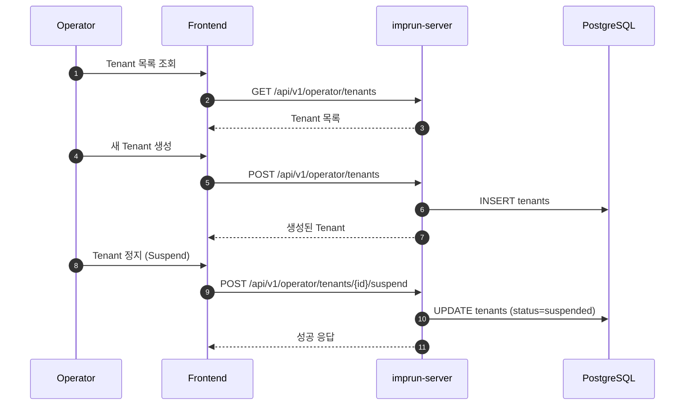

# EPIC-025: Tenant & User 관리 (Operator)

## 개요

| 항목 | 내용 |
|------|------|
| **Epic ID** | EPIC-025 |
| **제목** | Tenant & User 관리 |
| **우선순위** | P1 |
| **예상 기간** | 1.5주 |
| **상태** | 🔲 미시작 |
| **의존성** | EPIC-011 (인증) |
| **GitHub Issue** | [#18](https://github.com/imprun/imp-gateway/issues/18) |

## 용어 정의

> **Operator Portal**에서는 시스템 관리 관점에서 내부 용어를 사용합니다.

| 내부 용어 (Operator) | 사용자 용어 (Provider/Consumer) | 설명 |
|---------------------|-------------------------------|------|
| `Tenant` | **Workspace** | 격리된 작업 공간 단위 |
| `TenantMember` | **Member** | 워크스페이스 소속 사용자 |

## 목표

Operator가 시스템의 멀티 테넌트 구조를 관리하고, 사용자 계정 및 권한을 제어할 수 있다.

## 배경

Imp-Gateway는 멀티 테넌트 아키텍처를 기반으로 한다. 각 Provider와 Consumer는 특정 Tenant에 속하며, Operator는 이러한 Tenant를 생성, 수정, 정지할 수 있어야 한다. 또한 시스템 전반의 사용자 계정을 관리하고 시스템 역할을 부여해야 한다.

## 범위

### 포함
- **Tenant 관리**: 생성, 조회, 수정, 정지/활성화, 삭제
- **User 관리**: 사용자 목록 조회, 상세 정보, 강제 로그아웃, 비활성화
- **Role 관리**: 사용자에게 시스템 역할(System Admin, Operator 등) 부여
- **Tenant 멤버십**: 사용자를 특정 Tenant에 할당 및 역할 부여

### 제외
- Provider/Consumer의 워크스페이스 멤버 관리 (EPIC-029)
- 사용자 회원가입 흐름 (EPIC-011)

## 사용자 흐름

### Tenant 관리 흐름



## 기술 요구사항

### 백엔드 API

```
GET    /api/v1/operator/tenants           # Tenant 목록
POST   /api/v1/operator/tenants           # Tenant 생성
GET    /api/v1/operator/tenants/:id       # Tenant 상세
PUT    /api/v1/operator/tenants/:id       # Tenant 수정
DELETE /api/v1/operator/tenants/:id       # Tenant 삭제 (Soft Delete)

GET    /api/v1/operator/users             # User 목록
GET    /api/v1/operator/users/:id         # User 상세
PUT    /api/v1/operator/users/:id/roles   # User 시스템 역할 수정
```

### 데이터 모델

```typescript
interface Tenant {
  id: string;
  name: string;
  slug: string;
  status: 'active' | 'suspended' | 'deleted';
  plan: 'free' | 'pro' | 'enterprise';
  created_at: string;
}

interface User {
  id: string;
  email: string;
  name: string;
  avatar_url?: string;
  system_roles: ('admin' | 'operator' | 'viewer')[];
  status: 'active' | 'inactive';
  last_login_at: string;
}
```

## UI/UX 가이드

### Tenant 목록 페이지
- 테이블 컬럼: 이름, Slug, 상태(뱃지), 사용자 수, 생성일
- 필터: 상태별, 플랜별
- 검색: 이름, Slug

### User 목록 페이지
- 테이블 컬럼: 이름, 이메일, 시스템 역할, 상태, 최근 로그인
- 액션: 상세 보기, 역할 변경, 비활성화

## 스토리 분해

| Story | 제목 | 예상 | 우선순위 |
|-------|------|------|----------|
| 25.1 | Tenant 엔티티 및 API 구현 | 0.5일 | P1 |
| 25.2 | Tenant 목록 및 CRUD UI 구현 | 1.5일 | P1 |
| 25.3 | User 엔티티 및 API 구현 | 0.5일 | P1 |
| 25.4 | User 목록 및 관리 UI 구현 | 1.5일 | P1 |

## 변경 이력

| 날짜 | 버전 | 변경 내용 | 작성자 |
|------|------|----------|--------|
| 2025-11-27 | 1.0 | 초기 작성 | Gemini |
| 2025-11-28 | 1.1 | 용어 정의 섹션 추가 (Tenant ↔ Workspace) | Claude |
