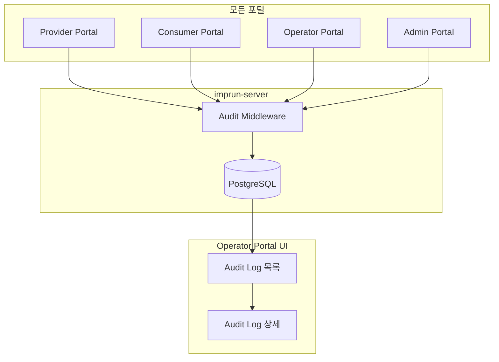
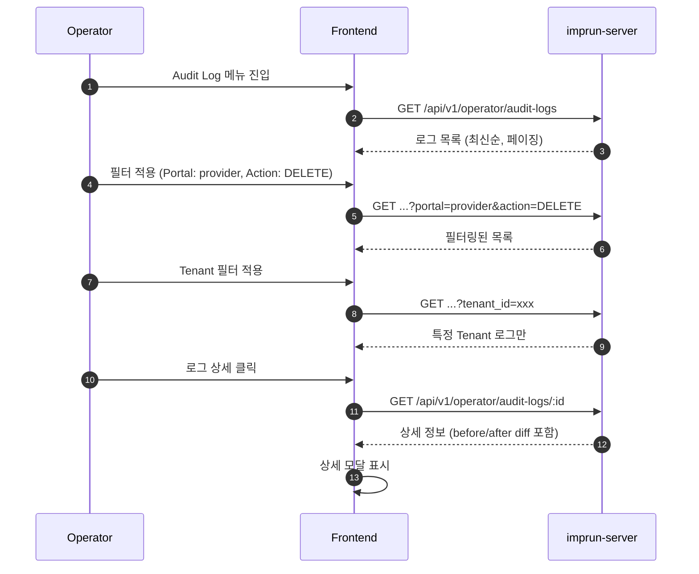

# EPIC-026: System Audit Logs (시스템 감사 로그)

## 개요

| 항목 | 내용 |
|------|------|
| **Epic ID** | EPIC-026 |
| **제목** | System Audit Logs |
| **우선순위** | P2 |
| **예상 기간** | 2주 |
| **상태** | 🔲 미시작 |
| **의존성** | EPIC-013 (Cluster), EPIC-014 (Agent), EPIC-017 (API Service) |
| **GitHub Issue** | [#19](https://github.com/imprun/imp-gateway/issues/19) |

## 목표

Operator Portal에서 **전체 시스템(모든 포털, 모든 Tenant)**에서 발생한 주요 작업의 이력을 추적하고 감사할 수 있다.

## 배경

Operator Portal은 **시스템 전체를 운영하는 관리자 포털**이다. 보안 및 규정 준수(Compliance)를 위해 모든 포털에서 발생한 작업을 중앙에서 감사할 수 있어야 한다.

### Operator Portal의 역할

```
Operator Portal (시스템 운영자)
├── 모든 포털의 작업 감사
│   ├── Provider Portal: API Service, Product, Gateway, ProductPublish
│   ├── Consumer Portal: Subscription, Credential
│   ├── Operator Portal: Cluster, Agent
│   └── Admin Portal: Tenant, User, Role
│
└── 시스템 전체 운영 책임
    ├── Fleet 모니터링 (Cluster/Agent)
    ├── 장애 대응
    └── 규정 준수 (Compliance)
```

---

## 도메인 모델

### Audit Log 데이터 흐름



---

## 범위

### 포함

- **감사 로그 수집**: 모든 포털의 주요 API 요청에 대한 자동 로깅 (Middleware)
- **감사 로그 조회**: Operator 포털에서의 로그 검색 및 필터링
- **상세 보기**: 변경 전/후 데이터(Diff) 확인

### 제외

- 로그 아카이빙/내보내기 (Post-MVP)
- 실시간 로그 스트리밍 (Post-MVP)
- **로그 보존 정책** (Post-MVP) - MVP에서는 무기한 보관, 추후 보존 기간 설정 및 자동 삭제/아카이브 기능 추가

---

## 기술 요구사항

### 백엔드 API

```
GET    /api/v1/operator/audit-logs        # 로그 목록 (검색/필터/페이징)
GET    /api/v1/operator/audit-logs/:id    # 로그 상세
```

### 데이터 모델

```go
// AuditLog 모델 (Go)
type AuditLog struct {
    ID        uuid.UUID `gorm:"type:uuid;primaryKey"`

    // Tenant 정보 (멀티테넌트 지원)
    TenantID   *uuid.UUID `gorm:"type:uuid;index"`
    TenantName string     // 스냅샷

    // Actor 정보
    ActorID    uuid.UUID `gorm:"type:uuid;index"`
    ActorName  string    // 스냅샷
    ActorEmail string    // 스냅샷
    ActorRole  string    // 작업 시점의 역할

    // Action 정보
    Action string `gorm:"index"` // CREATE, UPDATE, DELETE, DEPLOY, LOGIN, LOGOUT
    Portal string `gorm:"index"` // operator, provider, consumer, admin

    // Resource 정보
    ResourceType string    `gorm:"index"` // cluster, agent, api_service, product, etc.
    ResourceID   uuid.UUID `gorm:"type:uuid;index"`
    ResourceName string    // 식별용 스냅샷

    // Request 정보
    IPAddress     string
    UserAgent     string
    RequestMethod string // GET, POST, PUT, DELETE
    RequestPath   string

    // 변경 내용
    Details datatypes.JSON // { before: {}, after: {}, diff: {} }

    // Metadata
    CreatedAt time.Time `gorm:"index"`
}
```

```typescript
// AuditLog 타입 (TypeScript)
interface AuditLog {
  id: string;

  // Tenant 정보
  tenant_id: string | null;  // null = 시스템 레벨 작업
  tenant_name: string;

  // Actor 정보
  actor_id: string;
  actor_name: string;
  actor_email: string;
  actor_role: string;

  // Action 정보
  action: AuditAction;
  portal: Portal;

  // Resource 정보
  resource_type: ResourceType;
  resource_id: string;
  resource_name: string;

  // Request 정보
  ip_address: string;
  user_agent: string;
  request_method: string;
  request_path: string;

  // 변경 내용
  details?: {
    before?: Record<string, any>;
    after?: Record<string, any>;
    diff?: Record<string, any>;
  };

  created_at: string;
}

type AuditAction =
  | 'CREATE'
  | 'UPDATE'
  | 'DELETE'
  | 'DEPLOY'
  | 'PUBLISH'
  | 'WITHDRAW'
  | 'LOGIN'
  | 'LOGOUT'
  | 'APPROVE'
  | 'REJECT';

type Portal = 'operator' | 'provider' | 'consumer' | 'admin';

type ResourceType =
  // 물리 계층 (Operator)
  | 'cluster'
  | 'agent'
  // 논리 계층 (Provider)
  | 'api_service'
  | 'route'
  | 'backend'
  | 'policy'
  | 'product'
  | 'gateway'
  | 'plan'
  // 배포 계층
  | 'product_publish'
  // 구독 계층 (Consumer)
  | 'customer'
  | 'subscription'
  | 'client_app'
  | 'consumer'
  | 'credential'
  // 시스템 (Admin)
  | 'tenant'
  | 'user'
  | 'role';
```

### FSD 구조

```
web/src/
├── entities/audit-log/
│   ├── index.ts
│   ├── model/
│   │   └── types.ts              # AuditLog, AuditAction, ResourceType
│   └── api/
│       └── audit-log-api.ts      # useAuditLogs, useAuditLogDetail
│
├── features/audit-log/
│   ├── index.ts
│   ├── audit-log-filters.tsx     # 필터 컴포넌트
│   └── audit-log-detail-modal.tsx
│
├── widgets/operator/audit/
│   ├── index.ts
│   └── audit-log-table.tsx       # DataTable 위젯
│
└── pages/operator/
    └── audit-logs-page.tsx       # 감사 로그 페이지
```

---

## 사용자 흐름



---

## UI/UX 가이드

### Audit Log 목록

```
┌─────────────────────────────────────────────────────────────────────────────────┐
│  System Audit Logs                                                               │
├─────────────────────────────────────────────────────────────────────────────────┤
│                                                                                 │
│  ┌─ Filters ──────────────────────────────────────────────────────────────────┐ │
│  │                                                                             │ │
│  │  Portal: [All ▼]   Action: [All ▼]   Resource: [All ▼]   Tenant: [All ▼]  │ │
│  │                                                                             │ │
│  │  Date Range: [Last 7 days ▼]   Search: [________________]   [Search]       │ │
│  │                                                                             │ │
│  └─────────────────────────────────────────────────────────────────────────────┘ │
│                                                                                 │
│  ┌─────────────────────────────────────────────────────────────────────────────┐ │
│  │ Time         │ Portal   │ Actor        │ Action │ Resource      │ Tenant   │ │
│  ├──────────────┼──────────┼──────────────┼────────┼───────────────┼──────────┤ │
│  │ 2 mins ago   │ provider │ john@acme    │ CREATE │ api_service   │ Acme Inc │ │
│  │ 5 mins ago   │ operator │ admin@imp    │ UPDATE │ cluster       │ -        │ │
│  │ 10 mins ago  │ consumer │ dev@beta     │ CREATE │ credential    │ Beta Co  │ │
│  │ 15 mins ago  │ provider │ jane@acme    │ DELETE │ product       │ Acme Inc │ │
│  │ 20 mins ago  │ operator │ admin@imp    │ DEPLOY │ product_pub   │ Acme Inc │ │
│  └─────────────────────────────────────────────────────────────────────────────┘ │
│                                                                                 │
│  Showing 1-20 of 1,234 results                    [< Prev] [1] [2] [3] [Next >] │
│                                                                                 │
└─────────────────────────────────────────────────────────────────────────────────┘
```

### Action 색상 코드

| Action | 색상 | Badge |
|--------|------|-------|
| CREATE | 초록 | `<Badge variant="default">` |
| UPDATE | 파랑 | `<Badge variant="secondary">` |
| DELETE | 빨강 | `<Badge variant="destructive">` |
| DEPLOY | 보라 | `<Badge className="bg-purple-500">` |
| PUBLISH | 청록 | `<Badge className="bg-cyan-500">` |
| LOGIN/LOGOUT | 회색 | `<Badge variant="outline">` |

### Portal 색상 코드

| Portal | 색상 |
|--------|------|
| operator | 주황 |
| provider | 파랑 |
| consumer | 초록 |
| admin | 빨강 |

---

## 스토리 분해

### 백엔드 (imprun-server)

| Story | 제목 | 예상 | 우선순위 | 상태 |
|-------|------|------|----------|------|
| 26.1 | Audit Log DB 스키마 및 모델 정의 | 0.5일 | P2 | 🔲 |
| 26.2 | 불변성 트리거 및 인덱스 설정 | 0.25일 | P2 | 🔲 |
| 26.3 | Audit Middleware 구현 (자동 로깅) | 1.5일 | P2 | 🔲 |
| 26.4 | Audit Log 조회 API (목록/상세) + 접근 제어 | 1일 | P2 | 🔲 |

### 프론트엔드 (web)

| Story | 제목 | 예상 | 우선순위 | 상태 |
|-------|------|------|----------|------|
| 26.5 | Audit Log Entity 및 API 연동 | 0.5일 | P2 | 🔲 |
| 26.6 | Audit Log 목록 페이지 (DataTable + 필터) | 1.5일 | P2 | 🔲 |
| 26.7 | Audit Log 상세 모달 (Diff 표시) | 1일 | P2 | 🔲 |

**총 예상: 6.25일 (약 1.5주)**

### 스토리 상세

#### 26.1 Audit Log DB 스키마 및 모델 정의
- `audit_logs` 테이블 생성 (GORM AutoMigrate)
- Go 모델 정의 (`internal/models/audit_log.go`)
- 필드: tenant_id, actor_*, action, portal, resource_*, request_*, details, created_at

#### 26.2 불변성 트리거 및 인덱스 설정
- PostgreSQL 트리거: UPDATE/DELETE 방지
- 인덱스: tenant_id, actor_id, action, portal, resource_type, created_at
- DB 마이그레이션 파일 작성

#### 26.3 Audit Middleware 구현
- Gin Middleware로 구현
- POST/PUT/PATCH/DELETE 요청 시 자동 로깅
- 비동기 처리 (goroutine + channel)
- Before/After 데이터 캡처

#### 26.4 Audit Log 조회 API + 접근 제어
- `GET /api/v1/operator/audit-logs` (목록, 필터, 페이징)
- `GET /api/v1/operator/audit-logs/:id` (상세)
- system-admin 역할 체크 미들웨어

#### 26.5 Audit Log Entity 및 API 연동
- `entities/audit-log/model/types.ts`
- `entities/audit-log/api/audit-log-api.ts`
- TanStack Query hooks: `useAuditLogs`, `useAuditLogDetail`

#### 26.6 Audit Log 목록 페이지
- DataTable with columns: Time, Portal, Actor, Action, Resource, Tenant
- 필터: Portal, Action, Resource Type, Tenant, Date Range
- 페이징, 정렬

#### 26.7 Audit Log 상세 모달
- 모든 필드 표시
- Before/After Diff 시각화 (JSON Diff Viewer)

---

## 감사 대상 작업

### 물리 계층 (Operator Portal)

| Resource | Actions |
|----------|---------|
| cluster | CREATE, UPDATE, DELETE |
| agent | CREATE (등록), DELETE (해제), UPDATE (상태 변경) |

### 논리 계층 (Provider Portal)

| Resource | Actions |
|----------|---------|
| api_service | CREATE, UPDATE, DELETE |
| route | CREATE, UPDATE, DELETE |
| backend | CREATE, UPDATE, DELETE |
| policy | CREATE, UPDATE, DELETE |
| product | CREATE, UPDATE, DELETE |
| gateway | CREATE, UPDATE, DELETE |
| plan | CREATE, UPDATE, DELETE |
| product_publish | CREATE, UPDATE, DELETE, PUBLISH, WITHDRAW |

### 구독 계층 (Consumer Portal)

| Resource | Actions |
|----------|---------|
| customer | CREATE, UPDATE, DELETE |
| subscription | CREATE, APPROVE, REJECT, DELETE |
| client_app | CREATE, UPDATE, DELETE |
| credential | CREATE, DELETE (회전, 폐기) |

### 시스템 (Admin Portal)

| Resource | Actions |
|----------|---------|
| tenant | CREATE, UPDATE, DELETE |
| user | CREATE, UPDATE, DELETE, LOGIN, LOGOUT |
| role | CREATE, UPDATE, DELETE |

---

## 보안 요구사항

### 불변성 (Immutability)

Audit Log는 **수정 및 삭제가 불가능**해야 한다.

- **API 레벨**: UPDATE, DELETE API 미제공 (GET만 존재)
- **DB 레벨**: `audit_logs` 테이블에 UPDATE/DELETE 방지 트리거 설정

```sql
-- PostgreSQL: UPDATE/DELETE 방지 트리거
CREATE OR REPLACE FUNCTION prevent_audit_log_modification()
RETURNS TRIGGER AS $$
BEGIN
    RAISE EXCEPTION 'Audit logs cannot be modified or deleted';
END;
$$ LANGUAGE plpgsql;

CREATE TRIGGER audit_log_immutable
    BEFORE UPDATE OR DELETE ON audit_logs
    FOR EACH ROW
    EXECUTE FUNCTION prevent_audit_log_modification();
```

### 접근 제어

Audit Log 조회는 **Operator Portal의 system-admin 역할만** 가능하다.

| 역할 | 조회 권한 |
|------|----------|
| system-admin | ✅ 전체 시스템 로그 조회 가능 |
| sre-operator | ❌ 조회 불가 (Fleet 모니터링만) |
| 기타 역할 | ❌ 조회 불가 |

### Audit Log 조회 감사 (Post-MVP)

- MVP에서는 제외
- Post-MVP: "누가 Audit Log를 조회했는가" 기록 추가 (민감 정보 접근 추적)

---

## 수용 기준

### 기능 요구사항

- [ ] 모든 포털의 CRUD 작업이 자동으로 기록된다
- [ ] Operator(system-admin)가 전체 시스템 로그를 조회할 수 있다
- [ ] Portal, Action, Resource, Tenant로 필터링할 수 있다
- [ ] 날짜 범위로 검색할 수 있다
- [ ] 로그 상세에서 변경 전/후 값을 확인할 수 있다

### 보안 요구사항

- [ ] Audit Log는 수정/삭제가 불가능하다 (불변성)
- [ ] system-admin 역할만 Audit Log를 조회할 수 있다 (접근 제어)

### 비기능 요구사항

- [ ] 로그 기록이 API 응답 시간에 영향을 주지 않는다 (비동기 처리)
- [ ] 대량 로그에서도 조회 성능이 유지된다 (인덱스)
- [ ] TanStack Query로 캐싱 및 페이징 처리

---

## 변경 이력

| 날짜 | 버전 | 변경 내용 | 작성자 |
|------|------|----------|--------|
| 2025-11-27 | 1.0 | 초기 작성 | Gemini |
| 2025-11-28 | 2.0 | 전체 시스템 Audit으로 범위 확장, 데이터 모델 재설계 | Claude |
| 2025-11-28 | 2.1 | 보안 요구사항 추가 (불변성, 접근 제어, 조회 감사) | Claude |
