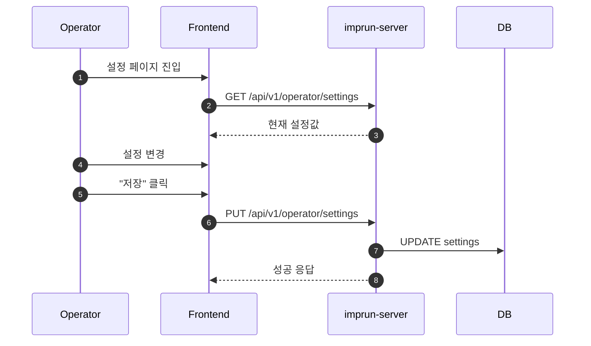

# EPIC-027: System Settings (시스템 설정)

## 개요

| 항목 | 내용 |
|------|------|
| **Epic ID** | EPIC-027 |
| **제목** | System Settings |
| **우선순위** | P2 |
| **예상 기간** | 1주 |
| **상태** | 🔲 미시작 |
| **의존성** | 없음 |
| **GitHub Issue** | [#20](https://github.com/imprun/imp-gateway/issues/20) |

## 목표

Operator가 시스템의 전역 설정(Global Configuration)을 관리할 수 있다.

## 배경

시스템 운영에 필요한 SMTP 서버 설정, 기본 정책, 화이트라벨링(로고, 이름), 호스트명 규칙 등의 설정을 코드 배포 없이 런타임에 변경할 수 있어야 한다.

## 범위

### 포함
- **일반 설정**: 시스템 이름, 로고 URL, 지원 이메일
- **도메인 설정**: 기본 도메인, 호스트명 템플릿
- **SMTP 설정**: 호스트, 포트, 사용자, 비밀번호, 보안 설정
- **보안 설정**: 세션 타임아웃, 허용된 도메인
- **Agent 설정**: 동기화 주기, 하트비트 주기

### 제외
- 인프라 레벨 설정 (K8s ConfigMap으로 관리되는 환경변수 등)
- OIDC/Keycloak 설정 (인프라 레벨)

## 사용자 흐름



## 기술 요구사항

### 백엔드 API

```
GET    /api/v1/operator/settings              # 전체 설정 조회
PUT    /api/v1/operator/settings              # 설정 업데이트 (부분 수정)
POST   /api/v1/operator/settings/test-email   # SMTP 테스트 발송
```

### 데이터 모델

```typescript
interface SystemSettings {
  general: {
    system_name: string;           // 시스템 표시 이름
    logo_url: string;              // 로고 URL
    support_email: string;         // 지원 이메일
  };
  domain: {
    base_domain: string;           // 기본 도메인 (예: imprun.dev)
    hostname_template: string;     // 호스트명 템플릿 (예: {product}.{env}.{region}.{domain})
  };
  smtp: {
    enabled: boolean;              // SMTP 활성화 여부
    host: string;
    port: number;
    username: string;
    password: string;              // 조회 시 마스킹 처리
    sender_name: string;
    sender_email: string;
    use_tls: boolean;
  };
  security: {
    session_timeout_minutes: number;
    allowed_domains: string[];     // 허용된 이메일 도메인
  };
  agent: {
    sync_interval_seconds: number;      // 동기화 주기 (기본: 30)
    heartbeat_interval_seconds: number; // 하트비트 주기 (기본: 10)
  };
}
```

### 데이터베이스 스키마

```sql
CREATE TABLE system_settings (
    id UUID PRIMARY KEY DEFAULT gen_random_uuid(),
    key VARCHAR(100) UNIQUE NOT NULL,
    value JSONB NOT NULL,
    created_at TIMESTAMP WITH TIME ZONE DEFAULT NOW(),
    updated_at TIMESTAMP WITH TIME ZONE DEFAULT NOW()
);

-- 초기 데이터
INSERT INTO system_settings (key, value) VALUES
('general', '{"system_name": "Imp-Gateway", "logo_url": "", "support_email": "support@imprun.dev"}'),
('domain', '{"base_domain": "imprun.dev", "hostname_template": "{product}.{env}.{region}.{domain}"}'),
('smtp', '{"enabled": false, "host": "", "port": 587, "username": "", "password": "", "sender_name": "Imp-Gateway", "sender_email": "", "use_tls": true}'),
('security', '{"session_timeout_minutes": 60, "allowed_domains": []}'),
('agent', '{"sync_interval_seconds": 30, "heartbeat_interval_seconds": 10}');
```

## UI/UX 가이드

### 설정 페이지 구조
- **레이아웃**: 탭 기반 구분
  - General (일반)
  - Domain (도메인)
  - Email (SMTP)
  - Security (보안)
  - Agent (에이전트)
- **폼**: 각 설정 항목에 대한 입력 필드 및 유효성 검사
- **테스트 기능**: SMTP "Send Test Email" 버튼

### 호스트명 템플릿 변수
| 변수 | 설명 | 예시 |
|------|------|------|
| `{product}` | Product slug | payment-api |
| `{env}` | Environment | dev, staging, prod |
| `{region}` | Cluster region | kr-seoul, us-east |
| `{domain}` | Base domain | imprun.dev |

**예시 결과**: `payment-api.prod.kr-seoul.imprun.dev`

## 스토리 분해

| Story | 제목 | 예상 | 우선순위 |
|-------|------|------|----------|
| 27.1 | System Settings Backend API | 0.5일 | P2 |
| 27.2 | General/Domain/Security 설정 UI | 0.5일 | P2 |
| 27.3 | SMTP 설정 및 테스트 UI | 0.5일 | P2 |
| 27.4 | Agent 설정 UI | 0.25일 | P2 |

## 변경 이력

| 날짜 | 버전 | 변경 내용 | 작성자 |
|------|------|----------|--------|
| 2025-11-27 | 1.0 | 초기 작성 | Gemini |
| 2025-11-28 | 1.1 | Domain/Agent 설정 추가, 스토리 세분화 | Claude |
