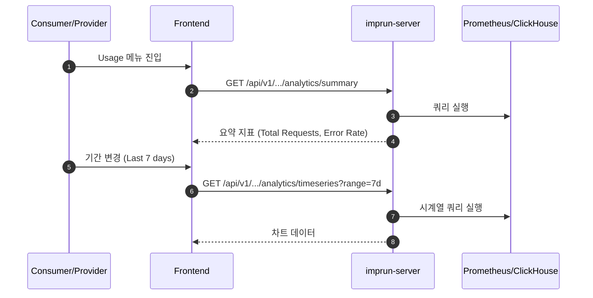

# EPIC-028: Usage Analytics (사용량 분석)

## 개요

| 항목 | 내용 |
|------|------|
| **Epic ID** | EPIC-028 |
| **제목** | Usage Analytics |
| **우선순위** | P1 |
| **예상 기간** | 2주 |
| **상태** | 🔲 미시작 |
| **의존성** | EPIC-015 (Fleet Dashboard) |
| **GitHub Issue** | [#21](https://github.com/imprun/imp-gateway/issues/21) |

## 목표

Consumer와 Provider에게 API 사용량, 트래픽 패턴, 에러율 등에 대한 시각적 분석 정보를 제공한다.

## 배경

- **Consumer**: 자신의 API 사용량(Quota)을 확인하고, 비용을 예측하며, 연동 상태를 모니터링해야 한다.
- **Provider**: 제공하는 API의 인기, 트래픽 추이, 소비자별 사용량을 분석하여 서비스를 개선해야 한다.

## 범위

### 포함
- **Consumer Usage**: 내 구독별 호출 수, 에러율, 응답 시간 (시계열 차트)
- **Provider Analytics**: Product/Service별 총 호출 수, Top Consumers, 상태 코드 분포
- **기간 필터**: 최근 1시간, 24시간, 7일, 30일, 사용자 지정

### 제외
- 실시간 로그 스트림 (Post-MVP)
- 복잡한 BI 리포트 (Post-MVP)

## 사용자 흐름



## 기술 요구사항

### 백엔드 API

```
# Consumer
GET /api/v1/consumer/analytics/summary
GET /api/v1/consumer/analytics/timeseries

# Provider
GET /api/v1/provider/analytics/summary
GET /api/v1/provider/analytics/timeseries
GET /api/v1/provider/analytics/top-consumers
```

### 시각화 라이브러리
- **Recharts** 또는 **Visx** 사용 권장 (React 생태계 친화적)

## UI/UX 가이드

### 대시보드 위젯
- **Line Chart**: 시간대별 트래픽 추이 (성공/실패 구분)
- **Bar Chart**: 일별/월별 사용량
- **Donut Chart**: 상태 코드 분포 (2xx, 4xx, 5xx)
- **Metric Card**: 주요 지표 (총 호출 수, 평균 응답 시간)

## 스토리 분해

| Story | 제목 | 예상 | 우선순위 |
|-------|------|------|----------|
| 28.1 | Analytics API 연동 및 데이터 처리 | 1일 | P1 |
| 28.2 | 차트 컴포넌트 구현 (Line, Bar, Donut) | 2일 | P1 |
| 28.3 | Consumer Usage 페이지 구현 | 1.5일 | P1 |
| 28.4 | Provider Analytics 페이지 구현 | 1.5일 | P1 |

## 변경 이력

| 날짜 | 버전 | 변경 내용 | 작성자 |
|------|------|----------|--------|
| 2025-11-27 | 1.0 | 초기 작성 | Gemini |
