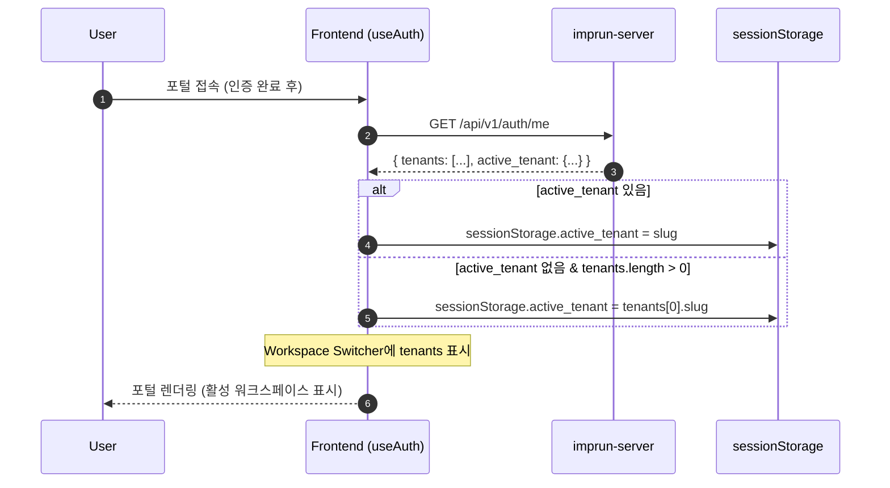
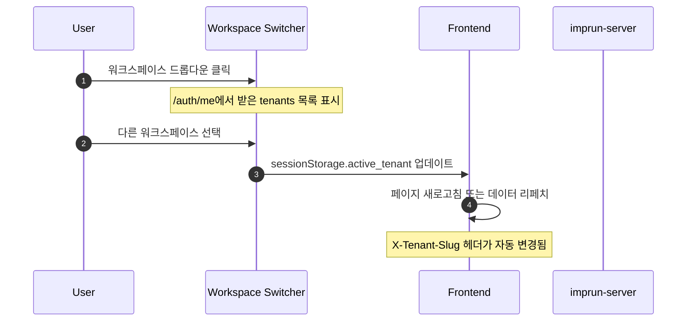
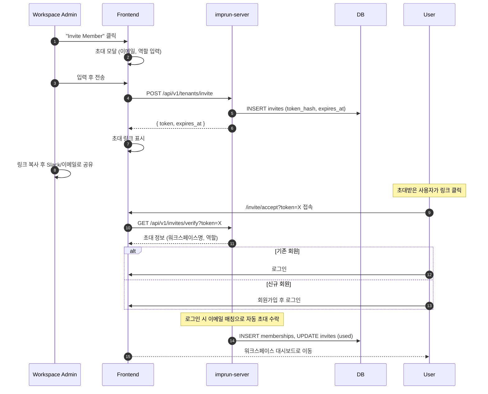

# EPIC-029: Workspace Management (워크스페이스 관리)

## 개요

| 항목 | 내용 |
|------|------|
| **Epic ID** | EPIC-029 |
| **제목** | Workspace Management (워크스페이스 관리) |
| **우선순위** | P1 |
| **예상 기간** | 1.5주 |
| **상태** | ✅ 완료 |
| **의존성** | EPIC-011 (인증) |
| **GitHub Issue** | [#22](https://github.com/imprun/imp-gateway/issues/22) |

## 용어 정의

| 백엔드 (내부) | 프론트엔드 (UI) | 설명 |
|--------------|----------------|------|
| `Tenant` | **Workspace** | 사용자들이 함께 작업하는 공간 |
| `Membership` | **Member** | 워크스페이스에 소속된 사용자 |
| `Invite` | **Invitation** | 워크스페이스 초대 |
| `tenant_slug` | `workspace_slug` | 워크스페이스 고유 식별자 |
| `active_tenant` | `current_workspace` | 현재 활성화된 워크스페이스 |

> **참고**: 백엔드 API와 DB에서는 `tenant`를 사용하지만, UI에서는 **Workspace**로 표시합니다.

## 목표

Provider 포털에서 워크스페이스를 생성/전환하고, 멤버를 초대하여 협업할 수 있다. 포털 진입 시 `/auth/me`에서 워크스페이스 목록을 가져와 스위처에 표시하고, 활성 워크스페이스를 자동 선택한다.

## 배경

Imp-Gateway는 멀티 테넌트 아키텍처 기반이다. 회원가입 시 개인 워크스페이스가 자동 생성되며, 사용자는 추가 워크스페이스를 생성하거나 초대를 통해 다른 워크스페이스에 참여할 수 있다.

---

## 백엔드 구현 현황 분석

> **결론: 기존 백엔드를 대부분 재사용하고, 일부 API만 추가 구현**

### ✅ 이미 구현된 기능 (재사용)

#### Models (`models.go`)
| Model | 필드 | 상태 |
|-------|------|------|
| `Tenant` | id, slug, name, type, status, settings | ✅ 완료 |
| `User` | id, keycloak_user_id, email, display_name, status | ✅ 완료 |
| `Membership` | id, user_id, tenant_id, role, status, scopes | ✅ 완료 |
| `Invite` | id, tenant_id, email, role, token_hash, expires_at, status | ✅ 완료 |

#### Repository Layer
| Repository | 메서드 | 상태 |
|------------|--------|------|
| `TenantRepo` | Create, FindBySlug, FindByID, List, Update, Delete | ✅ 완료 |
| `MembershipRepo` | Create, ListByTenant, ListActiveByUser, GetByUserAndTenant, Save | ✅ 완료 |
| `InviteRepo` | Create, ListByTenant, FindByTokenHash, MarkUsed, Delete | ✅ 완료 |
| `UserRepo` | CreatePersonalTenantForUser, FindOrCreate | ✅ 완료 |

#### API Endpoints
| Endpoint | 설명 | 상태 |
|----------|------|------|
| `GET /api/v1/auth/me` | 사용자 정보 + 워크스페이스 목록 | ✅ 완료 |
| `POST /api/v1/tenants` | 워크스페이스 생성 | ✅ 완료 |
| `GET /api/v1/tenants` | 워크스페이스 목록 | ✅ 완료 |
| `GET /api/v1/tenants/members` | 멤버 목록 | ✅ 완료 |
| `POST /api/v1/tenants/invite` | 멤버 초대 | ✅ 완료 |
| `GET /api/v1/tenants/invitations` | 초대 목록 | ✅ 완료 |
| `DELETE /api/v1/tenants/invitations/:id` | 초대 취소 | ✅ 완료 |
| `POST /api/v1/tenants/members/update` | 멤버 역할/상태 수정 | ✅ 완료 |
| `GET /api/v1/invites/verify?token=X` | 초대 검증 (Public) | ✅ 완료 |

#### 특이사항 (잘 구현된 기능)
- **초대 자동 수락**: 로그인 시 이메일 매칭으로 자동 초대 수락
- **개인 워크스페이스 자동 생성**: 신규 사용자에게 자동 생성
- **SHA256 토큰 해싱**: 보안적으로 안전한 초대 토큰 관리
- **Role 기반 권한**: owner, admin, developer, viewer, billing, operator

### ⚠️ 추가 구현 필요

| 기능 | Endpoint | 우선순위 | 설명 |
|------|----------|----------|------|
| 멤버 제거 | `DELETE /api/v1/tenants/members/:id` | P1 | MembershipRepo.Delete() 추가 필요 |
| 워크스페이스 수정 | `PUT /api/v1/tenants/:slug` | P1 | 이름 변경 등 |
| 워크스페이스 삭제 | `DELETE /api/v1/tenants/:slug` | P2 | 개인 워크스페이스 제외 |
| 초대 재발송 | `POST /api/v1/tenants/invitations/:id/resend` | P2 | 만료된 초대 갱신 |
| 활성 워크스페이스 변경 | `PUT /api/v1/auth/me` | P1 | active_tenant 저장 (서버사이드) |

### 🔧 개선 권장사항

| 항목 | 현재 | 개선 |
|------|------|------|
| 멤버 목록 페이지네이션 | ❌ 없음 | 추가 필요 |
| 초대 목록 페이지네이션 | ❌ 없음 | 추가 필요 |
| 감사 로그 | ❌ 없음 | 멤버 변경 이력 추적 |
| 초대 Rate Limiting | ❌ 없음 | 스팸 방지 |

---

## 범위

### 포함
- **워크스페이스 전환**: 사이드바에서 워크스페이스 스위칭
- **워크스페이스 생성**: 새 팀 워크스페이스 생성
- **워크스페이스 설정**: 이름 변경, 삭제
- **멤버 목록**: 현재 워크스페이스에 소속된 사용자 목록
- **멤버 초대**: 이메일로 멤버 초대 (초대 링크 발송)
- **멤버 권한 관리**: 멤버별 역할 할당 및 수정
- **멤버 제거**: 멤버 제명
- **초대 관리**: 보낸 초대 목록, 취소

### 제외
- 세밀한 리소스 단위 권한 제어 (Resource-level ACL) - Post-MVP
- 워크스페이스 간 리소스 이동
- 초대 메일 자동 발송 (SMTP) - 현재는 초대 링크를 수동으로 공유

---

## 워크스페이스 유형

### Personal Workspace (개인 워크스페이스)
- 회원가입 시 자동 생성
- Slug: `{username}-personal` 형식
- 소유자만 접근 가능
- 삭제 불가 (계정 삭제 시에만)
- 이름 변경 가능

### Team Workspace (팀 워크스페이스)
- 사용자가 직접 생성
- 여러 멤버 초대 가능
- Owner가 삭제 가능
- Type: `provider` 또는 `customer`

---

## 사용자 흐름

### 포털 진입 & 워크스페이스 초기화 플로우



### 워크스페이스 전환 플로우



### 멤버 초대 플로우



---

## UI/UX 가이드

### 워크스페이스 스위처 (사이드바 헤더)

**위치**: Provider 사이드바 상단

```
┌─────────────────────────────────────┐
│  🏢 Acme Corp                    ▼  │
├─────────────────────────────────────┤
│  ✓ Acme Corp                        │  <- Current (체크 표시)
│    Personal Workspace               │
│    Startup Inc.                     │
│  ───────────────────────────────    │
│  + Create Workspace                 │
└─────────────────────────────────────┘
```

### 워크스페이스 설정 페이지 (`/provider/settings/workspace`)

```
┌─────────────────────────────────────────────────────────────────┐
│  Workspace Settings                                             │
├─────────────────────────────────────────────────────────────────┤
│                                                                 │
│  General                                                        │
│  ┌─────────────────────────────────────────────────────────┐    │
│  │  Workspace Name                                         │    │
│  │  ┌───────────────────────────────────┐  [Save]          │    │
│  │  │ Acme Corp                         │                  │    │
│  │  └───────────────────────────────────┘                  │    │
│  │                                                         │    │
│  │  Workspace URL                                          │    │
│  │  imprun.dev/acme-corp (read-only)                       │    │
│  └─────────────────────────────────────────────────────────┘    │
│                                                                 │
│  Danger Zone                                                    │
│  ┌─────────────────────────────────────────────────────────┐    │
│  │  ⚠️ Delete Workspace                                    │    │
│  │  This action cannot be undone.        [Delete Workspace]│    │
│  └─────────────────────────────────────────────────────────┘    │
│                                                                 │
└─────────────────────────────────────────────────────────────────┘
```

### 멤버 관리 페이지 (`/provider/settings/members`)

```
┌─────────────────────────────────────────────────────────────────┐
│  Members                                        [+ Invite]      │
├─────────────────────────────────────────────────────────────────┤
│                                                                 │
│  ┌─────────────────────────────────────────────────────────┐    │
│  │  👤 John Doe          john@acme.com       Owner         │    │
│  │  👤 Jane Smith        jane@acme.com       Admin    [⋮]  │    │
│  │  👤 Bob Wilson        bob@acme.com        Developer[⋮]  │    │
│  └─────────────────────────────────────────────────────────┘    │
│                                                                 │
│  Pending Invitations (2)                        [Expand ▼]      │
│  ┌─────────────────────────────────────────────────────────┐    │
│  │  ✉ alice@acme.com     Developer  Expires in 5d    [x]   │    │
│  │  ✉ charlie@acme.com   Viewer     Expires in 7d    [x]   │    │
│  └─────────────────────────────────────────────────────────┘    │
│                                                                 │
└─────────────────────────────────────────────────────────────────┘
```

### 역할(Role) 정의

| Role | 설명 | 권한 |
|------|------|------|
| **owner** | 워크스페이스 소유자 | 모든 권한 + 워크스페이스 삭제 + 소유권 이전 |
| **admin** | 관리자 | 모든 권한 + 멤버 관리 |
| **developer** | 개발자 | API 서비스, 라우트, 백엔드 관리 |
| **viewer** | 뷰어 | 읽기 전용 |
| **billing** | 결제 담당 | 결제 정보만 접근 가능 |

---

## 기술 요구사항

### 현재 Workspace Switcher 구현 현황 (개선 필요)

> **문제점**: 현재 `provider-sidebar.tsx`는 **하드코딩된 mock 데이터**를 사용하고 있음

#### 현재 상태 (`web/src/widgets/layout/provider-sidebar.tsx`)
```typescript
// ❌ 현재 - Mock 데이터 사용 중
const data = {
  tenants: [
    { name: "Acme Inc", logo: Package, plan: "Enterprise" },
    { name: "Acme Corp.", logo: Network, plan: "Startup" },
    { name: "Evil Corp.", logo: Rocket, plan: "Free" },
  ],
  // ...
}
const [activeTenant, setActiveTenant] = React.useState(data.tenants[0])
```

#### 개선 목표
```typescript
// ✅ 개선 후 - /auth/me API 데이터 사용
// 1. useAuthMe hook으로 워크스페이스 목록 가져오기
const { data: authMe } = useAuthMe(); // TanStack Query

// 2. sessionStorage에서 활성 워크스페이스 읽기
const activeTenantSlug = sessionStorage.getItem("active_tenant");
const currentWorkspace = authMe?.tenants.find(t => t.slug === activeTenantSlug);

// 3. 워크스페이스 전환 시 sessionStorage 업데이트
const handleWorkspaceChange = (workspace: Workspace) => {
  sessionStorage.setItem("active_tenant", workspace.slug);
  window.location.reload(); // or queryClient.invalidateQueries()
};
```

#### 구현 필요 사항

| 항목 | 파일 | 설명 |
|------|------|------|
| `useAuthMe` hook 생성 | `entities/workspace/model/queries.ts` | TanStack Query로 `/auth/me` 캐싱 |
| Workspace Switcher 개선 | `widgets/layout/provider-sidebar.tsx` | mock → 실제 API 데이터 |
| AuthProvider 확장 | `shared/lib/auth/client.ts` | 워크스페이스 목록을 Context로 공유 |
| X-Tenant-Slug 자동 주입 | `shared/api/client.ts` | API 호출 시 헤더 자동 추가 |

### 백엔드 API (기존 + 신규)

```bash
# ✅ 기존 API (재사용)
GET    /api/v1/auth/me                      # 사용자 정보 + 워크스페이스 목록
POST   /api/v1/tenants                      # 워크스페이스 생성
GET    /api/v1/tenants                      # 워크스페이스 목록
GET    /api/v1/tenants/members              # 멤버 목록
POST   /api/v1/tenants/invite               # 멤버 초대
GET    /api/v1/tenants/invitations          # 초대 목록
DELETE /api/v1/tenants/invitations/:id      # 초대 취소
POST   /api/v1/tenants/members/update       # 멤버 역할/상태 수정
GET    /api/v1/invites/verify?token=X       # 초대 검증 (Public)

# 🆕 신규 API (구현 필요)
PUT    /api/v1/tenants/:slug                # 워크스페이스 수정
DELETE /api/v1/tenants/:slug                # 워크스페이스 삭제
DELETE /api/v1/tenants/members/:id          # 멤버 제거
```

### 프론트엔드 데이터 모델

```typescript
// 워크스페이스 (from /auth/me)
interface Workspace {
  id: string;
  slug: string;
  name: string;
  type: 'personal' | 'provider' | 'customer';
  role: WorkspaceRole;  // 현재 사용자의 역할
}

// 역할
type WorkspaceRole = 'owner' | 'admin' | 'developer' | 'viewer' | 'billing';

// 멤버
interface WorkspaceMember {
  id: string;
  user_id: string;
  email: string;
  display_name: string;
  role: WorkspaceRole;
  status: 'active' | 'invited' | 'disabled';
  created_at: string;
}

// 초대
interface WorkspaceInvitation {
  id: string;
  email: string;
  role: WorkspaceRole;
  token?: string;  // 생성 시에만 반환
  status: 'active' | 'used' | 'expired';
  expires_at: string;
  created_at: string;
}
```

### FSD 구조

```
web/src/
├── entities/workspace/
│   ├── api/workspace-api.ts          # API 호출 함수
│   ├── model/
│   │   ├── types.ts                  # 타입 정의
│   │   └── queries.ts                # TanStack Query hooks
│   └── ui/
│       ├── workspace-avatar.tsx
│       └── workspace-role-badge.tsx
│
├── features/workspace/
│   ├── workspace-switcher/           # 워크스페이스 전환
│   │   └── ui/workspace-switcher.tsx
│   ├── create-workspace/             # 워크스페이스 생성
│   │   ├── ui/create-workspace-dialog.tsx
│   │   └── model/schema.ts
│   ├── invite-member/                # 멤버 초대
│   │   ├── ui/invite-member-dialog.tsx
│   │   └── model/schema.ts
│   ├── manage-member/                # 멤버 관리
│   │   └── ui/member-role-select.tsx
│   └── delete-workspace/             # 워크스페이스 삭제
│       └── ui/delete-workspace-dialog.tsx
│
├── widgets/workspace/
│   ├── members-table/
│   │   └── index.tsx
│   └── invitations-list/
│       └── index.tsx
│
├── pages/provider/settings/
│   ├── workspace-settings-page.tsx   # /provider/settings/workspace
│   └── members-page.tsx              # /provider/settings/members
│
└── app/provider/settings/
    ├── workspace/page.tsx
    └── members/page.tsx
```

---

## 스토리 분해

| Story | 제목 | 예상 | 우선순위 | 백엔드 |
|-------|------|------|----------|--------|
| 29.1 | Workspace 엔티티 및 API 연동 (`useAuthMe` hook) | 0.5일 | P0 | ✅ 재사용 |
| 29.2 | Workspace Switcher 개선 (mock → API 데이터) | 0.5일 | P0 | ✅ 재사용 |
| 29.3 | Workspace 생성 다이얼로그 | 0.5일 | P1 | ✅ 재사용 |
| 29.4 | Workspace 설정 페이지 (이름 변경, 삭제) | 0.5일 | P1 | 🆕 일부 구현 |
| 29.5 | 멤버 목록 테이블 UI | 0.5일 | P1 | ✅ 재사용 |
| 29.6 | 멤버 초대 다이얼로그 (링크 복사) | 0.5일 | P1 | ✅ 재사용 |
| 29.7 | 멤버 역할 변경 및 제거 | 0.5일 | P1 | 🆕 DELETE 구현 |
| 29.8 | 초대 목록 및 취소 UI | 0.5일 | P2 | ✅ 재사용 |
| 29.9 | 초대 수락 페이지 (`/invite/accept`) | 0.5일 | P2 | ✅ 재사용 |

**총 예상 기간**: 4.5일 (프론트엔드) + 0.5일 (백엔드 보완) = **5일**

### Story 29.1 상세: Workspace 엔티티 및 API 연동

**목표**: `/auth/me` API 응답을 캐싱하고 워크스페이스 데이터를 전역에서 접근 가능하게 한다.

**구현 파일**:
```
entities/workspace/
├── api/workspace-api.ts      # fetchAuthMe, fetchWorkspaces
├── model/
│   ├── types.ts              # Workspace, WorkspaceRole 타입
│   └── queries.ts            # useAuthMe, useWorkspaces hooks
└── index.ts
```

**TanStack Query 훅 예시**:
```typescript
// entities/workspace/model/queries.ts
export function useAuthMe() {
  return useQuery({
    queryKey: ['auth', 'me'],
    queryFn: fetchAuthMe,
    staleTime: 5 * 60 * 1000, // 5분 캐시
    enabled: isAuthenticated(),
  });
}
```

### Story 29.2 상세: Workspace Switcher 개선

**목표**: 하드코딩된 mock 데이터 대신 실제 API 데이터로 워크스페이스 스위처 구현

**변경 사항**:
1. `provider-sidebar.tsx`에서 `useAuthMe()` 사용
2. `sessionStorage.active_tenant` 읽기/쓰기 로직
3. 워크스페이스 전환 시 쿼리 무효화 또는 페이지 리로드
4. 개인 워크스페이스 vs 팀 워크스페이스 아이콘 구분

**UI 구성**:
```
┌─────────────────────────────────────┐
│  🏠 Personal Workspace           ▼  │  <- 개인 (type: personal)
├─────────────────────────────────────┤
│  ✓ 🏠 Personal Workspace            │  <- 현재 선택됨
│    🏢 Acme Corp (Admin)             │  <- 팀 + 역할 표시
│    🏢 Startup Inc (Developer)       │
│  ───────────────────────────────    │
│  + Create Workspace                 │
└─────────────────────────────────────┘
```

---

## 수용 기준

### 기능 요구사항
- [ ] 포털 진입 시 `/auth/me`에서 워크스페이스 목록을 가져와야 한다.
- [ ] 활성 워크스페이스가 없으면 첫 번째 워크스페이스를 자동 선택해야 한다.
- [ ] 사이드바에서 워크스페이스를 전환할 수 있어야 한다.
- [ ] 워크스페이스 전환 시 API 호출에 `X-Tenant-Slug` 헤더가 자동 변경되어야 한다.
- [ ] 새 워크스페이스를 생성할 수 있어야 한다.
- [ ] 워크스페이스 이름을 변경할 수 있어야 한다.
- [ ] 팀 워크스페이스를 삭제할 수 있어야 한다 (개인 워크스페이스 제외).
- [ ] 멤버 목록에서 역할을 변경할 수 있어야 한다.
- [ ] 이메일로 새 멤버를 초대할 수 있어야 한다.
- [ ] 초대받은 사용자가 로그인 시 자동으로 워크스페이스에 참여해야 한다.
- [ ] Owner/Admin은 멤버를 제명할 수 있어야 한다.

### UI/UX 요구사항
- [ ] 워크스페이스 스위처가 현재 워크스페이스를 명확히 표시해야 한다.
- [ ] 역할 변경/제거 시 확인 다이얼로그를 표시해야 한다.
- [ ] 본인을 제명하거나 유일한 Owner를 제명할 수 없어야 한다.
- [ ] 초대 링크를 클립보드에 복사할 수 있어야 한다.

### 기술 요구사항
- [ ] 워크스페이스 전환 시 `sessionStorage`의 `active_tenant`가 업데이트되어야 한다.
- [ ] API 호출 시 `X-Tenant-Slug` 헤더가 자동으로 포함되어야 한다.
- [ ] TanStack Query를 사용하여 멤버/초대 목록을 캐싱해야 한다.

---

## 변경 이력

| 날짜 | 버전 | 변경 내용 | 작성자 |
|------|------|----------|--------|
| 2025-11-27 | 1.0 | 초기 작성 | Gemini |
| 2025-11-28 | 2.0 | Team → Workspace 용어 변경, 백엔드 분석 추가, 범위 확장 | Claude |
| 2025-11-28 | 2.1 | 포털 진입 시 워크스페이스 초기화 플로우 추가, Switcher 개선 요구사항 상세화 | Claude |
