# EPIC-030: Account Settings

## 개요

| 항목 | 내용 |
|------|------|
| **Epic ID** | EPIC-030 |
| **제목** | Account Settings (계정 설정) |
| **우선순위** | P1 |
| **예상 기간** | 1주 |
| **상태** | ✅ 완료 |
| **의존성** | EPIC-012 (포털 레이아웃) |
| **GitHub Issue** | [#23](https://github.com/imprun/imp-gateway/issues/23) |

## 목표

사용자가 자신의 프로필, 청구 정보, 알림 설정, 연결된 앱 등을 통합된 설정 페이지에서 관리할 수 있다.

## 배경

현재 사용자는 기본적인 정보 수정 외에 통합된 계정 관리 기능을 제공받지 못하고 있다. 프리미엄 서비스를 지향하는 UI/UX에 맞춰, 사용자가 자신의 계정 관련 설정을 직관적이고 편리하게 관리할 수 있는 중앙화된 설정 페이지가 필요하다.

> **참고**: 제공된 디자인 시안을 바탕으로 다크 테마 기반의 고급스러운 UI를 구현한다.

---

## UI/UX 가이드

### 레이아웃 구조 (GitHub Style)

설정 페이지는 **글로벌 헤더(App Bar)** 아래에 위치하며, **카테고리별로 그룹화된 사이드바**를 가진 2단 레이아웃으로 구성된다.

```
┌─────────────────────────────────────────────────────────────────────────────┐
│  [Logo]  Breadcrumbs / Settings                                     [User]  │  <-- Global Header
├─────────────────────────────────────────────────────────────────────────────┤
│  ┌───────────────┐  ┌───────────────────────────────────────────────────┐   │
│  │               │  │  Public profile                                   │   │
│  │  User Settings│  │                                                   │   │
│  │   Profile     │  │  Name                                             │   │
│  │   Account     │  │  ┌─────────────────────────────────────────────┐  │   │
│  │   Appearance  │  │  │ Your name                                   │  │   │
│  │   Notificati..│  │  └─────────────────────────────────────────────┘  │   │
│  │               │  │                                                   │   │
│  │  Access       │  │  Public email                                     │   │
│  │   Billing     │  │  ┌─────────────────────────────────────────────┐  │   │
│  │   Plans       │  │  │ Select a verified email to display       ▼  │  │   │
│  │   Emails      │  │  └─────────────────────────────────────────────┘  │   │
│  │   Security 🔗 │  │                                                   │   │
│  │               │  │  Bio                                              │   │
│  │  Integrations │  │  ┌─────────────────────────────────────────────┐  │   │
│  │   Applications│  │  │ Tell us a little bit about yourself         │  │   │
│  │               │  │  └─────────────────────────────────────────────┘  │   │
│  └───────────────┘  └───────────────────────────────────────────────────┘   │
└─────────────────────────────────────────────────────────────────────────────┘
```

### 메뉴 구성 (GitHub Style)

1.  **User Settings**
    *   **Profile**: 공개 프로필 정보 (이름, Bio, URL, 소셜 계정)
    *   **Account**: 계정 삭제, 사용자명 변경
    *   **Appearance**: **테마 설정 (Light/Dark/System)** - `next-themes` 사용
    *   **Notifications**: 알림 수신 설정 (UI Only)

2.  **Access**
    *   **Billing & Plans**: 결제 수단, 구독 플랜 관리 (UI Only)
    *   **Emails**: 이메일 주소 관리 (UI Only)
    *   **Security**: 🔗 **Keycloak Account Console로 리다이렉트** (비밀번호, 2FA, 세션 관리)

3.  **Integrations**
    *   **Applications**: 연동된 외부 앱 관리 (UI Only)

---

## Keycloak 연동

> **중요**: 인증 관련 설정(비밀번호, 2FA, 세션)은 Keycloak에서 관리됩니다.

### Security 섹션 처리

Password & Authentication 대신 **Security** 메뉴를 제공하며, Keycloak Account Console로 리다이렉트합니다.

```typescript
// Security 메뉴 클릭 시
const KC_ISSUER = process.env.NEXT_PUBLIC_KC_ISSUER;
const accountUrl = `${KC_ISSUER}/account/#/security/signingin`;
window.open(accountUrl, '_blank');
```

### Keycloak Account Console 기능
- 비밀번호 변경
- 2단계 인증(2FA) 설정
- 활성 세션 관리
- 연동된 소셜 계정 관리

---

## 사용자 흐름

```mermaid
sequenceDiagram
    autonumber
    actor User
    participant Nav as User Dropdown
    participant Settings as 설정 페이지
    participant API as imprun-server
    participant KC as Keycloak

    User->>Nav: 프로필 클릭 -> Settings 선택
    Nav->>Settings: /settings (기본: Profile) 이동

    rect rgb(30, 30, 30)
        note right of Settings: 프로필 수정
        User->>Settings: 정보 입력 후 "Save Changes" 클릭
        Settings->>API: PUT /api/v1/auth/me
        API-->>Settings: 성공 응답
        Settings-->>User: 토스트 메시지 (Success)
    end

    rect rgb(30, 30, 30)
        note right of Settings: 테마 변경
        User->>Settings: "Appearance" 클릭
        Settings->>Settings: /settings/appearance 이동
        User->>Settings: Dark 테마 선택
        Settings->>Settings: localStorage에 저장, 즉시 반영
    end

    rect rgb(30, 30, 30)
        note right of Settings: 보안 설정
        User->>Settings: "Security" 클릭
        Settings->>KC: Keycloak Account Console 새 탭 열기
        KC-->>User: 비밀번호/2FA 설정 페이지
    end
```



---

## 범위

### 포함
- `/settings` 라우트 및 하위 페이지 구현
- 설정 전용 사이드바 레이아웃 (카테고리 지원)
- **Profile, Account**: 실제 API 연동 (정보 수정, 계정 관리)
- **Appearance**: 테마 설정 (Light/Dark/System) - `next-themes` 패키지 사용
- **Security**: Keycloak Account Console 링크 제공
- **Billing, Plans, Emails, Applications, Notifications**: **UI 전용 구현** (백엔드 연동 없음, Mock 데이터 사용)

### 제외
- 실제 결제 처리 (PG 연동)
- 외부 앱 실제 OAuth 연동
- 언어 설정 (다국어 지원 미포함)
- 복잡한 권한 관리
- Keycloak 내장 기능 (비밀번호 변경, 2FA 등) - Keycloak Console 사용

---

## 기술 요구사항

### 패키지 의존성

```bash
pnpm add next-themes
```

### FSD 구조

```
web/
├── app/settings/                    # Next.js App Router
│   ├── layout.tsx                   # SettingsLayout 적용
│   ├── page.tsx                     # redirect to /settings/profile
│   ├── profile/page.tsx
│   ├── account/page.tsx
│   ├── appearance/page.tsx
│   ├── notifications/page.tsx
│   ├── billing/page.tsx
│   ├── emails/page.tsx
│   └── applications/page.tsx
│
├── src/
│   ├── features/settings/           # 🆕 Settings 관련 기능
│   │   ├── profile-form/
│   │   │   ├── ui/profile-form.tsx
│   │   │   └── model/schema.ts
│   │   ├── account-form/
│   │   │   └── ui/account-form.tsx
│   │   ├── appearance-form/
│   │   │   └── ui/appearance-form.tsx
│   │   ├── billing-info/
│   │   │   └── ui/billing-info.tsx   # UI Only (Mock)
│   │   └── applications-list/
│   │       └── ui/applications-list.tsx # UI Only (Mock)
│   │
│   ├── widgets/layout/
│   │   └── settings-sidebar.tsx     # 🆕 설정 전용 사이드바
│   │
│   └── pages/settings/              # FSD page components
│       ├── profile-page.tsx
│       ├── account-page.tsx
│       ├── appearance-page.tsx
│       ├── notifications-page.tsx
│       ├── billing-page.tsx
│       ├── emails-page.tsx
│       └── applications-page.tsx
```

### 테마 설정 구현

```typescript
// app/layout.tsx (root)
import { ThemeProvider } from "next-themes";

export default function RootLayout({ children }) {
  return (
    <html lang="ko" suppressHydrationWarning>
      <body>
        <ThemeProvider
          attribute="class"
          defaultTheme="system"
          enableSystem
          disableTransitionOnChange
        >
          {children}
        </ThemeProvider>
      </body>
    </html>
  );
}
```

### 데이터 모델

```typescript
// Profile (API 연동)
interface UserProfile {
  name: string;
  username: string;
  email: string;
  bio?: string;
  urls?: string[];
  avatar_url?: string;
}

// Notifications (UI Only - localStorage)
interface NotificationSettings {
  communication_emails: boolean;
  marketing_emails: boolean;
  social_emails: boolean;
  security_emails: boolean;
}

// Theme (localStorage via next-themes)
type Theme = "light" | "dark" | "system";
```

### API 엔드포인트

| Method | Endpoint | 설명 | 상태 |
|--------|----------|------|------|
| GET | `/api/v1/auth/me` | 현재 사용자 정보 조회 | 구현됨 |
| PUT | `/api/v1/auth/me` | 프로필 정보 수정 | 구현 필요 |
| DELETE | `/api/v1/auth/me` | 계정 삭제 | 구현 필요 |

---

## 스토리 분해

| Story | 제목 | 예상 | 우선순위 |
|-------|------|------|----------|
| 30.1 | Settings 레이아웃 및 라우팅 구조 | 0.5일 | P0 |
| 30.2 | User Settings (Profile, Account) 구현 | 1일 | P0 |
| 30.3 | Appearance (테마 설정) 구현 | 0.5일 | P0 |
| 30.4 | Access (Billing, Emails, Security) UI 구현 | 1일 | P1 |
| 30.5 | Integrations (Applications) UI 구현 | 0.5일 | P1 |

---

## 수용 기준

### 기능 요구사항
- [ ] 사용자 드롭다운에서 Settings를 클릭하면 설정 페이지로 이동해야 한다.
- [ ] 설정 페이지 사이드바가 카테고리별로 구분되어야 한다.
- [ ] 프로필 정보를 수정하고 저장할 수 있어야 한다.
- [ ] 반응형 디자인이 적용되어 모바일에서도 사용 가능해야 한다.
- [ ] Security 메뉴 클릭 시 Keycloak Account Console로 이동해야 한다.

### UI/UX 요구사항
- [ ] GitHub Settings와 유사한 레이아웃 및 스타일을 제공해야 한다.
- [ ] 폼 입력 시 유효성 검사(Zod)가 동작해야 한다.
- [ ] 저장 성공/실패 시 토스트 메시지를 표시해야 한다.
- [ ] 테마 변경 시 즉시 반영되어야 한다 (새로고침 불필요).

### 기술 요구사항
- [ ] `next-themes`를 사용하여 테마 설정을 구현해야 한다.
- [ ] FSD 아키텍처를 준수해야 한다.
- [ ] TanStack Query를 사용하여 서버 상태를 관리해야 한다.
