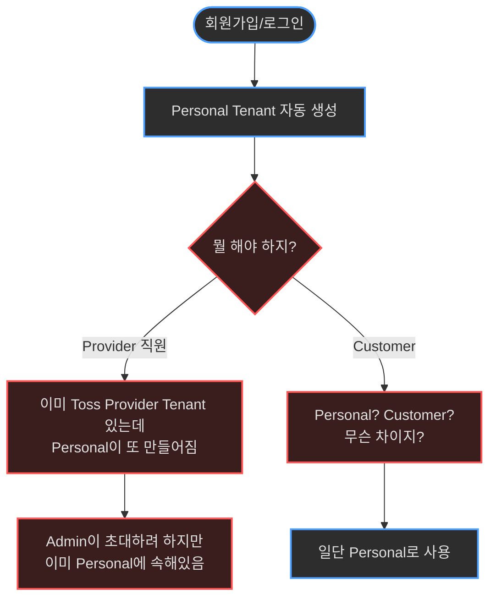
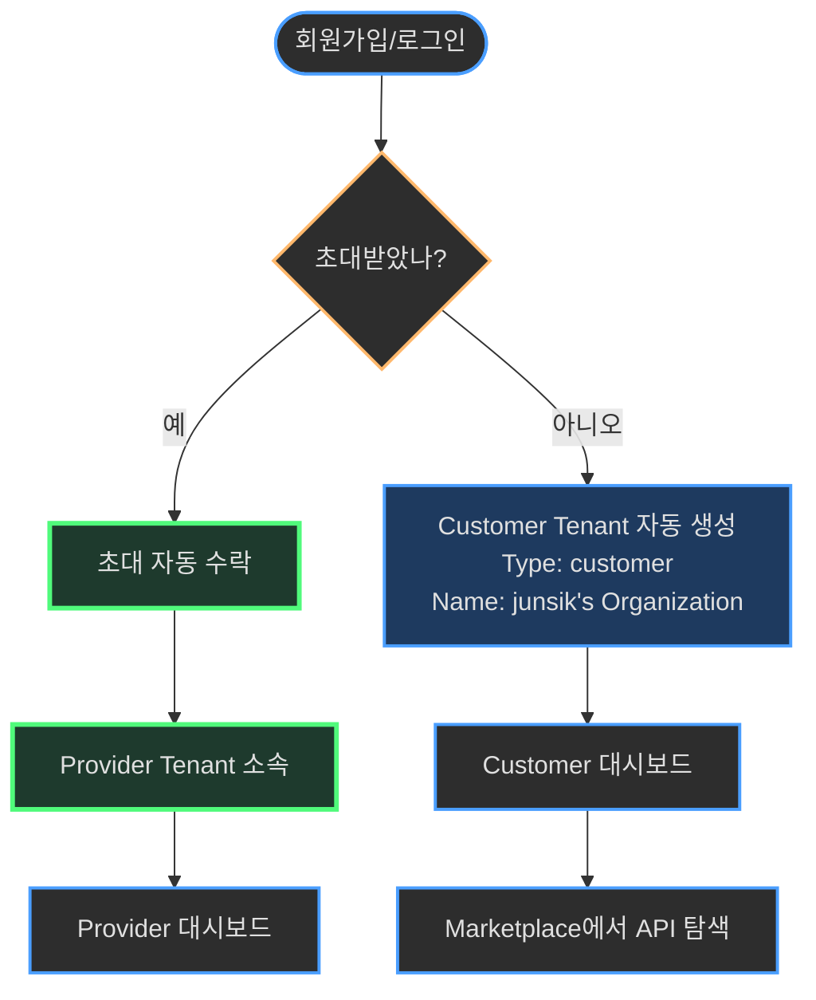
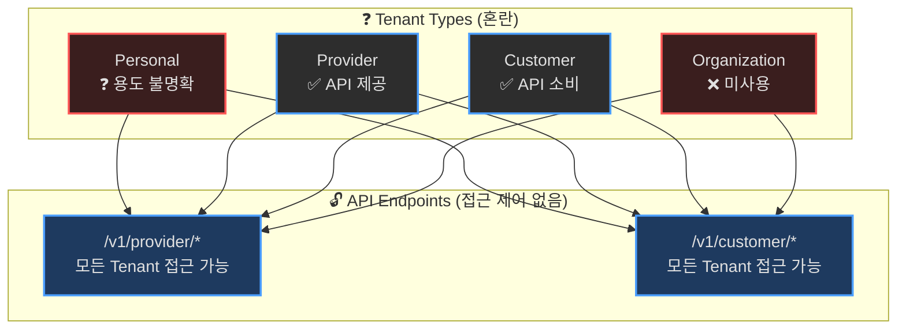
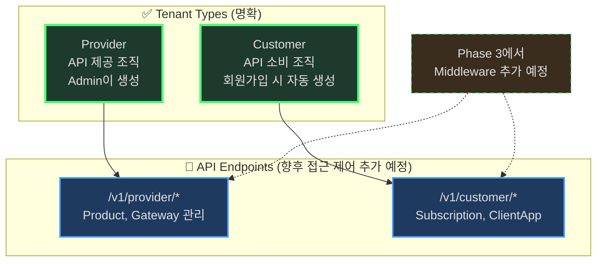
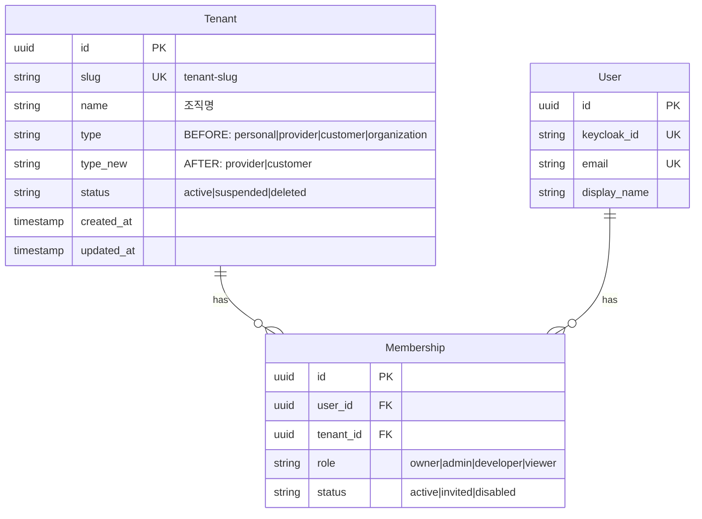

# EPIC-031: Tenant Type & Role 체계 정리

**Status**: 📝 Planning
**Priority**: P0
**Owner**: TBD
**Created**: 2025-12-01

---

## Background

### 현재 시스템 상태
> 💡 **Serena Memory 기반**: `domain_model.md`, `auth_security.md` 참조

**Tenant Type** (현재 4종):
```typescript
type TenantType = "personal" | "provider" | "customer" | "organization";
```

**Role 계층** (2단계):
1. **System Role** (Keycloak Realm Roles)
   - `system-admin`: 플랫폼 관리자
   - `sre-operator`: 인프라 관리자 (현재 미사용)
   - `user`: 일반 사용자

2. **Tenant Role** (Membership 테이블)
   - `owner`, `admin`, `developer`, `viewer`, `billing`, `operator`

### 문제점

#### 1. Tenant Type의 모호함
- **personal**: 회원가입 시 자동 생성되지만 용도가 불명확
  - Provider 기능 사용 가능? Customer 기능 사용 가능? → 실제로는 둘 다 가능
  - 삭제 불가 이유? → 에러 방지용으로 급하게 추가됨

- **organization**: 정의만 있고 실제 사용처 없음
  - personal과의 차이점 불명확
  - Backend 주석에는 언급도 없음 (`provider/customer/internal`만 언급)

- **provider/customer 구분이 있지만 실제 권한 차이 없음**
  - `/v1/provider/*` API: Tenant Type 체크 없음 (모든 Type 접근 가능)
  - `/v1/customer/*` API: Tenant Type 체크 없음 (모든 Type 접근 가능)
  - Type 필드는 UI 레이블용일 뿐

#### 2. 비즈니스 모델과 불일치

**PRD의 비전** (B2B API Marketplace):
```
Provider (API 판매자) ─→ Product 생성 ─→ Marketplace
                                          ↓
Customer (API 구매자) ←─ Subscription ←─┘
```

**현재 구현**:
- Provider와 Customer 구분 없음 (접근 제어 미구현)
- Personal Tenant가 모든 기능 사용 가능 → 비즈니스 모델과 충돌

#### 3. 회원가입 플로우의 혼란

**현재**:
```
회원가입 → Personal Tenant 자동 생성
         → Tenant 없으면 에러 발생 (임시 해결책)
```

**문제**:
- Personal이 Provider인지 Customer인지 모호
- Provider 직원은 Admin이 초대해야 하는데 Personal이 자동 생성됨
- Customer는 스스로 Tenant를 만들어야 하는데 Personal로 시작

### 비즈니스 목적

Imp-Gateway는 **B2B SaaS (Private Deployment)** 모델:
```
특정 회사 (예: Toss, Naver) → Imp-Gateway 설치
  ↓
회사 내부:
├── Provider (내부 직원)
│   └── API 개발팀, Product 관리팀
│
└── Customer (외부 고객사)
    └── 파트너사, 개인 개발자
```

**한 회사 = 한 Imp-Gateway 인스턴스**

---

## Motivation

**As a** Platform Architect,
**I want** 명확한 Tenant Type과 Role 체계,
**So that**
- Provider와 Customer의 역할이 명확히 구분되고
- 회원가입부터 온보딩까지 혼란 없이 진행되며
- Phase 3 (구독/결제) 구현 시 탄탄한 기반이 마련됨

### 기대 효과

1. **비즈니스 명확성**
   - Provider = API 제공, Customer = API 소비 명확히 구분
   - PRD의 Marketplace 비전과 일치

2. **기술 부채 해소**
   - Personal/Organization 중복 제거
   - 사용하지 않는 코드 정리

3. **향후 확장성**
   - Phase 3 (구독/결제) 구현 시 Tenant Type 기반 접근 제어 추가 가능
   - Middleware에서 Provider/Customer 분기 로직 명확화

---

## Goals

### 필수 (P0)

- [ ] **Tenant Type을 2종으로 단순화**
  - `provider`: API 제공 조직
  - `customer`: API 소비 조직 (회원가입 시 자동 생성)

- [ ] **Personal/Organization 제거**
  - DB Migration: `personal` → `customer` 변경
  - DB Migration: `organization` → `customer` 변경
  - Frontend Type 정의 수정
  - Backend Validation 수정

- [ ] **회원가입 플로우 개선**
  - Personal Tenant → Customer Tenant로 용도 변경
  - 이름: `{사용자명}'s Organization`
  - Type: `customer` (명확)

- [ ] **Customer Portal에 Workspace Switcher 추가**
  - 현재 Provider Portal만 Workspace Switcher 있음
  - Customer도 여러 Tenant 소속 가능하므로 필요
  - `consumer-sidebar.tsx` 수정 (Provider Sidebar 패턴 적용)

- [ ] **문서 업데이트**
  - PRD: Tenant Type 섹션 명확화
  - README: 회원가입 플로우 설명 추가

### 선택 (P1)

- [ ] **Provider Tenant 생성 UI**
  - Admin이 Provider Tenant 생성
  - 팀원 초대 기능

- [ ] **Role 이름 정리**
  - `sre-operator` → `operator`로 통합 (System Role)
  - Tenant Role의 `operator` 제거 또는 용도 명확화

---

## Non-Goals

이번 EPIC 범위 밖:

- ❌ **Provider/Customer API 접근 제어 구현** (Phase 3에서 다룸)
  - Middleware에서 Tenant Type 체크 추가
  - `/v1/provider/*`는 provider만, `/v1/customer/*`는 customer만

- ❌ **Tenant 삭제 정책** (별도 EPIC)
  - Soft delete vs Hard delete
  - 데이터 보관 기간

- ❌ **Tenant별 리소스 쿼터** (Phase 4)
  - API 호출 제한
  - Storage 제한

---

## User Flow Diagram

### 현재 문제 상황



### 개선된 플로우



---

## System Architecture

### 현재 (4종 Tenant Type)



### 개선안 (2종 Tenant Type)



---

## Data Model

### Migration 계획



### Migration SQL

```sql
-- Step 1: personal → customer
UPDATE tenants
SET type = 'customer'
WHERE type = 'personal';

-- Step 2: organization → customer
UPDATE tenants
SET type = 'customer'
WHERE type = 'organization';

-- Step 3: Validation 추가 (optional)
ALTER TABLE tenants
ADD CONSTRAINT check_tenant_type
CHECK (type IN ('provider', 'customer'));
```

---

## Implementation Details

### Backend (Go)

#### 1. Type 정의 변경

**파일**: `services/imprun-server/internal/data/models/models.go`

```go
// Before
Type string `gorm:"type:text" json:"type"` // provider/customer/internal

// After (주석 명확화)
Type string `gorm:"type:text" json:"type"` // provider|customer
```

#### 2. Validation 변경

**파일**: `services/imprun-server/internal/api/v1/admin/admin.go`

```go
// Before
Type string `json:"type" binding:"omitempty,oneof=personal organization provider customer"`

// After
Type string `json:"type" binding:"omitempty,oneof=provider customer"`
```

#### 3. Personal Tenant 생성 로직 변경

**파일**: `services/imprun-server/internal/data/repo/user_repo.go`

```go
// Before
func (r *UserRepo) CreatePersonalTenantForUser(...) {
    tenant = models.Tenant{
        Type:   "personal",
        Name:   generatePersonalName(...),
        ...
    }
}

// After
func (r *UserRepo) CreateDefaultCustomerTenant(...) {
    tenant = models.Tenant{
        Type:   "customer",  // personal → customer
        Name:   generateOrgName(...),  // "{이름}'s Organization"
        ...
    }
}
```

### Frontend (TypeScript)

#### 1. Type 정의

**파일**: `web/src/entities/operator-tenant/model/types.ts`

```typescript
// Before
export type TenantType = "personal" | "provider" | "customer" | "organization";

// After
export type TenantType = "provider" | "customer";
```

**파일**: `web/src/entities/workspace/model/types.ts`

```typescript
// Before
export type WorkspaceType = "personal" | "provider" | "customer";

// After
export type WorkspaceType = "provider" | "customer";
```

#### 2. Constants 수정

**파일**: `web/src/entities/operator-tenant/lib/constants.ts`

```typescript
// Before
export const TENANT_TYPES: Record<TenantType, {...}> = {
  personal: { label: "Personal", ... },
  provider: { label: "Provider", ... },
  customer: { label: "Customer", ... },
  organization: { label: "Organization", ... },
};

// After
export const TENANT_TYPES: Record<TenantType, {...}> = {
  provider: {
    label: "Provider",
    description: "API 제공 조직",
    variant: "default"
  },
  customer: {
    label: "Customer",
    description: "API 소비 조직",
    variant: "secondary"
  },
};
```

#### 3. Form Validation

**파일**: `web/src/features/operator-tenant/tenant-form/tenant-form.tsx`

```typescript
// Before
type: z.enum(["personal", "provider", "customer"]),

// After
type: z.enum(["provider", "customer"]),
```

#### 4. UI 컴포넌트

**파일**: `web/src/entities/workspace/ui/workspace-avatar.tsx`

```typescript
// Before
const Icon = type === "personal" ? Home : type === "customer" ? Users : Building2;

// After
const Icon = type === "customer" ? Users : Building2;
```

#### 5. Customer Portal에 Workspace Switcher 추가

**파일**: `web/src/widgets/layout/consumer-sidebar.tsx`

```typescript
// Import 추가
import {
  useWorkspaces,
  useCurrentWorkspace,
  switchWorkspace,
  type Workspace,
  WorkspaceRoleBadge,
} from "@/entities/workspace";
import { CreateWorkspaceDialog } from "@/features/workspace/create-workspace";
import { ChevronsUpDown, Plus, Check } from "lucide-react";

// SidebarHeader에 Workspace Switcher 추가
export function ConsumerSidebar({ ...props }: React.ComponentProps<typeof Sidebar>) {
  const { user } = useAuth();
  const { data: workspaces, isLoading: workspacesLoading } = useWorkspaces();
  const { data: currentWorkspace } = useCurrentWorkspace();

  const handleWorkspaceChange = (workspace: Workspace) => {
    if (workspace.slug !== currentWorkspace?.slug) {
      switchWorkspace(workspace);
    }
  };

  return (
    <Sidebar {...props}>
      <SidebarHeader>
        {/* Workspace Switcher - Provider Sidebar와 동일한 패턴 */}
        <SidebarMenu>
          <SidebarMenuItem>
            <DropdownMenu>
              <DropdownMenuTrigger asChild>
                <SidebarMenuButton size="lg" className="...">
                  {/* Current workspace display */}
                </SidebarMenuButton>
              </DropdownMenuTrigger>
              <DropdownMenuContent>
                {/* Workspace list */}
              </DropdownMenuContent>
            </DropdownMenu>
          </SidebarMenuItem>
        </SidebarMenu>
      </SidebarHeader>
      {/* ... rest of sidebar */}
    </Sidebar>
  );
}
```

**현재 상태**:
- ❌ Provider Portal: Workspace Switcher 있음 ✅
- ❌ Customer Portal: Workspace Switcher 없음 ❌
- ❌ Operator Portal: Workspace Switcher 없음 (System Admin이므로 불필요) ✅

**개선 후**:
- ✅ Provider Portal: Workspace Switcher 있음 ✅
- ✅ Customer Portal: Workspace Switcher 추가 ✅
- ✅ Operator Portal: Workspace Switcher 없음 (불필요) ✅

### Database

**Migration 파일**: `services/imprun-server/migrations/XXX_cleanup_tenant_types.sql`

```sql
-- Migrate existing data
UPDATE tenants SET type = 'customer' WHERE type IN ('personal', 'organization');

-- Optional: Add constraint (if you want strict validation)
-- ALTER TABLE tenants ADD CONSTRAINT check_tenant_type CHECK (type IN ('provider', 'customer'));

-- Update comments
COMMENT ON COLUMN tenants.type IS 'Tenant type: provider (API 제공) or customer (API 소비)';
```

---

## Test Plan

### 1. Backend Unit Tests (Go)

**대상**: `services/imprun-server/internal/data/repo/user_repo.go`

- [ ] **`user_repo_test.go` 생성**
  - `TestCreateDefaultCustomerTenant_Success`:
    - **입력**: 신규 사용자 (KeycloakID, Email, Name)
    - **기대 결과**:
      - Type=`customer`인 Tenant 생성됨
      - Tenant 이름 형식: `"{Name}'s Organization"`
      - Role=`owner`인 Membership 생성됨
  - `TestCreateDefaultCustomerTenant_Idempotency`:
    - **시나리오**: 동일 사용자에 대해 함수 2회 호출
    - **기대 결과**: 동일한 Tenant 인스턴스 반환, 에러 없음
  - `TestCreateDefaultCustomerTenant_SlugCollision`:
    - **시나리오**: 이미 존재하는 Slug를 생성하게 되는 이름의 사용자 생성
    - **기대 결과**: Slug에 랜덤 접미사가 자동으로 붙고 성공

**대상**: `services/imprun-server/internal/api/v1/admin/admin.go`

- [ ] **Validation 테스트**
  - `CreateTenantRequest` 유효성 검증 확인:
    - `type="provider"` → 통과
    - `type="customer"` → 통과
    - `type="personal"` → 실패 (ValidationError)
    - `type="organization"` → 실패 (ValidationError)

### 2. Frontend Unit Tests (TypeScript)

**대상**: `web/src/features/operator-tenant/tenant-form/tenant-form.tsx`

- [ ] **`tenant-form.test.tsx` 업데이트/생성**
  - `should render only Provider and Customer options`:
    - `type` 필드의 Select 옵션 확인
    - "Personal"과 "Organization"이 없는지 확인
  - `should validate required fields`:
    - 빈 폼 제출 → Validation 에러 발생 확인
  - `should submit correct payload`:
    - "Provider" 선택, 이름/Slug 입력 → 제출
    - API 호출 인자 확인

### 3. Integration / E2E Tests

**시나리오: 신규 사용자 회원가입**
1. **액션**: 사용자 최초 회원가입 / 로그인 (기존 멤버십 없음).
2. **확인**:
   - Backend: `CreateDefaultCustomerTenant` 호출됨.
   - DB: `type='customer'`인 신규 Tenant 존재.
   - UI: 사용자가 Customer Portal로 리다이렉트됨 (Provider Portal 아님).

**시나리오: Workspace Switcher**
1. **설정**: 사용자가 Tenant A (Provider)와 Tenant B (Customer)에 소속됨.
2. **액션**:
   - 로그인 → 기본 화면 진입 (예: Provider).
   - 사이드바 Workspace Switcher 열기.
3. **확인**:
   - Tenant A와 B 모두 목록에 표시됨.
   - Tenant B 클릭 → Customer Portal로 이동 (`/customer/...`).
   - Tenant A 클릭 → Provider Portal로 이동 (`/provider/...`).

### 4. Migration Verification

**스크립트**: `services/imprun-server/migrations/XXX_cleanup_tenant_types.sql`

- [ ] **마이그레이션 전 설정**:
  - Tenant A 추가 (`type='personal'`)
  - Tenant B 추가 (`type='organization'`)
  - Tenant C 추가 (`type='provider'`)
- [ ] **마이그레이션 실행**:
  - SQL 스크립트 실행.
- [ ] **마이그레이션 후 검증**:
  - Tenant A: `type`이 `'customer'`여야 함
  - Tenant B: `type`이 `'customer'`여야 함
  - Tenant C: `type`이 `'provider'`여야 함 (변경 없음)
  - ID와 이름은 변경되지 않아야 함.

### 5. Manual Verification Checklist

- [ ] **회원가입 플로우**:
  - [ ] 신규 계정으로 가입 → "My Organization"이 Customer 타입으로 생성되는지 확인.
- [ ] **Operator Console**:
  - [ ] Tenant 생성 시도 → Type 드롭다운에 Provider/Customer만 표시되는지 확인.
  - [ ] 기존 Personal Tenant들이 Customer로 표시되는지 확인 (마이그레이션 후).
- [ ] **Customer Portal**:
  - [ ] 사이드바에 Workspace Switcher가 표시되는지 확인.
  - [ ] 전환 기능이 정상 동작하는지 확인.

---

## Migration Plan

### Phase 1: Backend 변경

1. Migration SQL 작성 및 테스트
2. `user_repo.go` 함수명 변경 (Personal → DefaultCustomer)
3. Validation 수정 (2종만 허용)
4. Unit test 추가

### Phase 2: Frontend 변경

1. Type 정의 수정
2. Constants 수정
3. Form validation 수정
4. UI 컴포넌트 수정
5. **Customer Portal에 Workspace Switcher 추가**
   - `consumer-sidebar.tsx` 수정
   - Provider Sidebar 패턴 적용
   - useWorkspaces, switchWorkspace 통합

### Phase 3: Database Migration

1. Staging 환경에서 Migration 실행
2. 데이터 검증
3. Production 환경 Migration

### Rollback Plan

```sql
-- 필요 시 이전 상태로 복원
UPDATE tenants SET type = 'personal' WHERE type = 'customer' AND created_at < '2025-12-01';
```

---

## Dependencies

### Blocking

없음 (독립적 실행 가능)

### Related EPICs

- **EPIC-025**: Tenant & User 관리 (이미 완료)
- **EPIC-029**: Workspace Members (이미 완료)
- **Phase 3**: Provider/Customer API 접근 제어 (향후)

---

## Open Questions

- [ ] **기존 Personal Tenant 사용자들에게 어떻게 안내?**
  - 자동 마이그레이션 vs 공지 후 마이그레이션

- [ ] **Provider Tenant는 Admin만 생성?**
  - 현재: Admin만 생성 가능
  - 대안: 사용자가 "Provider로 전환" 신청?

- [ ] **Tenant Type 변경 기능 필요?**
  - Customer → Provider 전환?
  - 현재는 불가, 향후 요구사항 확인 필요

---

## Success Metrics

- ✅ Tenant Type이 2종으로 단순화됨
- ✅ 회원가입 시 Customer Tenant 자동 생성
- ✅ Personal/Organization 관련 코드 제거
- ✅ 모든 테스트 통과
- ✅ Migration 성공 (데이터 손실 없음)

---

## References

- [PRD v2](../../docs/prd.md)
- [Domain Model (Serena Memory)](../../.serena/memories/domain_model.md)
- [Auth & Security (Serena Memory)](../../.serena/memories/auth_security.md)
- 오늘 논의 내용 (2025-12-01)
