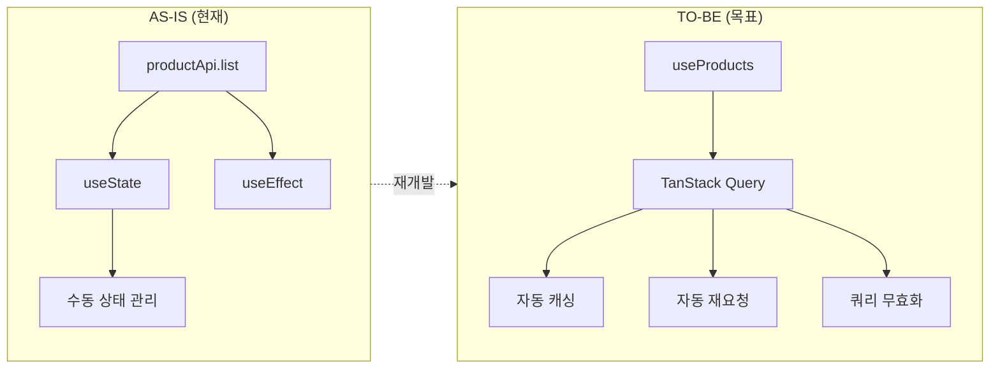
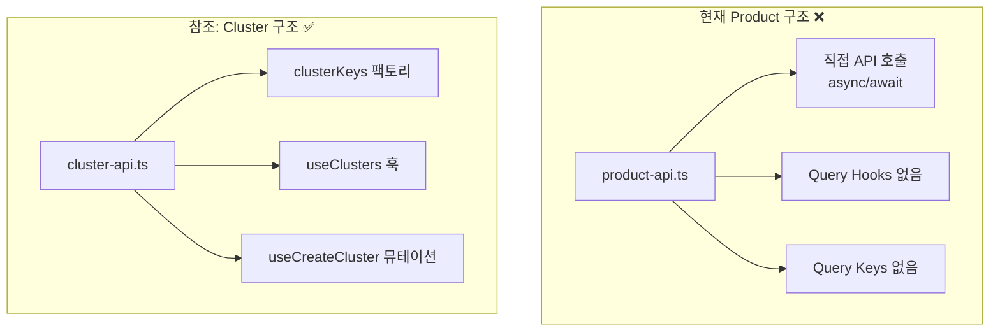
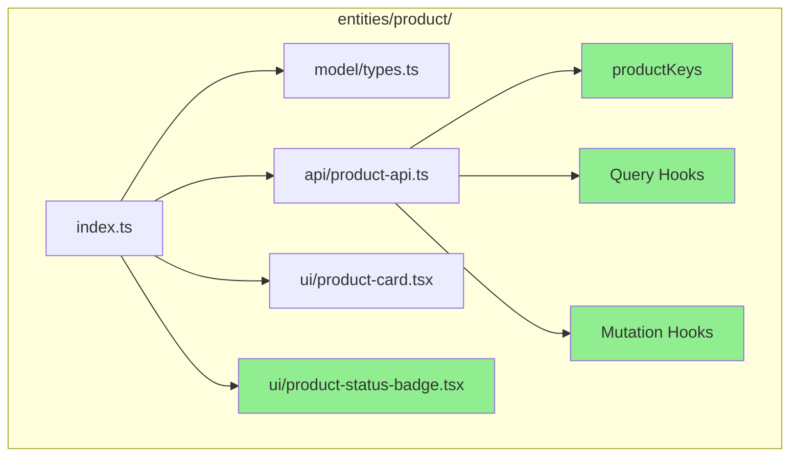
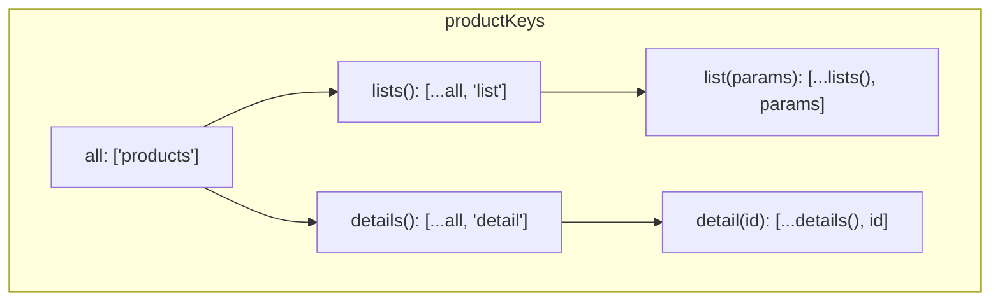
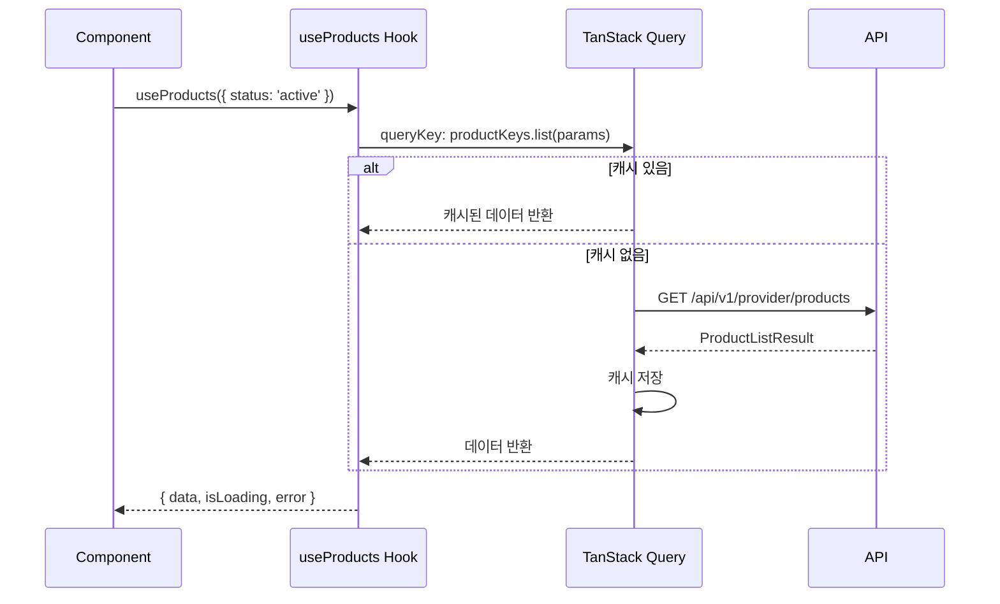
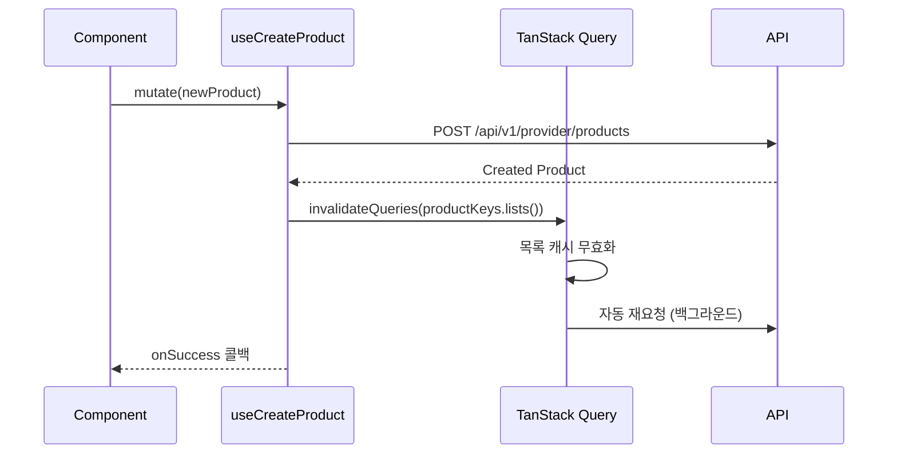

# STORY-17.1: Product Entity FSD 패턴 재개발

## 1. 개요
**Epic**: EPIC-017 Product 관리
**제목**: Product 엔티티 FSD 패턴 재개발
**담당자**: AI Agent
**상태**: 🔲 미시작

## 2. 목적
기존 Product 엔티티를 FSD 패턴과 TanStack Query 기반으로 재개발한다.

## 3. 변경 개요



## 4. 현재 코드 분석 (AS-IS)

### 4.1. 구조 비교



### 4.2. 문제점
```
entities/product/
├── api/
│   └── product-api.ts    ← 직접 API 호출, Query hooks 없음
├── model/
│   └── types.ts          ← OK
├── ui/
│   └── product-card.tsx  ← 부분적으로 사용 가능
└── index.ts              ← export * (안티패턴)
```

- TanStack Query 미사용 → 캐싱, 재요청 관리 불가
- Query Keys 없음 → 무효화 관리 불가
- `export *` 사용 → 명시적이지 않음
- Cluster 등 다른 Entity와 패턴 불일치

## 5. 구현 상세 (TO-BE)

### 5.1. 디렉토리 구조



### 5.2. Query Keys 구조



### 5.3. 데이터 흐름



### 5.4. 뮤테이션 & 캐시 무효화



## 6. 수용 기준
- [ ] `productKeys` Query Keys 팩토리 구현
- [ ] `useProducts(params)` 목록 조회 훅 구현
- [ ] `useProduct(id)` 단일 조회 훅 구현
- [ ] `useCreateProduct()` 생성 뮤테이션 구현
- [ ] `useUpdateProduct()` 수정 뮤테이션 구현
- [ ] `useDeleteProduct()` 삭제 뮤테이션 구현
- [ ] 뮤테이션 성공 시 쿼리 무효화 처리
- [ ] `ProductStatusBadge` 컴포넌트 신규 생성
- [ ] `index.ts` 명시적 named exports로 변경

## 7. 참조 파일
- `web/src/entities/cluster/api/cluster-api.ts` - Query hooks 패턴
- `web/src/entities/cluster/index.ts` - Export 패턴
- `web/src/entities/service/` - EPIC-016 Service 엔티티

## 8. 비고
- 기존 `product-api.ts`의 API 함수들은 내부 함수로 변환
- 기존 사용처(pages)는 STORY-17.2에서 함께 수정
