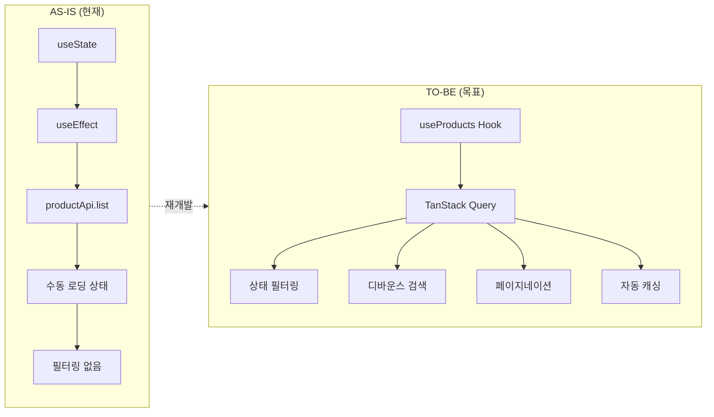
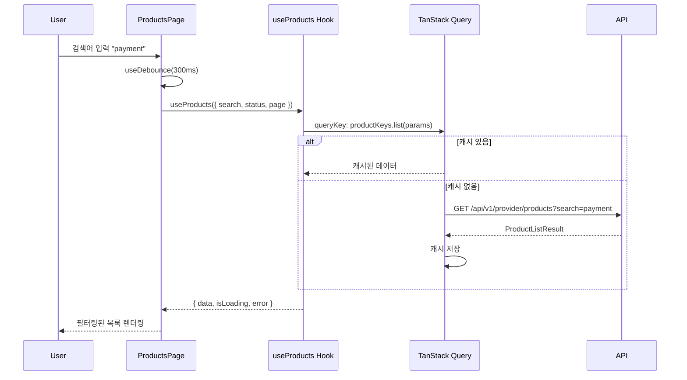
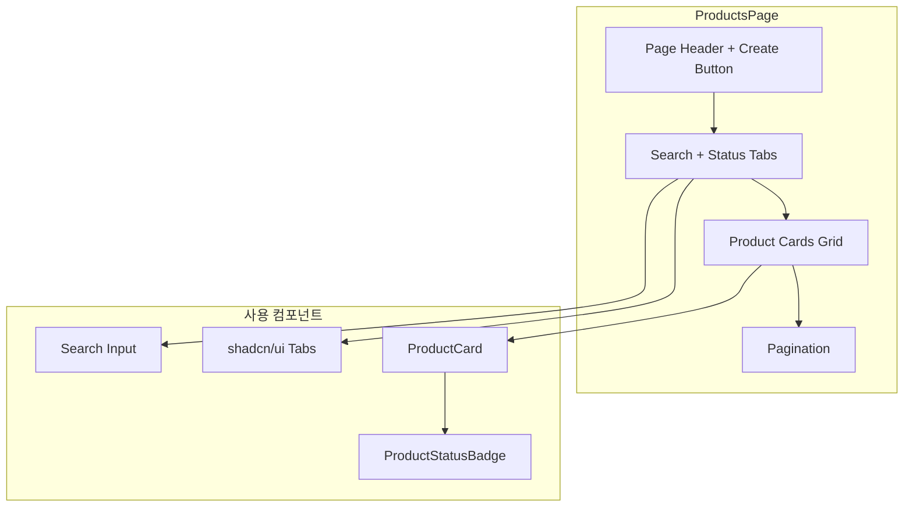
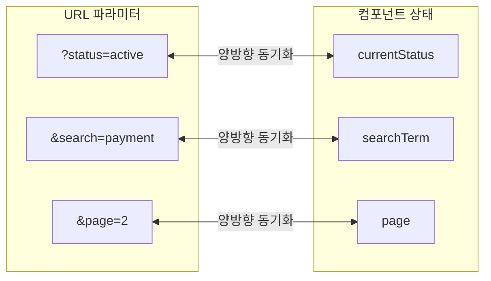

# STORY-17.2: Product 목록 페이지 재개발

## 1. 개요
**Epic**: EPIC-017 Product 관리
**제목**: Product 목록 페이지 재개발
**담당자**: AI Agent
**상태**: 🔲 미시작

## 2. 목적
Product 목록 페이지를 FSD 패턴에 맞게 재개발하고, 상태 필터링/검색/페이지네이션 기능을 추가한다.

## 3. 변경 개요



## 4. 현재 코드 분석 (AS-IS)

**Path**: `web/src/pages/provider/products-page.tsx`

```typescript
// 문제점: useState + useEffect 직접 사용
const [products, setProducts] = useState<ApiProduct[]>([]);
const [isLoading, setIsLoading] = useState(true);

useEffect(() => {
  const loadProducts = async () => {
    const result = await productApi.list();
    setProducts(result.data);
  };
  loadProducts();
}, []);
```

**문제점:**
- TanStack Query 미사용
- 상태 필터링 없음 (탭 UI 없음)
- 검색 기능 미작동 (Input만 있음)
- 페이지네이션 없음

## 5. 구현 상세 (TO-BE)

### 5.1. 데이터 흐름



### 5.2. TanStack Query 사용
```typescript
const { data, isLoading, error } = useProducts({
  status: currentStatus === "all" ? undefined : currentStatus,
  search: debouncedSearch,
  page,
  limit: 20,
});
```

### 5.3. UI 컴포넌트 구조



### 5.4. UI 구조
```
┌─────────────────────────────────────────────────────────────┐
│ API Products                              [+ Create Product]│
│ Manage your API products and their versions                 │
├─────────────────────────────────────────────────────────────┤
│ ┌─────────────┐  ┌─────────────────────────────────────┐   │
│ │ 🔍 Search.. │  │ All │ Draft │ Active │ Archived    │   │
│ └─────────────┘  └─────────────────────────────────────┘   │
├─────────────────────────────────────────────────────────────┤
│ [Product Cards Grid - 3 columns]                            │
├─────────────────────────────────────────────────────────────┤
│ [Pagination: < 1 2 3 ... 10 >]                              │
└─────────────────────────────────────────────────────────────┘
```

### 5.5. 상태 필터 탭
```typescript
const statusTabs = [
  { value: "all", label: "All" },
  { value: "draft", label: "Draft" },
  { value: "active", label: "Active" },
  { value: "archived", label: "Archived" },
];
```

### 5.6. 검색 (디바운스)
```typescript
const [searchTerm, setSearchTerm] = useState("");
const debouncedSearch = useDebounce(searchTerm, 300);
```

### 5.7. URL 파라미터 동기화



## 6. 수용 기준
- [ ] TanStack Query (`useProducts`) 사용으로 전환
- [ ] 상태별 탭 필터링 (All / Draft / Active / Archived)
- [ ] 검색 기능 (디바운스 300ms)
- [ ] 페이지네이션 (limit 20)
- [ ] 빈 상태 처리 (Empty State)
- [ ] 카드 클릭 시 상세 페이지 이동
- [ ] 로딩 상태 (스켈레톤)
- [ ] 에러 상태 및 재시도
- [ ] URL 파라미터 동기화 (`?status=active&search=xxx`)

## 7. 참조 파일
- `web/src/pages/operator/clusters-page.tsx` - 목록 페이지 패턴
- `web/src/entities/product/` - STORY-17.1에서 구현된 훅

## 8. 비고
- App Router 엔트리 (`app/provider/products/page.tsx`)는 이미 존재하거나, 존재해야 함
- 기존 `ProductCard` 컴포넌트 재사용 (STORY-17.1에서 개선됨)
