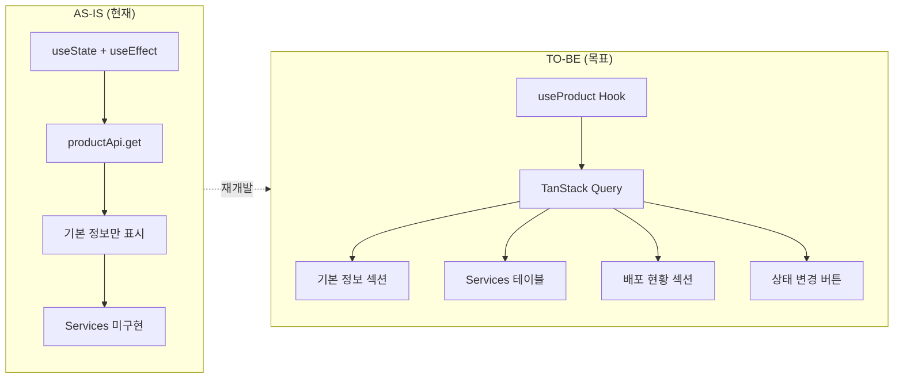
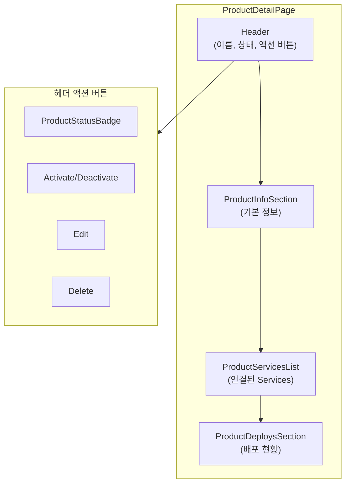
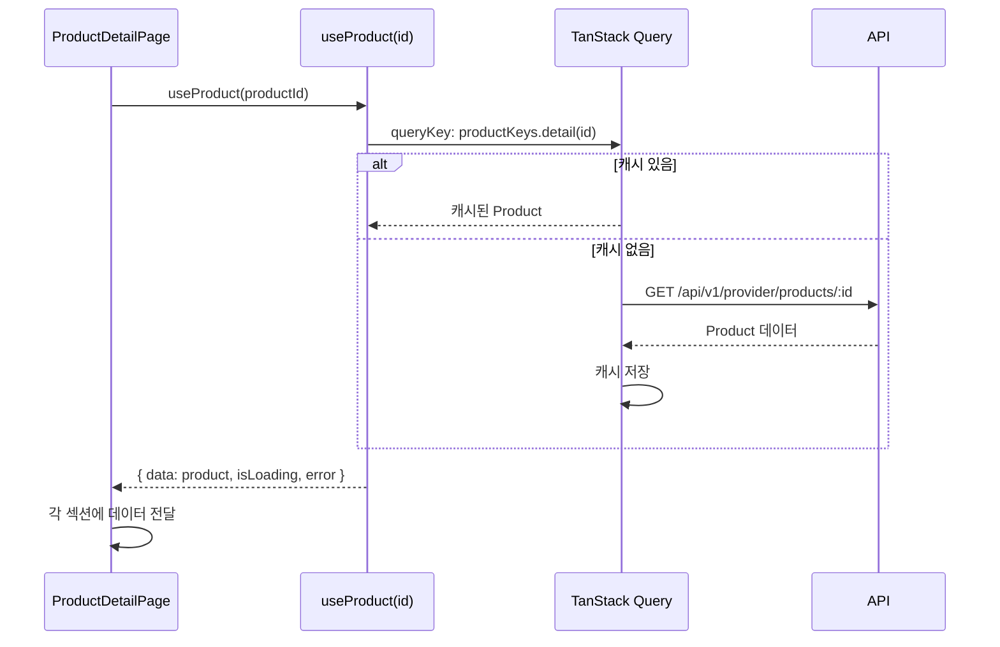
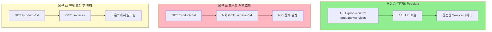

# STORY-17.3: Product 상세 페이지 재개발

## 1. 개요
**Epic**: EPIC-017 Product 관리
**제목**: Product 상세 페이지 재개발
**담당자**: AI Agent
**상태**: 🔲 미시작

## 2. 목적
Product 상세 페이지를 FSD 패턴에 맞게 재개발하고, API Services 연결 기능을 추가한다.

## 3. 변경 개요



## 4. 현재 코드 분석 (AS-IS)

**Path**: `web/src/pages/provider/product-detail-page.tsx`

```typescript
// 문제점: useState + useEffect 직접 사용
const [product, setProduct] = useState<ApiProduct | null>(null);
useEffect(() => {
  const data = await productApi.get(params.id);
  setProduct(data);
}, [params?.id]);

// API Services 섹션: TODO 주석만 있음
<div className="rounded-md border p-4">
  {/* TODO: List Services */}
  No services linked yet.
</div>
```

**문제점:**
- TanStack Query 미사용
- API Services 목록 미구현
- 상태 변경 버튼 없음
- 배포 현황 섹션 없음

## 5. 구현 상세 (TO-BE)

### 5.1. 페이지 구성



### 5.2. 데이터 흐름



### 5.3. UI 구조
```
┌─────────────────────────────────────────────────────────────┐
│ ← Payment API v2.0                   [Draft] [Activate]     │
│                                      [Edit] [Delete]        │
├─────────────────────────────────────────────────────────────┤
│ 기본 정보                                                   │
│ ├─ 버전: 2.0                                               │
│ ├─ 설명: 결제 처리 API                                      │
│ ├─ 카테고리: [결제] [금융]                                  │
│ └─ 문서: https://docs.example.com/payment                  │
├─────────────────────────────────────────────────────────────┤
│ API Services (3)                               [+ Add]      │
│ ┌────────────────────┬──────────┬────────────┬───────────┐ │
│ │ Name               │ Version  │ Status     │ Action    │ │
│ ├────────────────────┼──────────┼────────────┼───────────┤ │
│ │ Payment Service    │ v1.0     │ ● Active   │ [Remove]  │ │
│ │ Settlement Service │ v1.2     │ ● Active   │ [Remove]  │ │
│ └────────────────────┴──────────┴────────────┴───────────┘ │
├─────────────────────────────────────────────────────────────┤
│ 배포 현황                                      [Deploy →]   │
│ (아직 배포 없음 - EPIC-019에서 구현)                        │
└─────────────────────────────────────────────────────────────┘
```

### 5.4. 컴포넌트 분리
```
entities/product/ui/
├── product-info-section.tsx     # 기본 정보 섹션
├── product-services-list.tsx    # Services 테이블
└── product-deploys-section.tsx  # 배포 현황 (placeholder)
```

## 6. 미해결 과제: API Service 조회 전략

Product API는 Service ID만 반환:
```typescript
api_services?: string[];  // ["svc-001", "svc-002"]
```

### 6.1. 옵션 비교



| 옵션 | 장점 | 단점 |
|------|-----|------|
| A. 백엔드에서 populated 데이터 | 1회 호출 | API 수정 필요 |
| B. 프론트에서 개별 조회 | API 수정 불필요 | N+1 문제 |
| C. Service 목록 조회 후 필터링 | 간단 | 불필요한 데이터 로드 |

**권장**: 옵션 A (백엔드 수정) 또는 옵션 C (단기)

## 7. 수용 기준
- [ ] TanStack Query (`useProduct`) 사용으로 전환
- [ ] 기본 정보 표시 (이름, 버전, 설명, 카테고리, 문서URL)
- [ ] 상태 뱃지 표시 (`ProductStatusBadge`)
- [ ] 연결된 API Services 테이블 표시
- [ ] Service 클릭 시 Service 상세 페이지로 이동
- [ ] "Add Service" 버튼 (STORY-17.4 모달 연결)
- [ ] Service 제거 버튼 (연결 해제)
- [ ] 배포 현황 섹션 (placeholder, EPIC-019 연동 예정)
- [ ] 로딩 상태 (스켈레톤)
- [ ] 404 처리

## 8. 참조 파일
- `web/src/pages/operator/cluster-detail-page.tsx` - 상세 페이지 패턴
- `web/src/entities/cluster/ui/cluster-status-badge.tsx` - 상태 뱃지 패턴

## 9. 비고
- 상태 변경 버튼은 STORY-17.5에서 구현
- 배포 현황 섹션은 STORY-17.6에서 placeholder 구현, EPIC-019에서 완성
