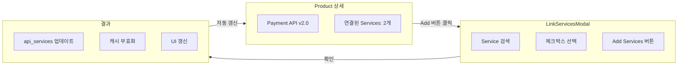
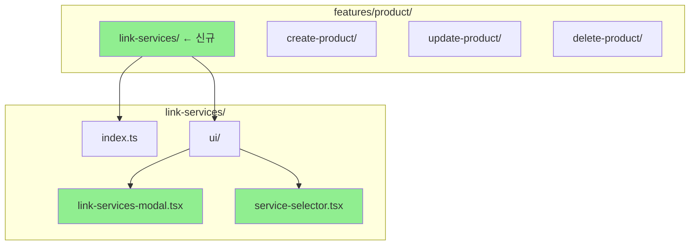
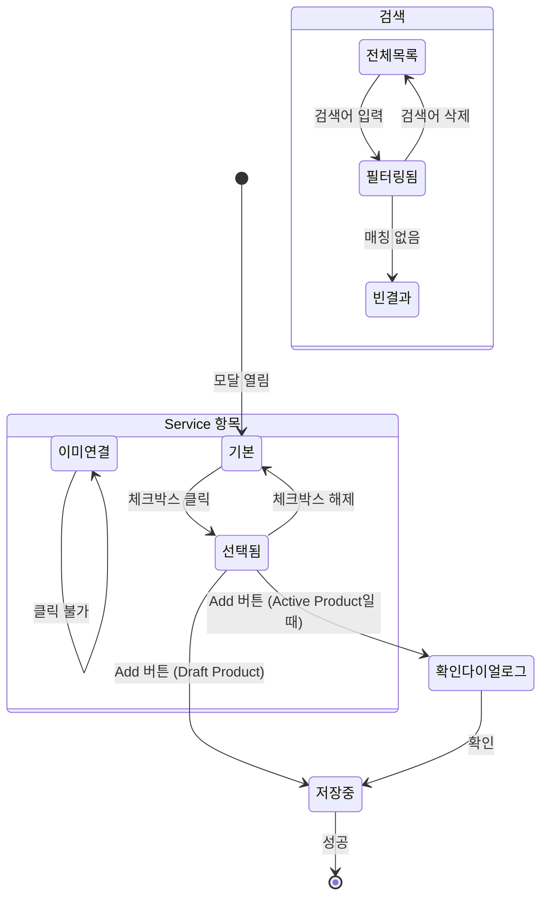
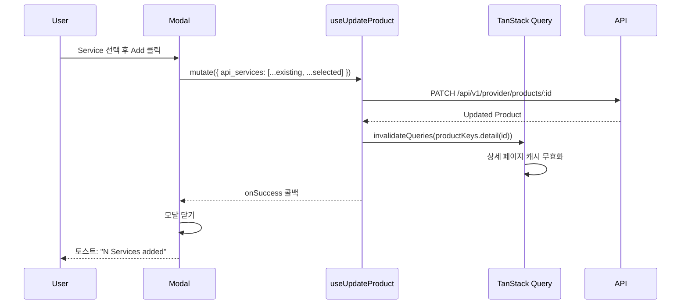

# STORY-17.4: API Service 연결 모달 구현

## 1. 개요
**Epic**: EPIC-017 Product 관리
**제목**: API Service 연결 모달 구현
**담당자**: AI Agent
**상태**: 🔲 미시작

## 2. 목적
Product에 API Service를 연결/해제할 수 있는 모달을 구현한다. 이것은 EPIC-017의 **핵심 기능**이다.

## 3. 기능 개요



## 4. 전제 조건

### EPIC-016 (API Service) 필요 항목
- [ ] `useServices(params)` 훅 - Service 목록 조회
- [ ] `APIService` 타입 정의

**만약 EPIC-016이 미완료라면:** 간단한 mock 데이터로 UI만 구현하고, 추후 연동

## 5. 구현 상세

### 5.1. 디렉토리 구조



### 5.2. UI 구조
```
┌─────────────────────────────────────────────────────────────┐
│ Add API Services to "Payment API"                    [×]    │
├─────────────────────────────────────────────────────────────┤
│ ┌─────────────────────────────────────────────────────┐    │
│ │ 🔍 Search services...                                │    │
│ └─────────────────────────────────────────────────────┘    │
│                                                             │
│ ┌───┬────────────────────────┬──────────┬────────────────┐ │
│ │ ☑ │ Payment Service        │ v1.0     │ (이미 연결됨)  │ │
│ │ ☐ │ Notification Service   │ v2.0     │                │ │
│ │ ☐ │ Report Service         │ v1.0     │                │ │
│ └───┴────────────────────────┴──────────┴────────────────┘ │
│                                                             │
├─────────────────────────────────────────────────────────────┤
│                         [Cancel]  [Add 1 Service]           │
└─────────────────────────────────────────────────────────────┘
```

### 5.3. 컴포넌트 Props
```typescript
interface LinkServicesModalProps {
  open: boolean;
  onOpenChange: (open: boolean) => void;
  productId: string;
  productName: string;
  linkedServiceIds: string[];
  onSuccess?: () => void;
}
```

### 5.4. 인터랙션 상태 다이어그램



| 상태 | 설명 |
|------|------|
| 기본 | 연결되지 않은 Service는 체크 해제, 클릭 가능 |
| 이미 연결됨 | 체크됨 + 비활성화 (row 회색 처리) |
| 선택됨 | 체크됨 + 파란색 하이라이트 |
| 빈 검색 결과 | "No services found" 메시지 |

### 5.5. 데이터 흐름



### 5.6. 경고 처리
Product가 active 상태일 때 Services를 변경하면 확인 다이얼로그:
> "이 Product는 이미 활성화되어 있습니다.
> Services를 변경하면 기존 배포에 영향을 줄 수 있습니다."

## 6. 수용 기준
- [ ] "Add Service" 클릭 시 모달 열기
- [ ] 사용 가능한 API Service 목록 표시
- [ ] 검색으로 Service 필터링 (디바운스 300ms)
- [ ] 체크박스로 다중 선택
- [ ] 이미 연결된 Service는 체크됨 + 비활성화 표시
- [ ] 선택된 개수 표시 ("Add N Services" 버튼)
- [ ] 확인 시 `useUpdateProduct` 호출
- [ ] 성공/실패 토스트 메시지
- [ ] 로딩 상태 표시
- [ ] 빈 검색 결과 처리

## 7. 참조 파일
- `web/src/features/cluster/` - Feature 구조 패턴
- `@/shared/components/ui/dialog` - 모달 컴포넌트
- `@/shared/components/ui/checkbox` - 체크박스 컴포넌트
- `web/src/entities/service/` - EPIC-016 Service 엔티티

## 8. 비고
- Service 제거 기능은 STORY-17.3 상세 페이지에서 직접 구현
