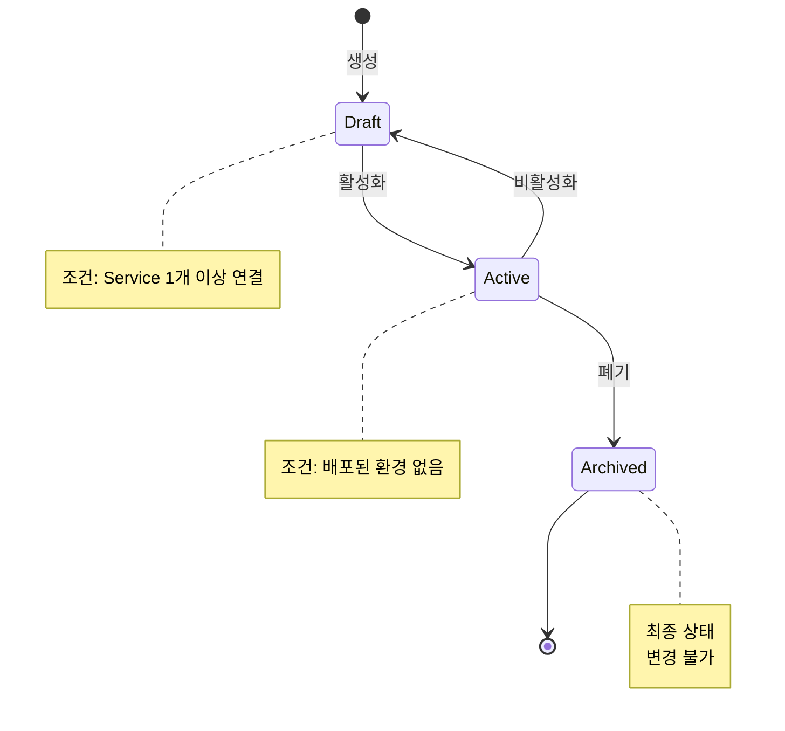
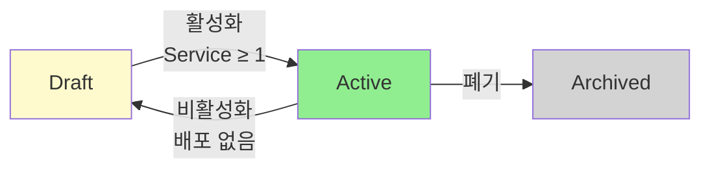
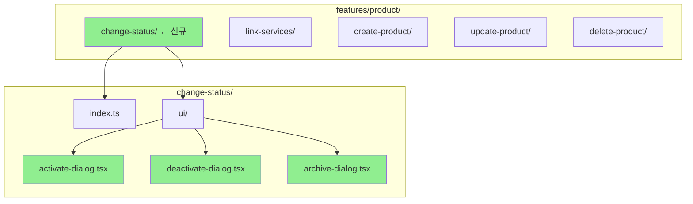
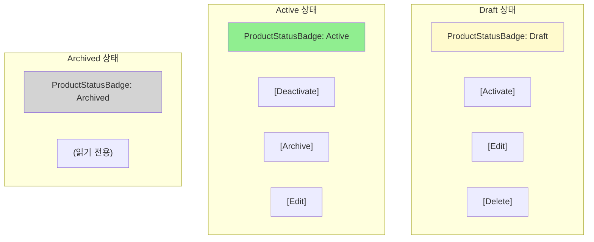
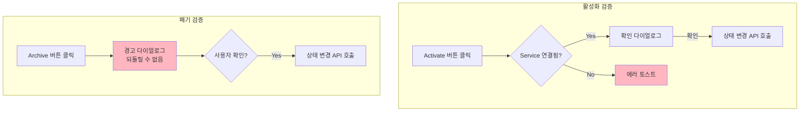

# STORY-17.5: Product 상태 관리 기능

## 1. 개요
**Epic**: EPIC-017 Product 관리
**제목**: Product 상태 관리 기능
**담당자**: AI Agent
**상태**: 🔲 미시작

## 2. 목적
Product의 라이프사이클 상태(draft/active/archived)를 변경하는 기능을 구현한다.

## 3. Product 라이프사이클



### 상태 전환 흐름



### 상태별 허용 동작
| 현재 상태 | 가능한 전환 | 조건 |
|----------|------------|------|
| Draft | → Active | API Service가 1개 이상 연결 |
| Active | → Draft | 배포된 환경 없음 (EPIC-019 연동) |
| Active | → Archived | - |
| Archived | (없음) | 최종 상태, 변경 불가 |

## 4. 구현 상세

### 4.1. 디렉토리 구조



### 4.2. 상태별 버튼 표시



### 4.3. UI - 상태별 헤더 버튼
```
Draft 상태:
┌─────────────────────────────────────────────────────┐
│ ← Payment API v2.0    [Draft]  [Activate] [Edit]   │
└─────────────────────────────────────────────────────┘

Active 상태:
┌─────────────────────────────────────────────────────┐
│ ← Payment API v2.0    [Active] [Deactivate] [Edit] │
│                                [Archive]           │
└─────────────────────────────────────────────────────┘

Archived 상태:
┌─────────────────────────────────────────────────────┐
│ ← Payment API v2.0    [Archived] (읽기 전용)       │
└─────────────────────────────────────────────────────┘
```

### 4.4. 활성화 확인 다이얼로그
```
┌─────────────────────────────────────────────────────┐
│ Activate Product                             [×]   │
├─────────────────────────────────────────────────────┤
│ "Payment API v2.0"을 활성화하시겠습니까?           │
│                                                     │
│ 활성화하면:                                         │
│ • Consumer에게 노출됩니다                           │
│ • 배포할 수 있습니다                                │
│                                                     │
│ 연결된 API Services: 3개                            │
├─────────────────────────────────────────────────────┤
│                        [Cancel]  [Activate]         │
└─────────────────────────────────────────────────────┘
```

### 4.5. 검증 흐름



### 4.6. 검증 로직
```typescript
// Activate 검증: Service가 1개 이상 연결되어야 함
if (!product.api_services?.length) {
  toast.error("최소 1개의 API Service를 연결해주세요.");
  return;
}

// Archive 경고: 되돌릴 수 없음
const confirmed = await confirm({
  title: "Archive Product",
  description: "이 작업은 되돌릴 수 없습니다.",
  variant: "destructive",
});
```

## 5. 수용 기준
- [ ] 상태에 따른 액션 버튼 표시
  - Draft: "Activate" 버튼
  - Active: "Deactivate", "Archive" 버튼
  - Archived: 액션 버튼 없음
- [ ] Draft → Active: Service 연결 확인
- [ ] Active → Draft: (향후) 배포 현황 확인
- [ ] 상태 변경 확인 다이얼로그
- [ ] 성공/실패 토스트
- [ ] 상태 변경 중 로딩 표시
- [ ] 버튼 disabled 상태 처리

## 6. 참조 파일
- `web/src/features/cluster/` - Feature 구조 패턴
- `@/shared/components/ui/alert-dialog` - 확인 다이얼로그

## 7. 비고
- Deactivate 시 배포 현황 확인은 EPIC-019 완료 후 연동
