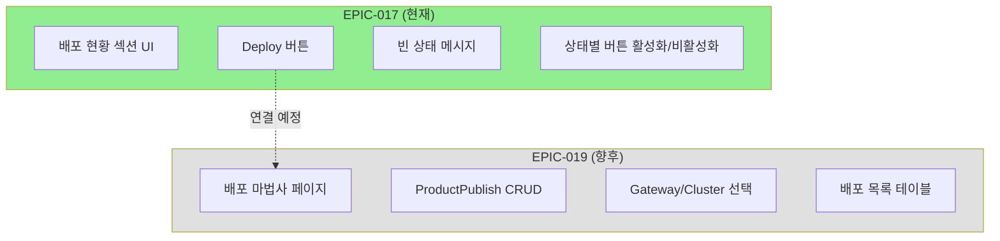
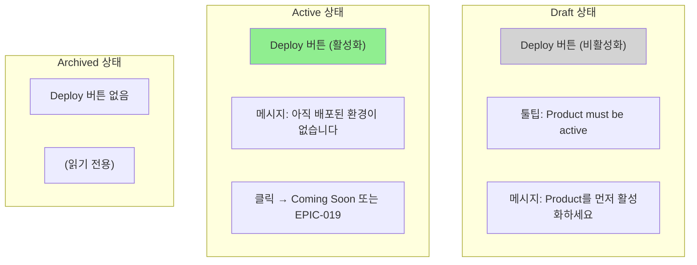
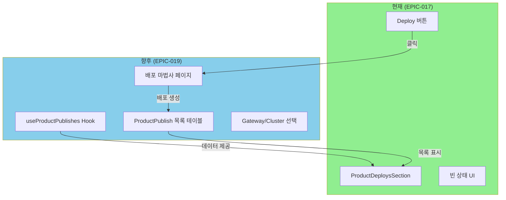

# STORY-17.6: 배포 마법사 진입점

## 1. 개요
**Epic**: EPIC-017 Product 관리
**제목**: 배포 마법사 진입점
**담당자**: AI Agent
**상태**: 🔲 미시작

## 2. 목적
Product 상세 페이지에서 배포 마법사로 진입할 수 있는 UI를 구현한다.
**실제 배포 마법사는 EPIC-019에서 구현된다.**

## 3. 범위



### 포함 (EPIC-017)
- 배포 현황 섹션 UI (placeholder)
- Deploy 버튼 (active 상태에서만 활성화)
- 빈 상태 메시지

### 제외 (EPIC-019)
- 실제 배포 마법사 페이지
- ProductPublish CRUD
- Gateway/Cluster 선택 UI

## 4. 구현 상세

### 4.1. 상태별 UI 흐름



### 4.2. UI - Active 상태
```
┌─────────────────────────────────────────────────────┐
│ 배포 현황                              [Deploy →]  │
├─────────────────────────────────────────────────────┤
│                                                     │
│     📦 아직 배포된 환경이 없습니다                 │
│     Deploy 버튼을 클릭하여 배포를 시작하세요       │
│                                                     │
└─────────────────────────────────────────────────────┘
```

### 4.3. UI - Draft 상태
```
┌─────────────────────────────────────────────────────┐
│ 배포 현황                    [Deploy →] (비활성화) │
│                              ↳ "Product must be    │
│                                 active to deploy"  │
├─────────────────────────────────────────────────────┤
│                                                     │
│     📦 Product를 먼저 활성화하세요                 │
│                                                     │
└─────────────────────────────────────────────────────┘
```

### 4.4. 컴포넌트
```typescript
// entities/product/ui/product-deploys-section.tsx
interface ProductDeploysSectionProps {
  productId: string;
  productStatus: "draft" | "active" | "archived";
}
```

## 5. 수용 기준
- [ ] "배포 현황" 섹션 표시
- [ ] "Deploy" 버튼 표시
- [ ] Draft 상태에서 Deploy 버튼 비활성화 + 툴팁
- [ ] Deploy 클릭 시 placeholder 페이지 또는 "Coming Soon" 표시
- [ ] 빈 상태 메시지 표시

## 6. 향후 EPIC-019 연동



EPIC-019에서 구현될 항목:
1. `useProductPublishes(productId)` 훅
2. ProductPublish 목록 테이블
3. 배포 마법사 (Gateway/Cluster 선택)
4. Deploy 버튼 클릭 시 마법사 페이지로 이동

## 7. 참조 파일
- `@/shared/components/ui/card` - 카드 컴포넌트
- `@/shared/components/ui/tooltip` - 비활성화 버튼 설명

## 8. 비고
- 이 스토리는 EPIC-019와의 연결점을 만드는 것이 목적
- 실제 배포 기능은 EPIC-019에서 구현
