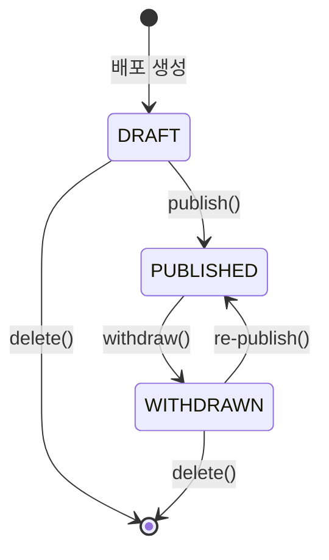

# STORY-19.6: Publish 실행 및 철회 기능

## 1. 개요
**Epic**: EPIC-019 ProductPublish 배포
**제목**: Publish 실행 및 철회 기능
**담당자**: AI Agent
**상태**: ✅ 완료

## 2. 목적
배포 실행(Publish) 및 철회(Withdraw) 액션을 구현한다.

## 3. 구현 상세

### 3.1. 상태 전이


### 3.2. 배포 실행 (Publish)
- API: `POST /api/v1/provider/product-publishes/:id/publish`
- 조건: status === 'draft' 또는 status === 'withdrawn'
- 확인 다이얼로그 표시
- 성공 시 상태가 'published'로 변경

### 3.3. 배포 철회 (Withdraw)
- API: `POST /api/v1/provider/product-publishes/:id/withdraw`
- 조건: status === 'published'
- 확인 다이얼로그 (철회 사유 입력)
- 성공 시 상태가 'withdrawn'으로 변경

### 3.4. 배포 삭제 (Delete)
- API: `DELETE /api/v1/provider/product-publishes/:id`
- 조건: status === 'draft' 또는 status === 'withdrawn'
- 확인 다이얼로그 (되돌릴 수 없음 경고)
- 성공 시 Product 상세 페이지로 이동

### 3.5. 컴포넌트 구조
```
features/publish/
├── execute/
│   └── ui/
│       └── publish-confirm-dialog.tsx
├── withdraw/
│   └── ui/
│       └── withdraw-dialog.tsx
└── delete/
    └── ui/
        └── delete-publish-dialog.tsx
```

## 4. 수용 기준
- [x] 배포 실행 확인 다이얼로그
- [x] 배포 실행 API 호출 및 상태 업데이트
- [x] 철회 다이얼로그 (사유 입력)
- [x] 철회 API 호출 및 상태 업데이트
- [x] 삭제 확인 다이얼로그
- [x] 삭제 API 호출 및 리다이렉트
- [x] 로딩 상태 표시
- [x] 에러 처리 및 토스트 메시지

## 5. 참조 파일
- `web/src/features/publish/execute/`
- `web/src/features/publish/withdraw/`
- `web/src/features/publish/delete/`
